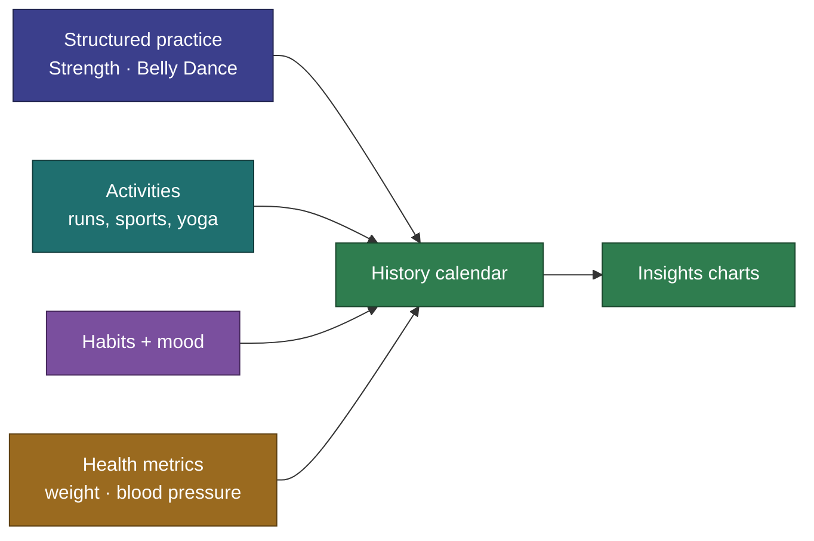

# CosmicWorkOut

**A fast, offline-first tracker for following a structured movement practice — and logging the rest of your day — entirely on your own device.**

CosmicWorkOut is a personal training notebook, not a fitness product. No account, no backend, no sync, no ads. You open it, log what you did in a couple of taps, and get on with your life. Everything you record stays on your device.

---

## Why it exists

Most fitness apps are either too simple (a notes app) or too complex (a gym-management platform), and almost all of them assume one kind of training and an always-on connection. CosmicWorkOut aims for the underserved middle: **structured, multi-week programs with real flexibility, that work offline, and treat each new movement type as configuration rather than a rewrite.**

The one friction it refuses to add: logging what you just did should take **under five seconds, one-handed, without thinking.**

---

## What you can do



- **Follow structured programs** across more than one Discipline — Strength and Belly Dance ship today, each with built-in course programs you can run or copy and customize.
- **Log sessions with one tap** — strength sets remember your last weight; dance routines track sections and moves.
- **Quick-log activities** — runs, walks, sports, yoga, and more, with duration and intensity.
- **Track daily habits and mood** — water, reading, meditation, a −5…+5 mood check-in, plus your own.
- **Track health metrics** (optional, off by default) — weight and blood pressure.
- **Review your history** on a calendar and **see trends** in the Insights charts.
- **Own your data** — works fully offline, installs as a PWA, and exports a complete JSON backup you can restore anytime.

---

## Get it running

```sh
npm install
npm run dev    # http://localhost:5678
```

For the full script list, project layout, and conventions, see the **[Dev Guide](docs/implementation/dev-guide.md)**.

---

## Learn more

- **New to the app?** Read **[How It Works](docs/implementation/behavior.md)** for the mental model.
- **Want the full picture?** The complete project wiki lives in **[docs/](docs/README.md)** — vision, architecture, requirements, per-feature decisions, and the glossary.

CosmicWorkOut is built with **Svelte 5 + SvelteKit** and stores everything in IndexedDB + localStorage. See the [Tech Stack](docs/architecture/tech-stack.md) for details.
