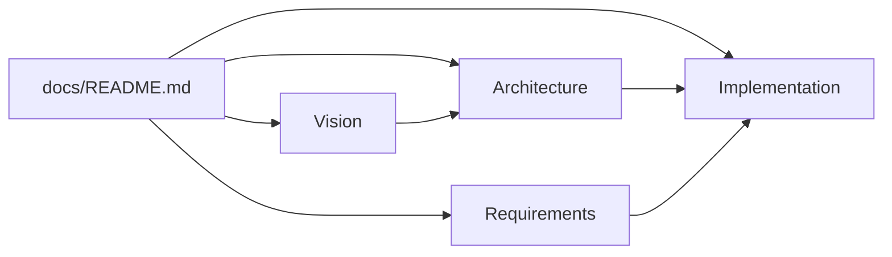

# CosmicWorkOut

A simple, offline-first fitness tracker for following structured strength programs. Log sets in one tap, track history, stay out of the way.

Built with **Svelte 5 + SvelteKit**. All data stays on your device (IndexedDB + localStorage). No backend, no accounts.

---

## Quick Start

```sh
npm install
npm run dev    # opens http://localhost:5678
```

---

## Documentation

Full project wiki: **[docs/README.md](docs/README.md)** — includes mermaid diagrams for architecture, flows, and data models.



| Start here | What you'll learn |
|------------|-------------------|
| [North Star](docs/vision/north-star.md) | What this app is and isn't |
| [How It Works](docs/implementation/behavior.md) | Mental model — start here to understand the app |
| [System Overview](docs/architecture/overview.md) | Architecture at a glance |
| [Implementation Status](docs/implementation/status.md) | What's built vs planned |
| [Dev Guide](docs/implementation/dev-guide.md) | Running and navigating the code |

---

## Scripts

| Command | Purpose |
|---------|---------|
| `npm run dev` | Dev server (port 5678) |
| `npm run build` | Production build |
| `npm run check` | Type checking |
| `npm run lint` | Lint + format check |
