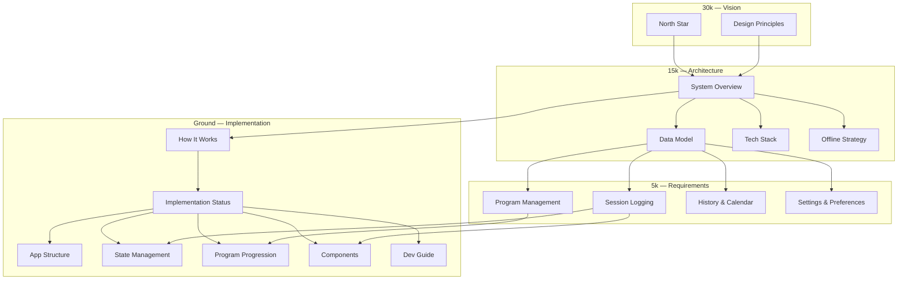

# CosmicWorkOut — Project Wiki

> A simple, offline-first fitness tracking app built for people who want to follow a structured program without the noise.

---

## How to read this wiki

Docs are organized by **altitude**. Start high to understand _why_, work down to understand _what_, _how_, and _where in the code_.

| Level  | Folder                             | Purpose                                  |
| ------ | ---------------------------------- | ---------------------------------------- |
| 30k    | [vision/](vision/)                 | North star — what we're building and why |
| 15k    | [architecture/](architecture/)     | System structure, data, tech, offline    |
| 5k     | [requirements/](requirements/)     | User stories per feature area            |
| Ground | [implementation/](implementation/) | Code map, stores, components, status     |
| —      | [features/](features/)             | Shipped version stories (v1.1–v1.7)      |
| —      | [roadmap/](roadmap/)               | Deferred ideas — post–user-testing work  |

Each doc is one complete thought — readable in ~60 seconds. Follow links to go deeper. Diagrams use **mermaid** for architecture, flows, entity relationships, and component trees.

**New here?** Start with [North Star](vision/north-star.md) → [How It Works](implementation/behavior.md) → [System Overview](architecture/overview.md).

**Unsure what a word means?** The [Glossary](glossary.md) defines the shared vocabulary — Discipline, Routine, Item, Activity, Habit — and the rule for where new movement types belong.

---

## Documenting decisions

**These docs are the project's memory.** There is no separate notebook, ticket system, or AI "memory" that outlives a session — if it isn't written here, it doesn't persist. So:

- When a decision is locked, record it in the relevant doc (a feature `README`, an architecture doc, or the [Glossary](glossary.md)) and mark shipped work ✅ in [Implementation Status](implementation/status.md).
- When something is **not** being built yet but might later, add it to the [Roadmap](roadmap/README.md) — not as `❌ Planned` on a shipped version.
- When behavior changes, update the doc that described the old behavior in the same change — don't let docs and code drift.
- Contributors (human or AI) should treat this wiki as the source of truth and **not** stash project knowledge in tool-specific memory stores. See the [Working Agreement](implementation/dev-guide.md#conventions-working-agreement).

---

## 30k — Vision

- [North Star](vision/north-star.md) — Core identity and purpose
- [Design Principles](vision/principles.md) — Rules that guide every decision

---

## 15k — Architecture

- [System Overview](architecture/overview.md) — How the pieces fit together
- [Data Model](architecture/data-model.md) — Entities, relationships, storage
- [Tech Stack](architecture/tech-stack.md) — SvelteKit, IndexedDB, CSS tokens
- [Offline Strategy](architecture/offline-strategy.md) — Local-first persistence

---

## 5k — Requirements

- [Program Management](requirements/program-management.md) — Programs, workouts, exercise library
- [Session Logging](requirements/session-logging.md) — Core workout logging flow
- [History & Calendar](requirements/history-calendar.md) — Past sessions and progress
- [Settings & Preferences](requirements/settings-preferences.md) — User customization

---

## Ground — Implementation

- [How It Works](implementation/behavior.md) — Mental model: what the app actually does
- [Implementation Status](implementation/status.md) — What's built vs planned
- [App Structure](implementation/app-structure.md) — Routes, layout, boot sequence
- [State Management](implementation/state.md) — Stores and data flow
- [Program Progression](implementation/program-progression.md) — How "today's workout" is chosen
- [Components](implementation/components.md) — UI component inventory
- [Dev Guide](implementation/dev-guide.md) — Run locally, key files

---

## Shipped Features

Version stories (v1.1–v1.7) in [features/](features/) — historical record of what shipped and when.

---

## Roadmap

**Current phase:** use the app, gather feedback. New ideas and deferred work live in [roadmap/](roadmap/README.md).

---

## Maintenance

- [June 2026 Audit](maintenance/audit-2026-06.md) — Holistic review before the user-testing pause: doc-drift inventory, clean-code findings (CSS reuse, ternaries, comments, oversized files), and the phased execution plan.

---

## Inspiration

The original design reference lives in [\_inspiration/](_inspiration/). It's a high-fidelity pickleball-specific prototype — useful for UI and UX patterns, not taken literally as the product spec.
