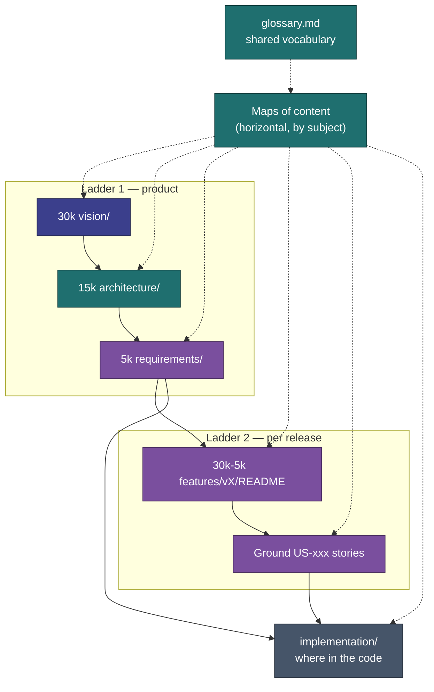

# CosmicWorkOut — Project Wiki

> A simple, offline-first tracker for following a structured movement practice — and logging the rest of your day — without the noise.

---

## How to read this wiki

The wiki has **two ladders and one index**. Knowing which one you are on saves a lot of clicking.

### Ladder 1 — the product ladder (why the product is like this)

Applies to the product as a whole. Read top-down when you are new.

| Level | Folder                         | Answers                                  |
| ----- | ------------------------------ | ---------------------------------------- |
| 30k   | [vision/](vision/)             | Why this product exists at all           |
| 15k   | [architecture/](architecture/) | How the systems are shaped and connected |
| 5k    | [requirements/](requirements/) | How a capability behaves, area by area   |

### Ladder 2 — the feature ladder (why one feature is like this)

Applies **per release**, inside [features/](features/README.md). This is the Epic → Feature →
Story ladder, compressed: each version README carries its own 30k → 15k → 5k, then links down
to the ground-level stories.

| Level  | Where                                               | Answers                                           |
| ------ | --------------------------------------------------- | ------------------------------------------------- |
| 30k    | Version README → _Design North Star_                | Why we built this                                 |
| 15k    | Version README → _What This Is_                     | The shape of it, and what it touches              |
| 5k     | Version README → _What's Shipping_, _Key Decisions_ | The breakdown and the trade-offs                  |
| Ground | `US-xxx` story files                                | Exactly what gets built, with acceptance criteria |

### The index — where it lives in the code

[implementation/](implementation/) is **not** a rung on either ladder. It is a separate axis
answering _where in the code_ — routes, stores, components, status. Enter it from either ladder
when you need to touch the source.

### Maps of content

Both ladders are vertical. The **maps** are horizontal: one page per subject that gathers every
altitude, every release and the relevant code for that subject. Use them when you know roughly
what you are looking for but not which folder it is in.

- [Movement & Training](map-movement-and-training.md) — Disciplines, programs, routines, items, sessions, lift plans
- [Daily Tracking](map-daily-tracking.md) — habits, activities, health metrics, baselines
- [Data & Persistence](map-data-and-persistence.md) — IndexedDB, stores, backup, clearing, offline
- [Interface & Navigation](map-interface-and-navigation.md) — routes, components, Overview, Settings
- [History & Insights](map-history-and-insights.md) — calendar, streaks, charts

### One complete thought per file

A guideline, not a word count. Some subjects need more room. The test to apply while writing is:

> **Does this detail belong here, or does it deserve its own file?**

If a section starts answering a different question than the page title asks, split it and link.
Diagrams use **mermaid** for architecture, flows, entity relationships, and component trees.

**New here?** Follow one short trail, then use the **Related** links at the bottom of each page:

1. [North Star](vision/north-star.md) — why this product exists
2. [How It Works](implementation/behavior.md) — what the app does (no code)
3. [System Overview](architecture/overview.md) — how the pieces fit
4. [Implementation Status](implementation/status.md) — what's built today

**Unsure what a word means?** The [Glossary](glossary.md) defines the shared vocabulary — Discipline, Routine, Item, Activity, Habit, Lift plan, Baseline — and the rule for where new movement types belong. It is **enforceable**: if a doc uses a different word for a glossary term, the doc is wrong.

**Keeping the wiki honest:** relative links and heading anchors are checked by `npm run docs:links` (`scripts/check-doc-links.mjs`). When behavior or schema changes, update the docs in the same change — see [Documenting decisions](#documenting-decisions) and the [Documentation Standards](standards/documentation-standards.md).

---

## Documenting decisions

**These docs are the project's memory.** There is no separate notebook, ticket system, or AI "memory" that outlives a session — if it isn't written here, it doesn't persist. So:

- When a decision is locked, record it in the relevant doc (a feature `README`, an architecture doc, or the [Glossary](glossary.md)) and mark shipped work **Built** in [Implementation Status](implementation/status.md).
- When something is **not** being built yet but might later, add it to the [Roadmap](roadmap/README.md) — not as **Planned** on a shipped version.
- When behavior changes, update the doc that described the old behavior in the same change — don't let docs and code drift.
- Contributors (human or AI) should treat this wiki as the source of truth and **not** stash project knowledge in tool-specific memory stores. See the [Working Agreement](implementation/dev-guide.md#conventions-working-agreement).

### Documentation conventions

- **No emojis** in the docs — they read as unprofessional and don't survive every renderer. Use words.
- **Status labels** are plain text: **Built** / **Shipped** / **Done** (in code today), **Planned** (agreed, not yet built — keep these on the [Roadmap](roadmap/README.md)), **Removed** (was built, then taken out), **Not built** (a gap).
- **Diagrams use [mermaid](https://mermaid.js.org/)**. When a diagram uses color, every node sets a **dark fill with `color:#ffffff`** so text always has strong contrast (never light-on-light or dark-on-dark). The shared palette: vision `#3b3f8c`, architecture/stores `#1f6f6f`, requirements/data `#7a4f9e`, implementation/neutral `#465569`, shipped/done `#2f7d4f`, planned/triggers `#9a6a1f`.

---

## 30k — Vision

- [North Star](vision/north-star.md) — Core identity and purpose
- [Design Principles](vision/principles.md) — Rules that guide every decision

---

## 15k — Architecture

- [System Overview](architecture/overview.md) — How the pieces fit together
- [Data Model](architecture/data-model.md) — Entities, relationships, storage
- [Tech Stack](architecture/tech-stack.md) — SvelteKit, IndexedDB, CSS tokens
- [Offline Strategy](architecture/offline-strategy.md) — Local-first persistence

---

## 5k — Requirements

- [Program Management](requirements/program-management.md) — Programs, workouts, exercise library
- [Session Logging](requirements/session-logging.md) — Core workout logging flow
- [History & Calendar](requirements/history-calendar.md) — Past sessions and progress
- [Settings & Preferences](requirements/settings-preferences.md) — User customization

---

## Ground — Implementation

- [How It Works](implementation/behavior.md) — Mental model: what the app actually does
- [Implementation Status](implementation/status.md) — What's built vs planned
- [App Structure](implementation/app-structure.md) — Routes, layout, boot sequence
- [State Management](implementation/state.md) — Stores and data flow
- [Program Progression](implementation/program-progression.md) — How "today's workout" is chosen
- [Components](implementation/components.md) — UI component inventory
- [Dev Guide](implementation/dev-guide.md) — Run locally, key files

---

## Shipped Features

The [Features index](features/README.md) is the historical record of what shipped and when — one folder per release, each with a README and its user stories.

- [v1.1.0 — Core Workout Flows](features/v1.1.0/README.md)
- [v1.2.0 — Daily Dashboard & Habits](features/v1.2.0/README.md)
- [v1.3.0 — Habit Management & Calendar History](features/v1.3.0/README.md)
- [v1.4.0 — Belly Dance & the Discipline Model](features/v1.4.0/README.md)
- [v1.5.0 — Insights Hub](features/v1.5.0/README.md)
- [v1.6.0 — Belly Dance Catalog & Course Programs](features/v1.6.0/README.md)
- [v1.7.0 — Full Strength Catalog, PWA, Health & Backup](features/v1.7.0/README.md)
- [v1.8.0 — Granular Data Clearing](features/v1.8.0/README.md)
- [v1.9.0 — Lift Plans & Baselines](features/v1.9.0/README.md)

See [Implementation Status](implementation/status.md) for the current built-vs-deferred checklist.

---

## Standards

- [Documentation Standards](standards/documentation-standards.md) — Page anatomy, breadcrumbs, the language-tightens-as-you-descend rule, and glossary enforcement.
- [User Story Standards](standards/user-story-standards.md) — Personas, story format, and the acceptance-criteria template used in feature docs.

---

## Roadmap

**Current phase:** use the app, gather feedback. New ideas and deferred work live in [roadmap/](roadmap/README.md).

---

## Maintenance

- [June 2026 Audit](maintenance/audit-2026-06.md) — Holistic review before the user-testing pause: doc-drift inventory, clean-code findings (CSS reuse, ternaries, comments, oversized files), and the phased execution plan.
- [July 2026 Hardening Audit](maintenance/audit-2026-07-hardening.md) — Performance, memory-leak, security, and correctness review. Three data-loss bugs fixed; the rest recorded as deferred concerns with triggers for when to act.

---

## Inspiration

The original design reference lives in [\_inspiration/](_inspiration/). It's a high-fidelity pickleball-specific prototype — useful for UI and UX patterns, not taken literally as the product spec.
