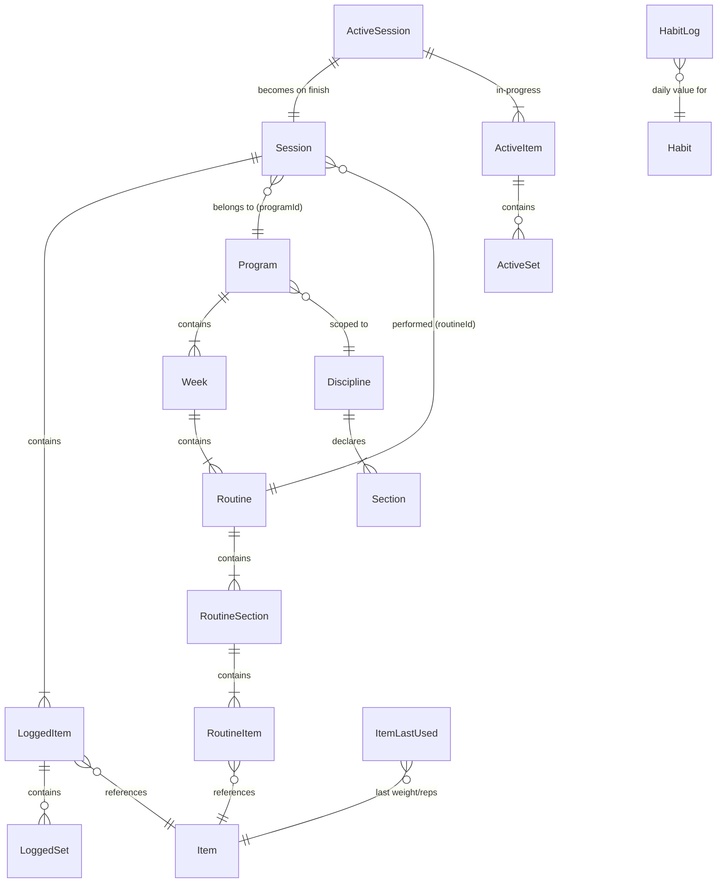

# Data Model

All data is stored locally on the device. **Source of truth: `src/lib/db/types.ts`** (entity shapes) and `src/lib/db/database.ts` (stores + DB version). See [Offline Strategy](offline-strategy.md) for write timing.

> The Discipline model is **shipped** (since v1.4.0). Strength and Belly Dance are two Disciplines running on one generic engine. Terms are defined in the [Glossary](../glossary.md).

---

## Discipline model

A **Discipline** is a data-driven definition of a structured movement practice. It makes the engine specific (each Discipline brings its own sections, metrics, and seed content) while the engine itself stays generic — no belly-dance or strength knowledge is baked into the code.

Disciplines are **seeded, read-only config** — they live in `src/lib/discipline.ts`, **not** in IndexedDB, and are not user-editable. Programs, Items, Routines, and Sessions all carry a `disciplineId`.

```typescript
type Metric = 'setsReps' | 'measure' | 'check';
// setsReps → sets × reps × weight (volume); measure → duration or reps; check → done/not-done

type Section = {
	key: string; // "exercises" | "warm-up" | "conditioning" | "moves" | "cool-down"
	label: string;
	metric: Metric;
	isBookend?: boolean; // warm-up / cool-down inherit from Routine A
};

type Discipline = {
	id: string; // "strength" | "bellydance"
	label: string;
	color?: string;
	icon?: string;
	sections: Section[]; // strength: one section; belly dance: four
};
```

The two shipped Disciplines (`src/lib/discipline.ts`):

| Discipline  | id           | Sections                                        | Section metrics                        |
| ----------- | ------------ | ----------------------------------------------- | -------------------------------------- |
| Strength    | `strength`   | `exercises`                                     | `setsReps`                             |
| Belly Dance | `bellydance` | `warm-up`, `conditioning`, `moves`, `cool-down` | `check`, `measure`, `measure`, `check` |

Belly Dance's `warm-up` and `cool-down` are **bookends** — routines other than A inherit Routine A's bookend items unless they set `overridesBookends`.

### Active program is per-Discipline

There is **one active program per Discipline** — a Strength program and a Belly Dance program can be active at the same time. The user runs them concurrently (strength on some days, dance on others); the app does **not** bind a Discipline to days of the week. All progression values (`todaysRoutine`, `weekStreak`, `currentWeek`, `isComplete`) derive per Discipline, and "one session per program per day" is enforced per Discipline. Progression is **count-driven**: the next routine is `completedSessionCount % routineCount`. See [Program Progression](../implementation/program-progression.md).

---

## Catalog → Item derivation

Built-in **Items are derived from catalog seeds**, not hand-written one by one:

- **Strength:** `strength-exercises.ts` (72 exercise catalog entries) → `strengthItems` (section `exercises`, metric `setsReps`).
- **Belly Dance:** `bellydance-moves.ts` (39 moves) + `bellydance-bookends.ts` (10 warm-up/cool-down) → `bellyDanceItems` (moves metric `measure`; bookends metric `check`).

`src/lib/db/seed.ts` composes `builtInItems = [...strengthItems, ...bellyDanceItems]` (**121 built-in items**) and `builtInPrograms = [...strengthPrograms, ...bellyDancePrograms]` (**12 programs**).

---

## Entities

### Item

A single movement — the atomic unit of any routine. One model spans every Discipline; strength-only fields are optional so `measure`/`check` items (belly dance) share the shape.

```typescript
type Item = {
	id: string;
	disciplineId: string;
	name: string;
	cue: string; // coaching note shown during session
	section: string; // section key within the Discipline (strength: "exercises")
	metric: Metric;
	focus?: string[]; // body-part focus tags, e.g. ["hips", "core"]
	// Belly dance catalog metadata (dance items only)
	danceCat?: string;
	movementType?: 'sharp' | 'smooth' | 'variable';
	difficulty?: 'beginner' | 'intermediate' | 'advanced';
	// setsReps (strength) fields — absent on measure/check items
	muscles?: string;
	cat?: ItemCat; // Chest | Back | Shoulders | Biceps | Triceps | Legs | Core | Full Body
	exerciseType?: 'compound' | 'isolation' | 'dynamic' | 'isometric';
	equipment?: string[];
	unit?: 'lb' | 'kg' | 'band' | 'bodyweight';
	defaultSets?: number;
	defaultReps?: string; // "8-10" or "10 ea" — string for ranges
	weightIncrement?: number; // stepper step in lb/kg
	isBuiltIn: boolean;
};
```

Strength categories (`STRENGTH_CATS`) are **body-part based**: Chest, Back, Shoulders, Biceps, Triceps, Legs, Core, Full Body.

### Routine

A single training day. Holds **sections** (not a flat item list), so one engine serves strength's single section and belly dance's four.

```typescript
type RoutineItem = {
	itemId: string;
	sets?: number; // strength only — dance items enter values during the session
	reps?: string;
	notes?: string;
};

type RoutineSection = {
	key: string; // matches a Discipline Section key
	items: RoutineItem[];
	overridesBookends?: boolean; // bookend sections only — own list vs. inherit Routine A
};

type Routine = {
	id: string;
	disciplineId: string;
	name: string;
	letter?: string; // "A", "B", "C"
	focus?: string;
	color?: 'lime' | 'lavender' | 'red';
	estMin?: number;
	sections: RoutineSection[]; // strength: a single "exercises" section
};
```

### Program

A multi-week training plan.

```typescript
type Week = { weekNumber: number; routines: Routine[] };

type Program = {
	id: string;
	disciplineId: string;
	name: string;
	description: string;
	durationWeeks: number;
	daysPerWeek: number;
	weeks: Week[];
	createdAt: string;
	isBuiltIn: boolean;
};
```

Twelve built-in programs ship: six Strength and six Belly Dance "course" programs (Beginner 101–103, Intermediate 101–103).

### Session

A completed session, written on finish. Logged values vary by item metric.

```typescript
type LoggedSet = {
	setNumber: number;
	weight: number | string; // string for band levels
	reps: number;
	completedAt: string;
};

type LoggedItem = {
	itemId: string;
	sets: LoggedSet[]; // setsReps items
	checked?: boolean; // check items
	value?: number; // measure items
	measureMode?: 'duration' | 'reps';
	skipped?: boolean; // measure item logged with no value
};

type Session = {
	id: string;
	disciplineId: string;
	date: string; // ISO date "2026-06-10"
	routineId: string;
	programId: string;
	startedAt: string;
	finishedAt: string;
	durationSeconds: number;
	totalVolume: number; // sum of weight × reps (numeric weights only)
	totalSets: number;
	items: LoggedItem[];
};
```

### ActiveSession (in-memory + localStorage)

In-progress session for crash recovery. Not an IndexedDB entity — persisted to `cwout:activeSession`.

```typescript
type ActiveSet = {
	setNumber: number;
	targetReps: string;
	weight: number | string;
	reps: number;
	completed: boolean;
	completedAt: string | null;
};

type ActiveItem = {
	itemId: string;
	unit: 'lb' | 'kg' | 'band' | 'bodyweight';
	sets: ActiveSet[]; // setsReps
	metric?: Metric;
	section?: string;
	checked?: boolean; // check
	value?: number | null; // measure
	measureMode?: 'duration' | 'reps';
	skipped?: boolean;
};

type ActiveSession = {
	id: string;
	disciplineId: string;
	date: string;
	routineId: string;
	routineName: string;
	programId: string;
	startedAt: string;
	items: ActiveItem[];
	isEditing?: boolean; // editing a finished session
	originalFinishedAt?: string;
	originalDurationSeconds?: number;
};
```

### ItemLastUsed

Last logged weight and reps per item. Pre-fills weight when a new session starts.

```typescript
type ItemLastUsed = { itemId: string; weight: number | string; reps: number };
```

### Habit & HabitLog

```typescript
type HabitType = 'times' | 'minutes' | 'count' | 'boolean' | 'mood';

type Habit = {
	id: string;
	name: string;
	unit: string; // display label, e.g. "cups", "pages", ""
	type: HabitType;
	dailyGoal?: number; // undefined for boolean and mood
	active: boolean;
	sortOrder: number;
	createdAt: string;
};

type HabitLog = {
	id: string; // composite: "habitId_dateStr"
	habitId: string;
	date: string; // ISO date
	value: number; // 0/1 for boolean; -5..+5 for mood; count for others
};
```

Seven built-in habits ship in `seed.ts` (Meditation, Writing, Reading, Water, Coffee, Alcohol, Mood), seeded on first run only. A boot-time migration in `initDB()` patches `dailyGoal` onto pre-existing built-in habit records that lack it.

### ActivityLog

A non-workout physical activity entry.

```typescript
type ActivityType =
	| 'Run'
	| 'Walk'
	| 'Bike'
	| 'Swim'
	| 'Hike'
	| 'Pickleball'
	| 'Tennis'
	| 'Basketball'
	| 'Yoga'
	| 'Stretching'
	| 'Cardio'
	| 'Other';

type ActivityLog = {
	id: string;
	date: string;
	type: ActivityType;
	customType?: string; // filled when type === "Other"
	durationMinutes: number;
	intensity: 'Easy' | 'Moderate' | 'Hard';
	createdAt: string;
};
```

### UserPrefs

Stored in localStorage (`cwout:prefs`).

```typescript
type UserPrefs = {
	accentColor: string; // hex, default "#b2f042"
	density: 'compact' | 'comfortable' | 'spacious';
	roundness: 'sharp' | 'default' | 'soft';
	weightUnit: 'lb' | 'kg';
};
```

---

## Relationships



---

## IndexedDB stores

DB name `cosmic-workout`, version **7**. The upgrade path is **wipe-and-reseed** (pre-beta, no users): every store is dropped and recreated on a version bump, then `initDB()` re-seeds built-in content.

**Version history:**

| Version     | Change                                                                                                                                                                               |
| ----------- | ------------------------------------------------------------------------------------------------------------------------------------------------------------------------------------ |
| v4 (v1.4.0) | Discipline model. Strength-only schema generalized; stores renamed (`exercises`→`items`, `exerciseLastUsed`→`itemLastUsed`) with new record shapes. Wipe + re-seed both Disciplines. |
| v5 (v1.4.0) | Belly Dance content lands — Belly Dance items + program seed.                                                                                                                        |
| v6 (v1.6.0) | Full belly dance move catalog + six course programs (Beginner/Intermediate 101–103).                                                                                                 |
| v7 (v1.7.0) | Full gym exercise catalog + six strength course programs.                                                                                                                            |

| Store          | Key      | Indexes               | Contents                         |
| -------------- | -------- | --------------------- | -------------------------------- |
| `items`        | `id`     | —                     | Item library (built-in + custom) |
| `programs`     | `id`     | —                     | All programs                     |
| `sessions`     | `id`     | `by_date`             | Completed sessions               |
| `itemLastUsed` | `itemId` | —                     | Last weight/reps per item        |
| `activities`   | `id`     | `by_date`             | Activity log entries             |
| `habits`       | `id`     | —                     | Habit definitions                |
| `habitLogs`    | `id`     | `by_date`, `by_habit` | Daily habit log values           |

Built-in items and programs are **upserted on every boot** (`initDB()` → `upsertBuiltInRecords`): missing built-ins are added and built-in rows refreshed when seed content changes; user-created records are never touched.

---

## localStorage keys

| Key                      | Contents                                                           |
| ------------------------ | ------------------------------------------------------------------ |
| `cwout:prefs`            | UserPrefs JSON                                                     |
| `cwout:activeSession`    | ActiveSession JSON (crash recovery)                                |
| `cwout:activeProgramIds` | Active program id per Discipline                                   |
| `cwout:activeProgramId`  | Legacy single active-program id (pre-Discipline; cleared on reset) |
| `cwout:lastActivityType` | Last used ActivityType (pre-fills new activity sheet)              |
| `cwout:habitDay`         | Selected day on the habit log                                      |

---

## Related

- [Offline Strategy](offline-strategy.md) — When each store is written
- [State Management](../implementation/state.md) — How stores read/write these types
- [Program Progression](../implementation/program-progression.md) — How sessions advance the schedule
