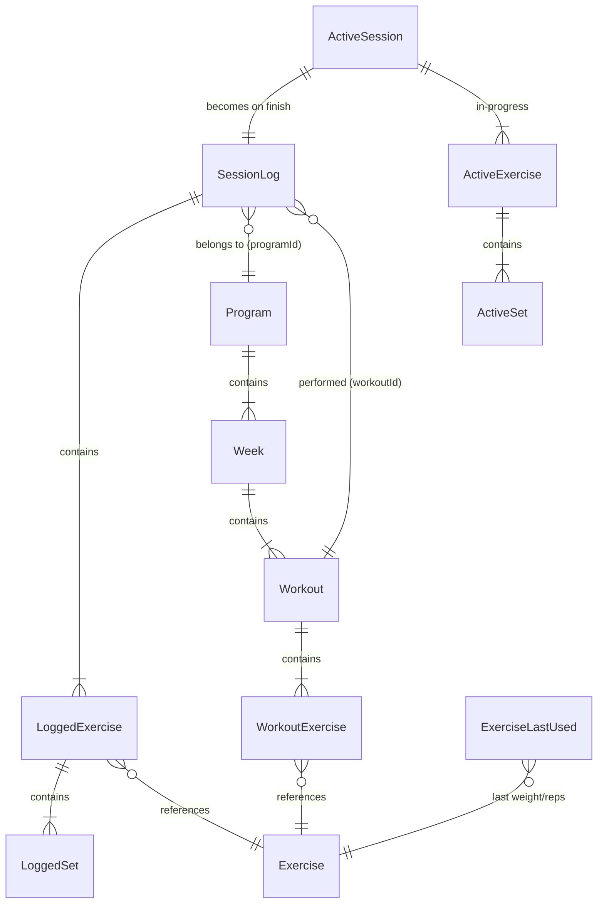
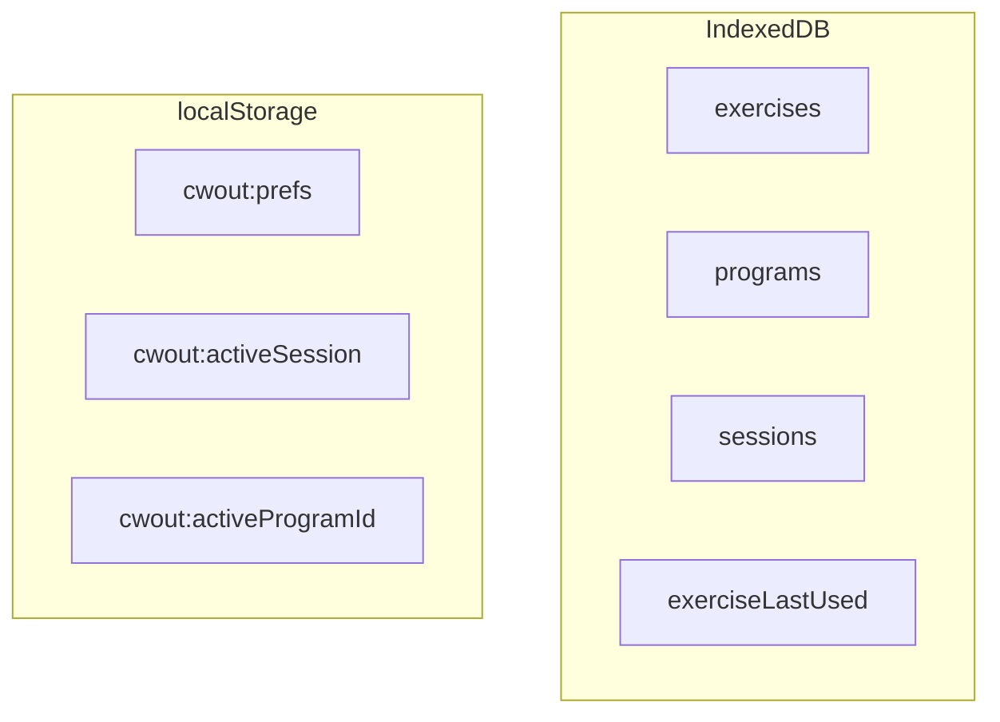

# Data Model

All data is stored locally. Source of truth: `src/lib/db/types.ts`. See [Offline Strategy](offline-strategy.md) for write timing.

---

## Entities

### Exercise

A single movement — the atomic unit of any workout.

```typescript
type Exercise = {
  id: string;
  name: string;
  cue: string;              // coaching note shown during session
  muscles: string;          // e.g. "Hamstrings · Glutes"
  cat: ExerciseCat;         // Hinge | Squat | Push | Pull | ...
  unit: "lb" | "kg" | "band" | "bodyweight";
  defaultSets: number;
  defaultReps: string;      // "8-10" or "10 ea" — string for ranges
  isBuiltIn: boolean;
};
```

Built-in exercises ship in `src/lib/db/seed.ts` and are upserted on every boot.

---

### Program

A multi-week training plan.

```typescript
type Program = {
  id: string;
  name: string;
  description: string;
  durationWeeks: number;
  daysPerWeek: number;
  weeks: Week[];
  createdAt: string;        // ISO datetime
  isBuiltIn: boolean;
};
```

Currently ships one built-in: **Strength Foundation** (12 weeks, 3 days/week).

---

### Workout

A single training day.

```typescript
type Workout = {
  id: string;
  name: string;             // "Lower + Lateral Power"
  letter?: string;          // "A", "B", "C"
  focus?: string;           // "Legs · Lateral · Rotational"
  color?: "lime" | "lavender" | "red";
  estMin?: number;
  exercises: WorkoutExercise[];
};

type WorkoutExercise = {
  exerciseId: string;
  sets: number;
  reps: string;
  notes?: string;
};
```

---

### SessionLog

A completed workout session. Written on session finish.

```typescript
type SessionLog = {
  id: string;
  date: string;             // ISO date "2025-06-10"
  workoutId: string;
  programId: string;
  startedAt: string;
  finishedAt: string;
  durationSeconds: number;
  totalVolume: number;      // sum of weight × reps (numeric weights only)
  totalSets: number;
  exercises: LoggedExercise[];
};

type LoggedSet = {
  setNumber: number;
  weight: number | string;  // string for band levels
  reps: number;
  completedAt: string;
};
```

---

### ActiveSession (in-memory + localStorage)

In-progress session for crash recovery. Not an IndexedDB entity.

```typescript
type ActiveSession = {
  id: string;
  date: string;
  workoutId: string;
  workoutName: string;
  programId: string;
  startedAt: string;
  exercises: ActiveExercise[];
};
```

---

### ExerciseLastUsed

Last logged weight and reps per exercise. Drives instant-mode defaults.

```typescript
type ExerciseLastUsed = {
  exerciseId: string;
  weight: number | string;
  reps: number;
};
```

---

### UserPrefs

Stored in localStorage (`cwout:prefs`).

```typescript
type UserPrefs = {
  accentColor: string;      // hex, default "#b2f042"
  loggingMode: "instant" | "stepper" | "numpad";
  completionFeel: "full" | "subtle";
  density: "compact" | "comfortable" | "spacious";
  roundness: "sharp" | "default" | "soft";
  weightUnit: "lb" | "kg";
};
```

---

## Relationships





---

## IndexedDB Stores

| Store | Key | Index | Contents |
|-------|-----|-------|----------|
| `exercises` | `id` | — | Exercise library |
| `programs` | `id` | — | All programs |
| `sessions` | `id` | `by_date` | Completed sessions |
| `exerciseLastUsed` | `exerciseId` | — | Last weight/reps per exercise |

DB name: `cosmic-workout`, version: `1`.

---

## localStorage Keys

| Key | Contents |
|-----|----------|
| `cwout:prefs` | UserPrefs JSON |
| `cwout:activeSession` | ActiveSession JSON (crash recovery) |
| `cwout:activeProgramId` | Active program ID |

---

## Related

- [Offline Strategy](offline-strategy.md) — When each store is written
- [State Management](../implementation/state.md) — How stores read/write these types
- [Program Progression](../implementation/program-progression.md) — How sessions advance the schedule
