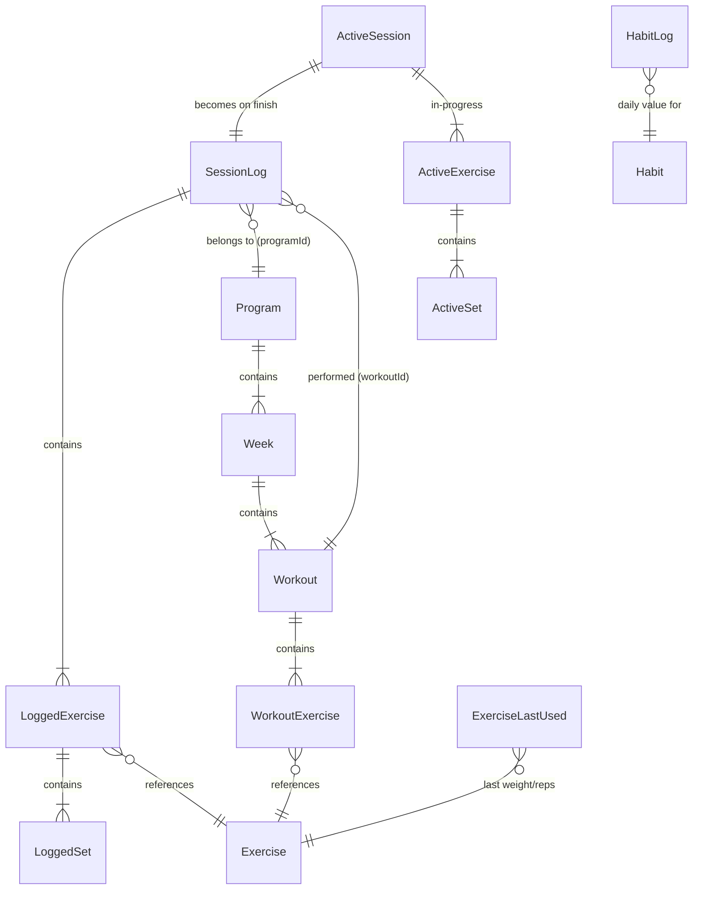

# Data Model

All data is stored locally. Source of truth: `src/lib/db/types.ts`. See [Offline Strategy](offline-strategy.md) for write timing.

> **🟡 v1.4.0 in flight.** The entities below describe the **current, strength-only** code. v1.4.0 generalizes them into the [Discipline Model](#discipline-model--planned-v140) so strength and belly dance share one engine. Terms are defined in the [Glossary](../glossary.md). Until that lands, the strength-only types here remain the shipped reality.

---

## Discipline Model — planned (v1.4.0)

A **Discipline** is a data-driven definition of a structured movement practice. It is what makes the engine specific (each Discipline brings its own sections, metrics, and seed) while staying generic (the engine has no belly-dance or strength knowledge baked in). Strength and Belly Dance are the two Disciplines that ship.

```typescript
// How one item is logged within a session — the core flexibility lever.
type Metric = 'setsReps' | 'measure' | 'check';
// setsReps → sets × reps × weight (volume); measure → duration or reps; check → done/not-done

type Section = {
	key: string; // "exercises" | "warm-up" | "conditioning" | "moves" | "cool-down"
	label: string;
	metric: Metric;
	isBookend?: boolean; // warm-up / cool-down inherit from Routine A
};

type Discipline = {
	id: string; // "strength" | "bellydance"
	label: string;
	color?: string;
	icon?: string;
	sections: Section[]; // strength: one section; belly dance: four
};
```

Disciplines are seeded and read-only (config, not user data). Programs, Items, Routines, and Sessions all carry a `disciplineId`.

### Active program is per-Discipline 🟡 (v1.4.0)

Today there is a single active program (one `cwout:activeProgramId` in localStorage, one `activeProgram` in the store). v1.4.0 generalizes this to **one active program per Discipline**: a Strength program and a Belly Dance program can be active **at the same time**. The user runs them concurrently (e.g. strength on some days, dance on others) — the app does **not** bind a Discipline to days of the week.

- Active-program tracking is keyed by `disciplineId` (see [localStorage Keys](#localstorage-keys)).
- All progression values (`todaysRoutine`, `weekStreak`, `currentWeek`, `isComplete`) are derived **per Discipline**.
- "One session per program per day" is enforced **per Discipline**, so one strength **and** one dance session may be logged on the same date.

> **No day-of-week scheduling and no load periodization in v1.4.0.** Progression stays **count-driven** — the next routine is `completedSessionCount % routineCount`, identical to today's strength logic, now per Discipline. Weeks are not auto-periodized; carrying weight forward is the existing per-item last-used prefill, adjusted manually. See [Program Progression](../implementation/program-progression.md).

### Naming map (current → generalized)

The existing strength entities are renamed/generalized — not replaced — when the engine lands. Behaviour is preserved; scope widens to "any Discipline."

| Current (below) | Generalized                       | Change                                                         |
| --------------- | --------------------------------- | -------------------------------------------------------------- |
| `Exercise`      | `Item`                            | gains `disciplineId`, `section`/type tag, `focus[]`, `metric`  |
| `Workout`       | `Routine`                         | gains `disciplineId`; sections instead of a flat exercise list |
| `Program`       | `Program`                         | gains `disciplineId`                                           |
| `SessionLog`    | `Session`                         | gains `disciplineId`; logged values vary by item metric        |
| —               | `Discipline`, `Section`, `Metric` | new                                                            |

Because the app is pre-beta with no users, v1.4.0 **wipes IndexedDB and re-seeds** rather than migrating records — see the [v1.4.0 README](../features/v1.4.0/README.md).

---

## Entities (current — strength-only)

### Exercise

A single movement — the atomic unit of any workout.

```typescript
type Exercise = {
	id: string;
	name: string;
	cue: string; // coaching note shown during session
	muscles: string; // e.g. "Hamstrings · Glutes"
	cat: ExerciseCat; // Hinge | Squat | Push | Pull | ...
	unit: 'lb' | 'kg' | 'band' | 'bodyweight';
	defaultSets: number;
	defaultReps: string; // "8-10" or "10 ea" — string for ranges
	weightIncrement?: number; // stepper step size in lb/kg — not used for band/bodyweight
	isBuiltIn: boolean;
};
```

Built-in exercises ship in `src/lib/db/seed.ts` and are upserted on every boot.

---

### Program

A multi-week training plan.

```typescript
type Program = {
	id: string;
	name: string;
	description: string;
	durationWeeks: number;
	daysPerWeek: number;
	weeks: Week[];
	createdAt: string; // ISO datetime
	isBuiltIn: boolean;
};
```

Currently ships one built-in: **Strength Foundation** (12 weeks, 3 days/week).

---

### Workout

A single training day.

```typescript
type Workout = {
	id: string;
	name: string; // "Lower + Lateral Power"
	letter?: string; // "A", "B", "C"
	focus?: string; // "Legs · Lateral · Rotational"
	color?: 'lime' | 'lavender' | 'red';
	estMin?: number;
	exercises: WorkoutExercise[];
};

type WorkoutExercise = {
	exerciseId: string;
	sets: number;
	reps: string;
	notes?: string;
};
```

---

### SessionLog

A completed workout session. Written on session finish.

```typescript
type SessionLog = {
	id: string;
	date: string; // ISO date "2025-06-10"
	workoutId: string;
	programId: string;
	startedAt: string;
	finishedAt: string;
	durationSeconds: number;
	totalVolume: number; // sum of weight × reps (numeric weights only)
	totalSets: number;
	exercises: LoggedExercise[];
};

type LoggedSet = {
	setNumber: number;
	weight: number | string; // string for band levels
	reps: number;
	completedAt: string;
};
```

---

### ActiveSession (in-memory + localStorage)

In-progress session for crash recovery. Not an IndexedDB entity.

```typescript
type ActiveSession = {
	id: string;
	date: string;
	workoutId: string;
	workoutName: string;
	programId: string;
	startedAt: string;
	exercises: ActiveExercise[];
};
```

---

### ExerciseLastUsed

Last logged weight and reps per exercise. Pre-fills weight when a new session starts for that exercise.

```typescript
type ExerciseLastUsed = {
	exerciseId: string;
	weight: number | string;
	reps: number;
};
```

---

### Habit

A trackable daily behaviour.

```typescript
type HabitType = 'times' | 'minutes' | 'count' | 'boolean' | 'mood';

type Habit = {
	id: string;
	name: string;
	unit: string; // display label, e.g. "cups", "pages", ""
	type: HabitType;
	dailyGoal?: number; // undefined for boolean and mood types
	active: boolean;
	sortOrder: number;
	createdAt: string;
};
```

Seven built-in habits ship in `src/lib/db/seed.ts`. Seeded on first run only. A boot-time migration patches `dailyGoal` onto any existing built-in records that pre-date the goal fields being added.

---

### HabitLog

A single day's logged value for one habit.

```typescript
type HabitLog = {
	id: string; // composite: "habitId_dateStr"
	habitId: string;
	date: string; // ISO date "2025-06-10"
	value: number; // 0/1 for boolean; -5..+5 for mood; count for others
	loggedAt: string;
};
```

One record per (habitId, date) pair. Upserted on every interaction.

---

### ActivityLog

A non-workout physical activity entry.

```typescript
type ActivityType =
	| 'Run'
	| 'Walk'
	| 'Bike'
	| 'Swim'
	| 'Hike'
	| 'Pickleball'
	| 'Tennis'
	| 'Basketball'
	| 'Yoga'
	| 'Stretching'
	| 'Cardio'
	| 'Other';

type ActivityIntensity = 'Easy' | 'Moderate' | 'Hard';

type ActivityLog = {
	id: string;
	date: string; // ISO date
	type: ActivityType;
	customType?: string; // filled when type === "Other"
	durationMinutes: number;
	intensity: ActivityIntensity;
	createdAt: string;
};
```

---

### UserPrefs

Stored in localStorage (`cwout:prefs`).

```typescript
type UserPrefs = {
	accentColor: string; // hex, default "#b2f042"
	completionFeel: 'full' | 'subtle';
	density: 'compact' | 'comfortable' | 'spacious';
	roundness: 'sharp' | 'default' | 'soft';
	weightUnit: 'lb' | 'kg';
};
```

---

## Relationships



---

## IndexedDB Stores

DB name: `cosmic-workout`, version: `2`.

| Store              | Key          | Indexes               | Contents                      |
| ------------------ | ------------ | --------------------- | ----------------------------- |
| `exercises`        | `id`         | —                     | Exercise library              |
| `programs`         | `id`         | —                     | All programs                  |
| `sessions`         | `id`         | `by_date`             | Completed workout sessions    |
| `exerciseLastUsed` | `exerciseId` | —                     | Last weight/reps per exercise |
| `activities`       | `id`         | `by_date`             | Activity log entries          |
| `habits`           | `id`         | —                     | Habit definitions             |
| `habitLogs`        | `id`         | `by_date`, `by_habit` | Daily habit log values        |

---

## localStorage Keys

| Key                      | Contents                                              |
| ------------------------ | ----------------------------------------------------- |
| `cwout:prefs`            | UserPrefs JSON                                        |
| `cwout:activeSession`    | ActiveSession JSON (crash recovery)                   |
| `cwout:activeProgramId`  | Active program ID — **🟡 v1.4.0:** keyed per Discipline (one active program per Discipline) |
| `cwout:lastActivityType` | Last used ActivityType (pre-fills new activity sheet) |

---

## Related

- [Offline Strategy](offline-strategy.md) — When each store is written
- [State Management](../implementation/state.md) — How stores read/write these types
- [Program Progression](../implementation/program-progression.md) — How sessions advance the schedule
