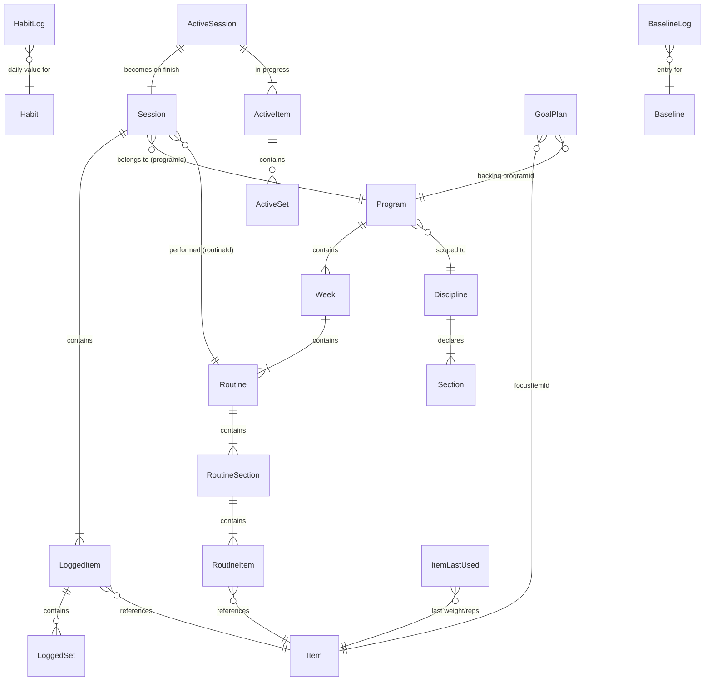

[Wiki](../README.md) › [15k — Architecture](../README.md#15k--architecture) › Data Model

# Data Model

All data is stored locally on the device. **Source of truth: `src/lib/db/types.ts`** (entity shapes) and `src/lib/db/database.ts` (stores + DB version). See [Offline Strategy](offline-strategy.md) for write timing.

> The Discipline model is **shipped** (since v1.4.0). Strength and Belly Dance are two Disciplines running on one generic engine. Terms are defined in the [Glossary](../glossary.md).

---

## Discipline model

A **Discipline** is a data-driven definition of a structured movement practice. It makes the engine specific (each Discipline brings its own sections, metrics, and seed content) while the engine itself stays generic — no belly-dance or strength knowledge is baked into the code.

Disciplines are **seeded, read-only config** — they live in `src/lib/discipline.ts`, **not** in IndexedDB, and are not user-editable. Programs, Items, Routines, and Sessions all carry a `disciplineId`.

```typescript
type Metric = 'setsReps' | 'measure' | 'check';
// setsReps → sets × reps × weight (volume); measure → duration or reps; check → done/not-done

type Section = {
	key: string; // "exercises" | "warm-up" | "conditioning" | "moves" | "cool-down"
	label: string;
	metric: Metric;
	isBookend?: boolean; // warm-up / cool-down inherit from Routine A
};

type Discipline = {
	id: string; // "strength" | "bellydance"
	label: string;
	color?: string;
	icon?: string;
	sections: Section[]; // strength: one section; belly dance: four
};
```

The two shipped Disciplines (`src/lib/discipline.ts`):

| Discipline  | id           | Sections                                        | Section metrics                        |
| ----------- | ------------ | ----------------------------------------------- | -------------------------------------- |
| Strength    | `strength`   | `exercises`                                     | `setsReps`                             |
| Belly Dance | `bellydance` | `warm-up`, `conditioning`, `moves`, `cool-down` | `check`, `measure`, `measure`, `check` |

Belly Dance's `warm-up` and `cool-down` are **bookends** — routines other than A inherit Routine A's bookend items unless they set `overridesBookends`.

### Active program is per-Discipline

The model is **one active program per Discipline** — a Strength program and a Belly Dance program can be active at the same time. The user runs them concurrently (strength on some days, dance on others); the app does **not** bind a Discipline to days of the week. Note this is a soft convention, not a hard invariant: `activeProgramIds` is a flat array, `setActiveProgram()` appends without deactivating another program of the same Discipline, and `activeProgramFor()` returns the first match — so a second same-Discipline activation is possible and only the first takes effect. (Tracked as a correctness item in the [hardening audit](../maintenance/audit-2026-07-hardening.md#correctness-deferred).) All progression values (`todaysRoutine`, `weekStreak`, `currentWeek`, `isComplete`) derive per Discipline, and "one session per program per day" is enforced per Discipline. Progression is **count-driven**: the next routine is `completedSessionCount % routineCount`. See [Program Progression](../implementation/program-progression.md).

---

## Catalog → Item derivation

Built-in **Items are derived from catalog seeds**, not hand-written one by one:

- **Strength:** `strength-exercises.ts` (72 exercise catalog entries) → `strengthItems` (section `exercises`, metric `setsReps`).
- **Belly Dance:** `bellydance-moves.ts` (39 moves) + `bellydance-bookends.ts` (10 warm-up/cool-down) → `bellyDanceItems` (moves metric `measure`; bookends metric `check`).

`src/lib/db/seed.ts` composes `builtInItems = [...strengthItems, ...bellyDanceItems]` (**121 built-in items**) and `builtInPrograms = [...strengthPrograms, ...bellyDancePrograms]` (**12 programs**).

---

## Entities

### Item

A single movement — the atomic unit of any routine. One model spans every Discipline; strength-only fields are optional so `measure`/`check` items (belly dance) share the shape.

```typescript
type Item = {
	id: string;
	disciplineId: string;
	name: string;
	cue: string; // coaching note shown during session
	section: string; // section key within the Discipline (strength: "exercises")
	metric: Metric;
	focus?: string[]; // body-part focus tags, e.g. ["hips", "core"]
	// Belly dance catalog metadata (dance items only)
	danceCat?: string;
	movementType?: 'sharp' | 'smooth' | 'variable';
	difficulty?: 'beginner' | 'intermediate' | 'advanced';
	// setsReps (strength) fields — absent on measure/check items
	muscles?: string;
	cat?: ItemCat; // Chest | Back | Shoulders | Biceps | Triceps | Legs | Core | Full Body
	exerciseType?: 'compound' | 'isolation' | 'dynamic' | 'isometric';
	equipment?: string[];
	unit?: 'lb' | 'kg' | 'band' | 'bodyweight';
	defaultSets?: number;
	defaultReps?: string; // "8-10" or "10 ea" — string for ranges
	weightIncrement?: number; // stepper step in lb/kg
	isBuiltIn: boolean;
};
```

Strength categories (`STRENGTH_CATS`) are **body-part based**: Chest, Back, Shoulders, Biceps, Triceps, Legs, Core, Full Body.

### Routine

A single training day. Holds **sections** (not a flat item list), so one engine serves strength's single section and belly dance's four.

```typescript
type RoutineItem = {
	itemId: string;
	sets?: number; // strength only — dance items enter values during the session
	reps?: string;
	notes?: string;
};

type RoutineSection = {
	key: string; // matches a Discipline Section key
	items: RoutineItem[];
	overridesBookends?: boolean; // bookend sections only — own list vs. inherit Routine A
};

type Routine = {
	id: string;
	disciplineId: string;
	name: string;
	letter?: string; // "A", "B", "C"
	focus?: string;
	color?: 'lime' | 'lavender' | 'red';
	estMin?: number;
	sections: RoutineSection[]; // strength: a single "exercises" section
};
```

### Program

A multi-week training plan.

```typescript
type Week = { weekNumber: number; routines: Routine[] };

type Program = {
	id: string;
	disciplineId: string;
	name: string;
	description: string;
	durationWeeks: number;
	daysPerWeek: number;
	weeks: Week[];
	createdAt: string;
	isBuiltIn: boolean;
};
```

Twelve built-in programs ship: six Strength and six Belly Dance "course" programs (Beginner 101–103, Intermediate 101–103).

### Session

A completed session, written on finish. Logged values vary by item metric.

```typescript
type LoggedSet = {
	setNumber: number;
	weight: number | string; // string for band levels
	reps: number;
	completedAt: string;
};

type LoggedItem = {
	itemId: string;
	sets: LoggedSet[]; // setsReps items
	checked?: boolean; // check items
	value?: number; // measure items
	measureMode?: 'duration' | 'reps';
	skipped?: boolean; // measure item logged with no value
};

type Session = {
	id: string;
	disciplineId: string;
	date: string; // ISO date "2026-06-10"
	routineId: string;
	programId: string;
	startedAt: string;
	finishedAt: string;
	durationSeconds: number;
	totalVolume: number; // sum of weight × reps (numeric weights only)
	totalSets: number;
	items: LoggedItem[];
};
```

### ActiveSession (in-memory + localStorage)

In-progress session for crash recovery. Not an IndexedDB entity — persisted to `cwout:activeSession`.

```typescript
type ActiveSet = {
	setNumber: number;
	targetReps: string;
	weight: number | string;
	reps: number;
	completed: boolean;
	completedAt: string | null;
};

type ActiveItem = {
	itemId: string;
	unit: 'lb' | 'kg' | 'band' | 'bodyweight';
	sets: ActiveSet[]; // setsReps
	metric?: Metric;
	section?: string;
	checked?: boolean; // check
	value?: number | null; // measure
	measureMode?: 'duration' | 'reps';
	skipped?: boolean;
};

type ActiveSession = {
	id: string;
	disciplineId: string;
	date: string;
	routineId: string;
	routineName: string;
	programId: string;
	startedAt: string;
	items: ActiveItem[];
	isEditing?: boolean; // editing a finished session
	originalFinishedAt?: string;
	originalDurationSeconds?: number;
};
```

### ItemLastUsed

Last logged weight and reps per item. Pre-fills weight when a new session starts.

```typescript
type ItemLastUsed = { itemId: string; weight: number | string; reps: number };
```

### Habit & HabitLog

```typescript
type HabitType = 'times' | 'minutes' | 'count' | 'boolean' | 'mood';

type Habit = {
	id: string;
	name: string;
	unit: string; // display label, e.g. "cups", "pages", ""
	type: HabitType;
	dailyGoal?: number; // undefined for boolean and mood
	active: boolean;
	sortOrder: number;
	createdAt: string;
	color?: string; // chart color (v1.10.0, US-042); a default is saved on load when missing
	negativeColor?: string; // mood only — bad-day color; `color` is the good-day color
};

type HabitLog = {
	id: string; // composite: "habitId:date" (colon-separated, ISO date)
	habitId: string;
	date: string; // ISO date
	value: number; // 0/1 for boolean; -5..+5 for mood; count for others
};
```

Five built-in trackable habits (Water, Coffee, Meditation, Writing, Reading) plus **Mood** (always on) ship in `seed.ts` — six total. Seeded only when the `habits` store is empty on first run; a legacy `duration`→`minutes` type migration runs inline on load. There is no automatic re-seed when built-ins change (the store already has rows). See [US-031](../features/v1.7.0/US-031-default-habits-tweak.md).

### ActivityLog

A non-workout physical activity entry.

```typescript
type ActivityType =
	| 'Run'
	| 'Walk'
	| 'Bike'
	| 'Swim'
	| 'Hike'
	| 'Pickleball'
	| 'Tennis'
	| 'Basketball'
	| 'Yoga'
	| 'Stretching'
	| 'Cardio'
	| 'Other';

type ActivityLog = {
	id: string;
	date: string;
	type: ActivityType;
	customType?: string; // filled when type === "Other"
	durationMinutes: number;
	intensity: 'Easy' | 'Moderate' | 'Hard';
	createdAt: string;
};
```

### HealthReading

> **Shipped — [US-029](../features/v1.7.0/US-029-health-metrics.md).** Optional body measurements (weight, blood pressure). Not a movement archetype — see [Glossary](../glossary.md#health-metrics).

Metric **definitions** live in code (`src/lib/health/metrics.ts`), not IndexedDB. Only **readings** are stored.

```typescript
type HealthMetricId = 'weight' | 'bloodPressure';

type WeightValues = { value: number };

type BloodPressureValues = {
	systolic: number;
	diastolic: number;
	pulse?: number;
};

type HealthReading = {
	id: string;
	metricId: HealthMetricId;
	date: string; // ISO date — global logging date
	recordedAt: string; // ISO datetime — orders multiple BP readings per day
	values: WeightValues | BloodPressureValues;
};
```

- **Weight:** at most one reading per `date` (upsert).
- **Blood pressure:** many readings per `date`; Insights charts use daily averages of systolic/diastolic (and pulse when present).
- **Feature gate:** `UserPrefs.healthMetricsEnabled` (default `false`). When off, UI is hidden; readings remain in IndexedDB.

### GoalPlan

> **Shipped — [US-033](../features/v1.9.0/US-033-goal-progression-plans.md).** Opt-in Strength stint toward one focus lift. Types live in `src/lib/goalPlans/types.ts`.

Each instance owns a generated backing `Program` (for A/B/C rotation) plus wave metadata. Backing programs are hidden from generic plan pickers and managed on `/goals`.

```typescript
type GoalPlanStatus = 'active' | 'paused' | 'completed';
type WavePhase = 'build' | 'peak' | 'deload';
type GoalTarget = { weight: number; reps: number };

type WaveWeek = {
	planWeek: number; // 1-based across the whole plan
	blockWeek: number; // 1-4 within the block
	phase: WavePhase;
	weight: number;
	reps: number;
};

type ProgressionBlock = {
	blockNumber: number;
	baseline: GoalTarget; // week-1 / deload target
	weeks: WaveWeek[]; // always 4
};

type SupportingBaseline = {
	itemId: string;
	startWeight: number; // history at generation, else 0
	weightIncrement: number; // frozen from the item at generation
};

type BlockRepeatEvent = {
	blockNumber: number;
	atCompletedCount: number;
	repeatedAt: string;
};

type GoalPlan = {
	id: string;
	disciplineId: string; // always "strength"
	programId: string; // backing Program
	templateId: string; // scaffold id (e.g. "gp-priority")
	name: string; // default: "<Focus> Goal NN"
	focusItemId: string;
	goal: GoalTarget;
	start: GoalTarget;
	focusIncrement: number;
	blocks: ProgressionBlock[];
	supporting: SupportingBaseline[];
	daysPerWeek: number;
	status: GoalPlanStatus;
	countOffset: number; // session-count rewind from block repeats
	repeatEvents: BlockRepeatEvent[];
	createdAt: string;
	completedAt?: string;
	pausedAt?: string;
};
```

- **Feature gate:** `UserPrefs.goalProgressionPlansEnabled` (default `false`). When off, UI is hidden; plans remain in IndexedDB.
- **Clear data:** the "Clear goal plans" control (UI label still uses the old name) deletes `goalPlans` **and** their backing programs. "Clear custom programs" skips goal-backed programs so plans stay consistent.
- **UI name:** Prefer **Lift plan** in product copy ([Glossary](../glossary.md#lift-plan)); routes/code may still say `goalPlan` / `/goals`.

### Baseline

> **[US-037](../features/v1.10.0/US-037-flexible-baseline-metrics.md) / [US-038](../features/v1.10.0/US-038-baseline-logging-comparison.md)** (v1.10.0, replacing the v1.9.0 shape from [US-034](../features/v1.9.0/US-034-baselines-setup.md)). Opt-in daily baselines with growth charts. Not a Habit; not a Lift plan.

```typescript
type BaselineMeasure = 'duration' | 'distance' | 'count';
type DistanceUnit = 'mi' | 'km' | 'm' | 'yd';

type BaselineMetric = {
	id: string;
	name: string; // e.g. "Pushups", "Walk"
	measure: BaselineMeasure; // fixed at creation
	baseline: number; // the floor; duration is stored in minutes
	unit?: DistanceUnit; // distance only
	label?: string; // count only — user-typed, e.g. "reps", "words"
	removed?: boolean; // hidden from the baseline; its logs are kept
};

type Baseline = {
	id: string;
	name: string;
	metrics: BaselineMetric[]; // 1 to n, display order
	sortOrder: number;
	active: boolean;
	createdAt: string;
};

type BaselineLog = {
	id: string;
	baselineId: string;
	date: string; // ISO date — global logging date
	recordedAt: string; // ISO datetime — orders multiple entries per day
	values: Record<string, number>; // metricId → amount for this entry
};
```

- **Done = logged:** any entry on a date marks the baseline done for that date. Values never fail a day.
- **Comparison:** each metric shows `total − baseline` as a neutral signed difference. The app does not decide what "better" means.
- **Aggregation:** many `BaselineLog` rows per `(baselineId, date)`; day total per metric = sum of `values[metricId]`, rounded to 4 decimal places.
- **Entry values:** an entry stores only the metrics the user filled in. A metric blank in every entry that day shows as "not logged".
- **Metric identity:** metric `id`s are generated once and never reassigned, because `BaselineLog.values` is keyed by them. Edits match by id; new metrics are appended; removed metrics are soft-deleted (`removed: true`).
- **Feature gate:** `UserPrefs.baselinesEnabled` (default `false`). When off, UI is hidden; data remains in IndexedDB.
- **Routes:** `/baselines` (logging + charts), `/settings/baselines` (toggle + CRUD).
- **Delete:** deleting a `Baseline` retains its `BaselineLog` rows, matching habits.
- **Clear data:** "Clear baselines" clears both `baselines` and `baselineLogs`.
- **Backups:** restoring a backup with v1.9.0-shaped baselines drops its baselines and baseline logs and restores everything else.

### UserPrefs

Stored in localStorage (`cwout:prefs`).

```typescript
type UserPrefs = {
	accentColor: string; // hex, default "#b2f042"
	theme: 'dark' | 'light' | 'system'; // default "dark" (v1.10.0, US-048)
	density: 'compact' | 'comfortable' | 'spacious';
	roundness: 'sharp' | 'default' | 'soft';
	weightUnit: 'lb' | 'kg'; // lifting and body weight (US-029)
	homeCardOrder: string[]; // Overview card order; repaired on read via resolveHomeCardOrder()
	habitsEnabled: boolean; // default false — gates Habits, including mood
	activityLogEnabled: boolean; // default false — gates the Activity log
	practiceEnabled: boolean; // default false — gates the whole Practice / session engine
	healthMetricsEnabled: boolean; // default false — US-029
	goalProgressionPlansEnabled: boolean; // default false — US-033 (Lift plans); only live when practiceEnabled
	baselinesEnabled: boolean; // default false — US-034
	hiddenCharts: string[]; // Insights chart ids hidden by the user — US-043
};
```

---

## Relationships



**Health readings** (`HealthReading`) are standalone rows keyed by `metricId` + `date` (+ `recordedAt` for blood pressure). Metric definitions are code-only — see [US-029](../features/v1.7.0/US-029-health-metrics.md).

**Lift plans** (`GoalPlan`) pair with a generated `Program` for session rotation; prescribed loads come from the plan's blocks, not `itemLastUsed`.

**Baselines** (`Baseline` + `BaselineLog`) are standalone daily growth tracking — see [US-037](../features/v1.10.0/US-037-flexible-baseline-metrics.md).

---

## IndexedDB stores

DB name `cosmic-workout`, version **11**. The upgrade path is **non-destructive**: `onupgradeneeded` creates only the stores and indexes that don't already exist (via idempotent `ensureStore` / `ensureIndex` helpers) and never drops user data. Future schema changes append new store/index creation plus, where needed, data transforms keyed on `event.oldVersion`. See the [July 2026 Hardening Audit](../maintenance/audit-2026-07-hardening.md#fixed-2026-07-16) for why this replaced the earlier wipe-on-bump behavior.

**Version history** (bumps up to v9 predate the non-destructive upgrade and ran under the old wipe-and-reseed path; from now on bumps preserve data):

| Version       | Change                                                                                                                                                                                                                                                                                                                                                                                  |
| ------------- | --------------------------------------------------------------------------------------------------------------------------------------------------------------------------------------------------------------------------------------------------------------------------------------------------------------------------------------------------------------------------------------- |
| v4 (v1.4.0)   | Discipline model. Strength-only schema generalized; stores renamed (`exercises`→`items`, `exerciseLastUsed`→`itemLastUsed`) with new record shapes. Wipe + re-seed both Disciplines.                                                                                                                                                                                                    |
| v5 (v1.4.0)   | Belly Dance content lands — Belly Dance items + program seed.                                                                                                                                                                                                                                                                                                                           |
| v6 (v1.6.0)   | Full belly dance move catalog + six course programs (Beginner/Intermediate 101–103).                                                                                                                                                                                                                                                                                                    |
| v7 (v1.7.0)   | Full gym exercise catalog + six strength course programs.                                                                                                                                                                                                                                                                                                                               |
| v8 (v1.7.0)   | `healthReadings` store — [US-029](../features/v1.7.0/US-029-health-metrics.md).                                                                                                                                                                                                                                                                                                         |
| v9 (v1.9.0)   | `goalPlans` — Lift plans ([US-033](../features/v1.9.0/US-033-goal-progression-plans.md)).                                                                                                                                                                                                                                                                                               |
| v10 (v1.9.0)  | `baselines` + `baselineLogs` — Baselines ([US-034](../features/v1.9.0/US-034-baselines-setup.md)). Originally planned to fold into the v9 bump, but `onupgradeneeded` only runs when the version **increases**, so any DB already opened at v9 would silently lack the two stores. A separate bump upgrades existing installs cleanly; the migration is idempotent and non-destructive. |
| v11 (v1.10.0) | Baselines reshaped ([US-037](../features/v1.10.0/US-037-flexible-baseline-metrics.md)). Upgrading from v10 **clears** `baselines` + `baselineLogs` — v1.9.0 baseline data was test-only, so it is dropped rather than converted. No other store is touched.                                                                                                                             |

| Store            | Key      | Indexes                  | Contents                                            |
| ---------------- | -------- | ------------------------ | --------------------------------------------------- |
| `items`          | `id`     | —                        | Item library (built-in + custom)                    |
| `programs`       | `id`     | —                        | All programs                                        |
| `sessions`       | `id`     | `by_date`                | Completed sessions                                  |
| `itemLastUsed`   | `itemId` | —                        | Last weight/reps per item                           |
| `activities`     | `id`     | `by_date`                | Activity log entries                                |
| `habits`         | `id`     | —                        | Habit definitions                                   |
| `habitLogs`      | `id`     | `by_date`, `by_habit`    | Daily habit log values                              |
| `healthReadings` | `id`     | `by_date`, `by_metric`   | Health metric readings (US-029)                     |
| `goalPlans`      | `id`     | `by_status`              | Lift plans (US-033)                                 |
| `baselines`      | `id`     | —                        | Baseline definitions (US-034, DB v10; reshaped v11) |
| `baselineLogs`   | `id`     | `by_date`, `by_baseline` | Baseline log entries (US-034, DB v10)               |

Built-in items and programs are **upserted on every boot** (`initDB()` → `upsertBuiltInRecords`): missing built-ins are added and built-in rows refreshed when seed content changes; user-created records are never touched.

---

## localStorage keys

| Key                      | Contents                                                                    |
| ------------------------ | --------------------------------------------------------------------------- |
| `cwout:prefs`            | UserPrefs JSON                                                              |
| `cwout:activeSession`    | ActiveSession JSON (crash recovery)                                         |
| `cwout:activeProgramIds` | Active program id per Discipline                                            |
| `cwout:activeProgramId`  | Legacy single active-program id (pre-Discipline; cleared on reset)          |
| `cwout:lastActivityType` | Last used ActivityType (pre-fills new activity sheet)                       |
| `cwout:habitDay`         | Written to today's date on habit-store load; not currently read (vestigial) |

---

## Related

- [Offline Strategy](offline-strategy.md) — When each store is written
- [State Management](../implementation/state.md) — How stores read/write these types
- [Program Progression](../implementation/program-progression.md) — How sessions advance the schedule
- [US-029 — Health Metrics](../features/v1.7.0/US-029-health-metrics.md) — Health readings store
- [US-033 — Goal Progression Plans](../features/v1.9.0/US-033-goal-progression-plans.md) — Lift plan store
- [US-034 — Baselines Setup](../features/v1.9.0/US-034-baselines-setup.md) — Baselines stores
- [US-037 — Flexible Baseline Metrics](../features/v1.10.0/US-037-flexible-baseline-metrics.md) — current baseline shape
