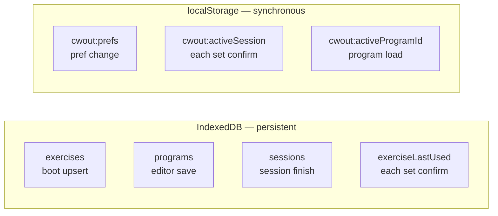
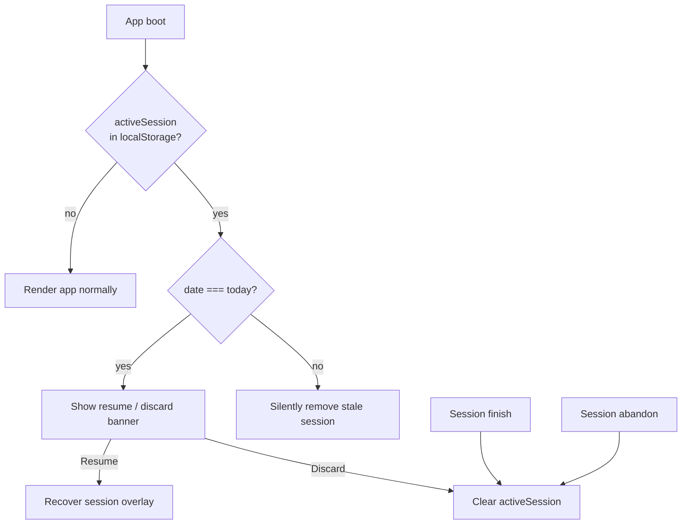

# Offline Strategy

Offline-first is a hard constraint — see [Design Principles](../vision/principles.md). This document covers what's **implemented today** and what's **planned**.

---

## Rule

**All writes happen immediately to local storage. There is no "pending" state waiting on a network round-trip.**

The app must be fully functional from the moment it launches, regardless of network state.

---

## Storage Map (Implemented)

| Store | Technology | Written When |
|-------|-----------|-------------|
| `exercises` | IndexedDB | On boot (upsert built-ins) + workout editor |
| `programs` | IndexedDB | On workout save in editor |
| `sessions` | IndexedDB | On session finish |
| `exerciseLastUsed` | IndexedDB | On each set confirm |
| `cwout:prefs` | localStorage | On every preference change |
| `cwout:activeSession` | localStorage | On every set confirm (crash recovery) |
| `cwout:activeProgramId` | localStorage | On program load (auto-select first) |

---

## App Shell Caching — Planned

A service worker will cache static assets on first load:

- `index.html`, JS bundles, CSS, fonts, icons

**Status: not built.** The app currently relies on normal browser HTTP caching after first load. This is sufficient for development but not for installable PWA offline launch.

**Target strategy:** Cache-first for all app shell assets.

---

## Crash Recovery (Implemented)

In-progress sessions are written to `localStorage:cwout:activeSession` on every set confirmation.

Implemented in `sessionStore.checkForRecovery()` and the recovery banner in `+layout.svelte`.

---

## Data Integrity (Implemented)

- `SessionLog` is finalized on session finish — in-progress state lives only in `activeSession`
- `exerciseLastUsed` is written per-set, always reflects the most recent log
- Completed sets within an active session survive browser close via localStorage

---

## What Happens When Back Online

Nothing special. No sync to trigger. Network awareness will only matter for service worker cache refresh (when built).

---

## PWA Install — Planned

Service worker + web app manifest will enable "Add to Home Screen." `app.html` already includes mobile-web-app meta tags, but there is no manifest or service worker file yet.

---

## Related

- [Data Model](data-model.md) — What's being stored
- [Tech Stack](tech-stack.md) — IndexedDB wrapper, planned Workbox
- [State Management](../implementation/state.md) — Store write paths
- [Design Principles](../vision/principles.md) — Why offline is non-negotiable
