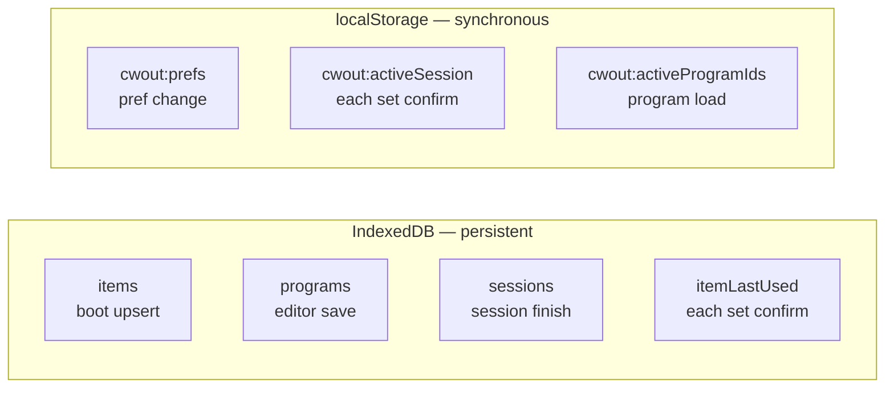
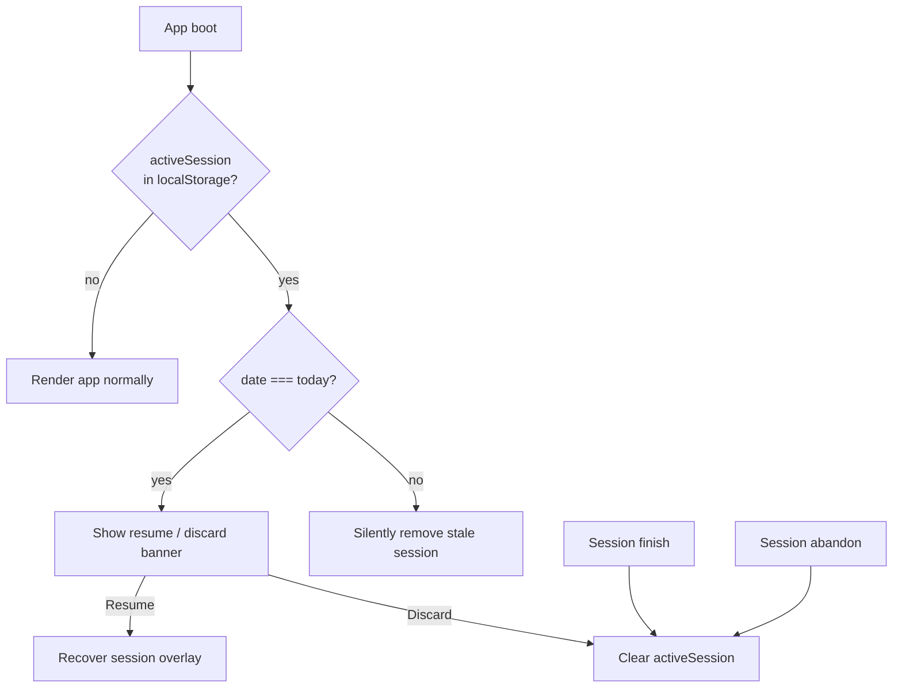

# Offline Strategy

Offline-first is a hard constraint — see [Design Principles](../vision/principles.md). This document covers what's **implemented today** and what's **planned**.

---

## Rule

**All writes happen immediately to local storage. There is no "pending" state waiting on a network round-trip.**

The app must be fully functional from the moment it launches, regardless of network state.

---

## Storage Map (Implemented)

| Store                    | Technology   | Written When                                |
| ------------------------ | ------------ | ------------------------------------------- |
| `items`                  | IndexedDB    | On boot (upsert built-ins) + routine editor |
| `programs`               | IndexedDB    | On routine save in editor                   |
| `sessions`               | IndexedDB    | On session finish                           |
| `itemLastUsed`           | IndexedDB    | On each set confirm                         |
| `cwout:prefs`            | localStorage | On every preference change                  |
| `cwout:activeSession`    | localStorage | On every set confirm (crash recovery)       |
| `cwout:activeProgramIds` | localStorage | On program load (per Discipline)            |

---

## App Shell Caching — Implemented

A service worker ([`src/service-worker.ts`](../../src/service-worker.ts)) precaches the app shell on `install` and serves it offline.

- **Precached** (`$service-worker` `build` + `files` + `/`): JS bundles, CSS, fonts, icons, manifest, static assets, and the SPA HTML shell. Served **cache-first** — these assets are immutable per build.
- **SPA navigations** (any other route): **network-first**, falling back to the precached shell when offline so deep links still boot.
- **Cross-origin** requests are passed straight to the network — never cached.
- **Versioning:** the cache name embeds the build `version`, so each deploy installs a fresh SW, precaches the new shell, and deletes stale caches on `activate`.

The build emits a single SPA fallback (`adapter-static` with `fallback: 'index.html'`, since `ssr=false`/`prerender=false`), which is what the SW serves for offline navigations.

---

## Crash Recovery (Implemented)

In-progress sessions are written to `localStorage:cwout:activeSession` on every set confirmation.

Implemented in `sessionStore.checkForRecovery()` and the recovery banner in `+layout.svelte`.

---

## Data Integrity (Implemented)

- `SessionLog` is finalized on session finish — in-progress state lives only in `activeSession`
- `itemLastUsed` is written per-set, always reflects the most recent log
- Completed sets within an active session survive browser close via localStorage

---

## What Happens When Back Online

Nothing special. No sync to trigger. Network awareness will only matter for service worker cache refresh (when built).

---

## PWA Install — Implemented

"Add to Home Screen" / installable PWA is wired up:

- **Manifest:** [`static/manifest.webmanifest`](../../static/manifest.webmanifest) — `standalone` display, `#101010` theme/background, fitness categories.
- **Icons:** [`static/icon.svg`](../../static/icon.svg) is the master (cosmic dumbbell emblem); `icon-192.png` / `icon-512.png` (purpose `any maskable`) and `apple-touch-icon.png` (180px, required by iOS) are rasterized from it. Regenerate the PNGs from the SVG with a one-off `sharp` script if the logo changes.
- **Meta:** [`src/app.html`](../../src/app.html) links the manifest, icons, and apple-touch-icon alongside the existing mobile-web-app meta tags.

**Notes:** install + service worker require a secure context — works on `localhost` and any HTTPS host, but **not** over plain `http://` LAN (`npm run dev --host`). iOS never shows an install prompt; it's always manual _Share → Add to Home Screen_.

---

## Related

- [Data Model](data-model.md) — What's being stored
- [Tech Stack](tech-stack.md) — IndexedDB wrapper, planned Workbox
- [State Management](../implementation/state.md) — Store write paths
- [Design Principles](../vision/principles.md) — Why offline is non-negotiable
