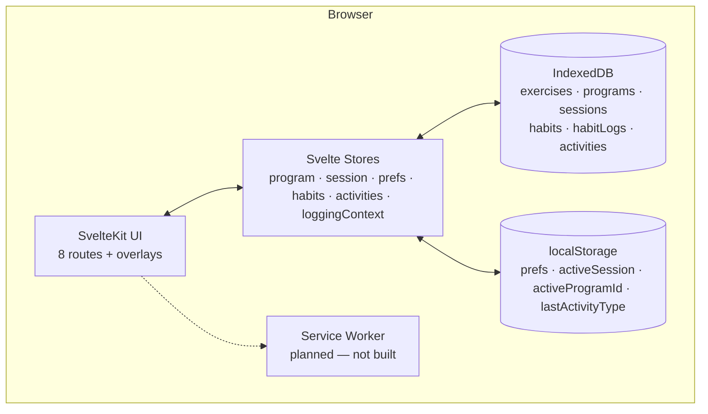
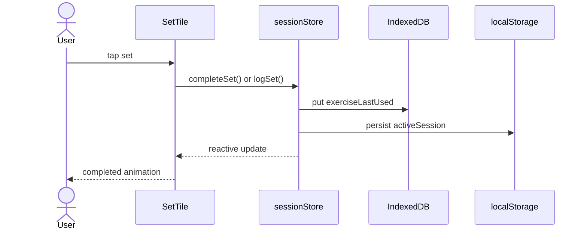
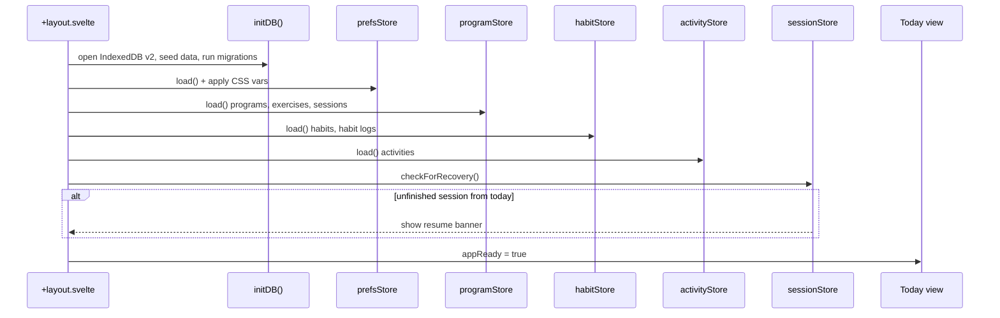
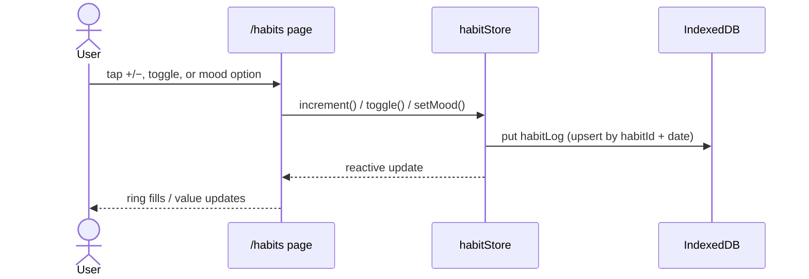
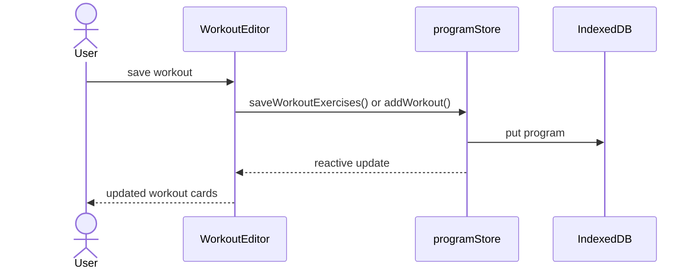
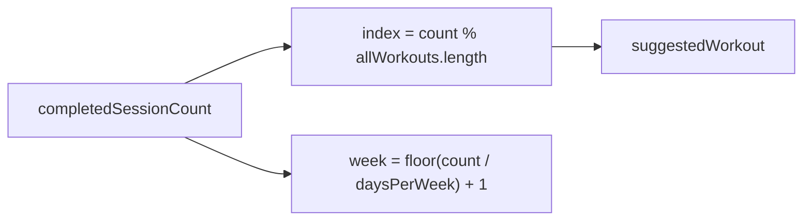

# System Overview

CosmicWorkOut is a **client-only** SvelteKit web app. No backend, no API, no auth. All data lives on the user's device.

---

## High-Level Architecture

After the first page load the app runs entirely in the browser. A service worker for offline shell caching is **planned but not yet implemented** — see [Offline Strategy](offline-strategy.md).

---

## Layers

### UI Layer — Svelte 5 + SvelteKit

Eight routes: **Today** (`/`), **Habits** (`/habits`), **Workout** (`/workout`), **Activity Log** (`/log`), **Program** (`/program`), **Calendar** (`/calendar`), **Settings** (`/settings`), plus global overlays (active session, completion screen, crash recovery) in the root layout.

The UI reads and writes through six Svelte stores — no REST, no server state.

See [App Structure](../implementation/app-structure.md) and [Tech Stack](tech-stack.md).

### Data Layer — IndexedDB + localStorage

Persistent data in IndexedDB (version 2) via a thin Promise wrapper (`src/lib/db/database.ts`). Preferences, in-progress sessions, and last-used activity type in localStorage for synchronous access.

See [Data Model](data-model.md) and [State Management](../implementation/state.md).

### Service Worker — Planned

Not built yet. When added, it will cache the app shell for offline launch and PWA install. Core functionality already works offline after first load in a normal browser tab.

---

## Data Flow

### Logging a set

### Starting the app

### Logging a habit

### Editing a program

---

## Program Progression

Today's workout is **not calendar-based**. The app advances linearly through the program:

`completedSessionCount` = number of finished sessions for the active program. Week number is derived from session count ÷ days per week.

See [Program Progression](../implementation/program-progression.md).

---

## What Does Not Exist (By Design)

- **No backend API** — v1 is local-only
- **No authentication** — single-user per device
- **No cloud sync** — data stays on device
- **No analytics or telemetry**

---

## Related

- [How It Works](../implementation/behavior.md) — Mental model for the whole app
- [Data Model](data-model.md) — What gets stored
- [Tech Stack](tech-stack.md) — SvelteKit, IndexedDB, CSS tokens
- [Offline Strategy](offline-strategy.md) — What's built vs planned
- [Implementation Status](../implementation/status.md) — Feature checklist
- [North Star](../vision/north-star.md) — Why this architecture
