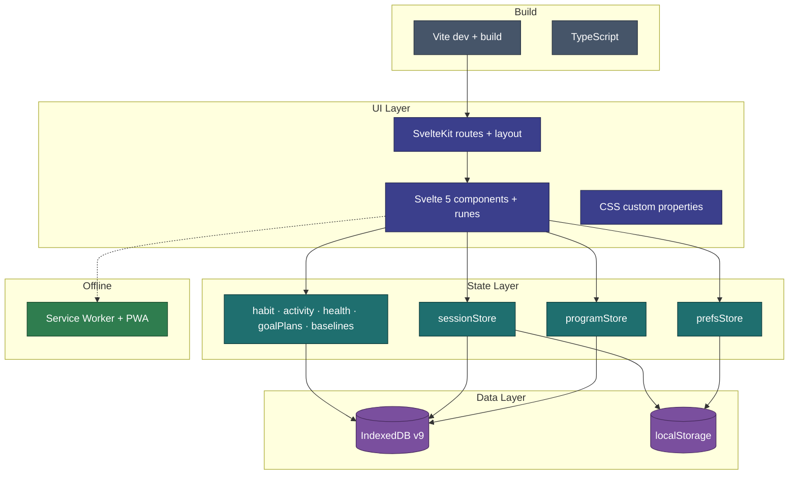

# Tech Stack

Technology choices for CosmicWorkOut. All choices prioritize web-native approaches.



---

## UI Framework — Svelte 5 + SvelteKit

**Svelte 5** with runes (`$state`, `$derived`, `$effect`) for reactive state. **SvelteKit** for routing, layout, and build tooling.

File-based routes plus a root layout that owns global overlays (session, completion, recovery banner). SSR is disabled (`ssr = false`) — the app is fully client-rendered. See [App Structure](../implementation/app-structure.md) for the full route list.

```typescript
// src/routes/+layout.ts
export const ssr = false;
```

**Why Svelte:** Component-heavy UI (set tiles, bottom sheets, overlays) with minimal boilerplate. Svelte 5 runes give fine-grained reactivity without a virtual DOM.

---

## Build Tool — Vite

Fast dev server on port **5678** (`npm run dev`). Vite + `@sveltejs/vite-plugin-svelte` with runes mode enabled project-wide.

---

## Language — TypeScript

All application code in TypeScript. Types live in `src/lib/db/types.ts` and mirror IndexedDB records. See [Data Model](data-model.md).

---

## Styling — CSS Custom Properties + Scoped Svelte CSS

Design tokens in `src/app.css` as CSS custom properties (colors, spacing, radius, timing, fonts). Component styles are scoped `<style>` blocks in each `.svelte` file.

Runtime theming via `data-density` and `data-roundness` attributes on `<html>`, plus `--color-accent` set by the prefs store.

Reference tokens also exist in the [inspiration package](../_inspiration/packet/tokens.css).

**No CSS-in-JS** — keeps the bundle lean.

---

## Data Persistence — IndexedDB (raw API)

All session and program data in IndexedDB. A thin Promise wrapper in `src/lib/db/database.ts` — **not Dexie.js**.

```typescript
// DB name: 'cosmic-workout', version 9
// Stores: items, programs, sessions (indexed by date), itemLastUsed,
//         activities, habits, habitLogs, healthReadings, goalPlans
// Planned on same v9: baselines, baselineLogs
```

Built-in items and programs are upserted on every boot (so new fields land on old records). Habits seed only on first run. Schema upgrades are **non-destructive** — `onupgradeneeded` creates only missing stores/indexes and never drops existing data. See [Data Model — IndexedDB stores](data-model.md#indexeddb-stores).

---

## State Management — Svelte Stores

Class-based stores using Svelte 5 runes. The core ones:

| Store            | File                       | Responsibility                              |
| ---------------- | -------------------------- | ------------------------------------------- |
| `programStore`   | `program.svelte.ts`        | Programs, items, sessions, today's routine  |
| `sessionStore`   | `session.svelte.ts`        | Active session, set logging, finish/abandon |
| `prefsStore`     | `prefs.svelte.ts`          | User preferences, accent color, density     |
| `habitStore`     | `habits.svelte.ts`         | Habit definitions, daily logs, mood         |
| `activityStore`  | `activities.svelte.ts`     | Quick-log activity entries                  |
| `healthStore`    | `health.svelte.ts`         | Weight + blood pressure readings (US-029)   |
| `goalPlanStore`  | `goalPlans.svelte.ts`      | Lift plans / goal progression plans (US-033) |
| `baselineStore`  | _(planned)_                | Baselines + logs (US-034 / US-035)           |
| `loggingContext` | `loggingContext.svelte.ts` | Global selected/logging date                |
| `toastStore`     | `toast.svelte.ts`          | Transient error/info notifications          |

See [State Management](../implementation/state.md) for the complete list and data flow.

---

## Offline / PWA — Implemented

Installable PWA via SvelteKit's **built-in service worker** (`src/service-worker.ts` using the `$service-worker` module) plus a web app manifest — **no Workbox**, to keep the dependency surface minimal. The SW precaches the app shell (cache-first) and serves a cached fallback for offline navigations. The build uses `@sveltejs/adapter-static` with an `index.html` SPA fallback.

See [Offline Strategy](offline-strategy.md) for the caching and install details.

---

## Charts — Chart.js

Insights charts render with **Chart.js** (`chart.js`), the app's only runtime UI dependency beyond fonts. Chart config helpers live in `src/lib/chart-utils.ts`; each chart is a component under `src/lib/components/insights/`. See [Insights Hub](../features/v1.5.0/README.md).

---

## Key dependency versions

Pinned in `package.json` (kept here as a snapshot; `package.json` is authoritative):

| Package                      | Version |
| ---------------------------- | ------- |
| `svelte`                     | 5.56.1  |
| `@sveltejs/kit`              | 2.63.0  |
| `@sveltejs/adapter-static`   | 3.0.10  |
| `vite`                       | 8.0.16  |
| `typescript`                 | 6.0.3   |
| `chart.js`                   | 4.5.1   |

---

## Animations

CSS keyframes + transitions. Key properties:

- `transform` and `opacity` only
- `--ease-spring: cubic-bezier(0.34, 1.56, 0.64, 1)` for spring feel
- `prefers-reduced-motion` respected in component styles

---

## Haptics

`navigator.vibrate()` on set completion and exercise completion. Wrapped in `try/catch` — silent failure on unsupported devices.

---

## Fonts

Self-hosted via `@fontsource/*` packages, imported in `src/app.css` (no external CDN request):

- **Space Grotesk** (`@fontsource/space-grotesk`) — display headings
- **Inter** (`@fontsource/inter`) — body text
- **JetBrains Mono** (`@fontsource/jetbrains-mono`) — numbers (weight, reps)

---

## No Backend (By Design)

No server, database backend, API, or auth. See [System Overview](overview.md).

---

## Related

- [System Overview](overview.md) — How pieces fit together
- [Data Model](data-model.md) — IndexedDB stores
- [Offline Strategy](offline-strategy.md) — Caching strategy
- [Dev Guide](../implementation/dev-guide.md) — Running locally
