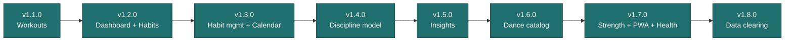

# Features

The historical record of what shipped, release by release. Each version folder holds a `README.md` (the release summary) and the individual user stories (`US-0NN-*.md`) that made it up. This is the **what and when** — for the current built-vs-deferred picture, see [Implementation Status](../implementation/status.md); for terminology, see the [Glossary](../glossary.md).

New stories follow the [User Story Standards](../standards/user-story-standards.md).

---

## Releases

| Version | Theme                                       | Stories            |
| ------- | ------------------------------------------- | ------------------ |
| [v1.1.0](v1.1.0/README.md) | Core workout flows             | US-001 – US-006    |
| [v1.2.0](v1.2.0/README.md) | Daily dashboard & habits       | US-007, 008, 011   |
| [v1.3.0](v1.3.0/README.md) | Habit management & calendar history | US-009, 010, 013 |
| [v1.4.0](v1.4.0/README.md) | Belly dance & the Discipline model | US-015 – US-021 |
| [v1.5.0](v1.5.0/README.md) | Insights hub                   | US-022 – US-027    |
| [v1.6.0](v1.6.0/README.md) | Belly dance catalog & course programs | Backfilled (no per-story files) |
| [v1.7.0](v1.7.0/README.md) | Full strength catalog, PWA, health & backup | US-028 – US-031 |
| [v1.8.0](v1.8.0/README.md) | Granular data clearing         | US-032             |

---

## Notes

- **v1.6.0 and v1.7.0 READMEs are backfilled** — reconstructed from git history and code after the fact, not original design records. They are clearly marked as such.
- The **Journal** page (US-012 / US-014) shipped in v1.3.0 and was later removed; it is recorded as **Removed** in [Implementation Status](../implementation/status.md) and is not on the roadmap unless feedback brings it back.

---

## Related

- [Implementation Status](../implementation/status.md) — Current built-vs-deferred checklist
- [Roadmap](../roadmap/README.md) — Deferred and future work
- [User Story Standards](../standards/user-story-standards.md) — How stories are written
