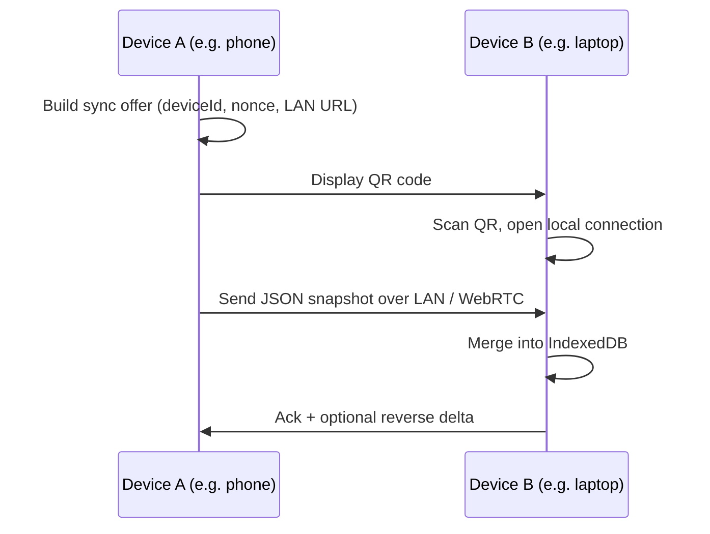
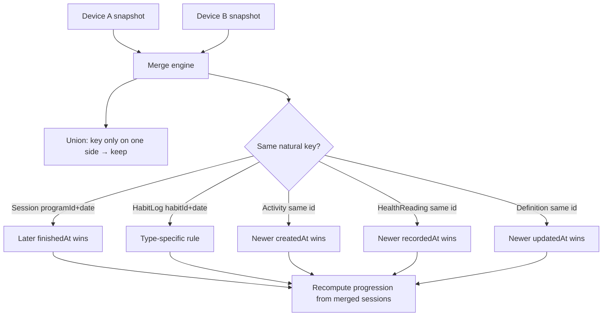

# US-028 — Data Export, Backup & Device Sync

> **Status: 🟡 Phase 1 shipped — v1.7.0** (Phase 2 device sync still planned)
>
> Offline-first data portability. Phase 1 is JSON file export/import; Phase 2 adds QR-paired device-to-device sync with merge rules. No cloud accounts, no backend.
>
> **As built (Phase 1):** `src/lib/db/backup.ts` provides `exportBackup()` / `downloadBackup()` / `parseBackup()` / `importBackup()` over a versioned `cosmic-workout-backup` v1 envelope; `putAllRecords` and `itemLastUsed.getAll` were exposed from `database.ts`. Export/Restore live on `settings/data` — restore is **Replace-only**, validates `format`/`version`, confirms via dialog, then wipes + writes + re-seeds built-ins + reloads. Parse/validation errors surface as toasts and leave data untouched. Phase 2 (QR/LAN sync + merge engine) is unbuilt.

As a **fitness user**, I want to back up my workout history and move it between devices
so that I do not lose data when switching phones, clearing browser storage, or using the app on both phone and computer.

---

## Design North Star

> "Your data is yours — take it with you."

The app is client-only ([Design Principles](../../vision/principles.md)). Backup and sync must work **entirely on-device**: file download, file picker, and optional local peer transfer. No online services.

---

## What Gets Backed Up

| Store                    | Technology   | Include in backup? | Notes                                                         |
| ------------------------ | ------------ | ------------------ | ------------------------------------------------------------- |
| `items`                  | IndexedDB    | Yes                | User-created / user-edited; built-ins re-seed on boot         |
| `programs`               | IndexedDB    | Yes                | Same                                                          |
| `sessions`               | IndexedDB    | Yes                | Core history                                                  |
| `itemLastUsed`           | IndexedDB    | Yes                | Weight/rep memory                                             |
| `activities`             | IndexedDB    | Yes                | Activity log                                                  |
| `habits`                 | IndexedDB    | Yes                | Custom habits + edits to built-ins                            |
| `habitLogs`              | IndexedDB    | Yes                | Habit history                                                 |
| `healthReadings`         | IndexedDB    | Yes                | Health metric readings ([US-029](./US-029-health-metrics.md)) |
| `cwout:prefs`            | localStorage | Optional           | User may choose to include preferences                        |
| `cwout:activeProgramIds` | localStorage | Yes                | Per-Discipline active program                                 |
| `cwout:lastActivityType` | localStorage | Yes                | Last-used activity type                                       |
| `cwout:activeSession`    | localStorage | **No**             | Transient crash-recovery state                                |
| `cwout:habitDay`         | localStorage | **No**             | Ephemeral UI cache                                            |

Built-in items, programs, and habits ship in code (`src/lib/db/seed.ts`) and are upserted on every boot via `initDB()`. A backup may include built-in records for a complete snapshot, but restore does not depend on them.

---

## Backup File Format

Versioned JSON envelope — one file, human-readable, diffable in git if the user wants.

```json
{
	"format": "cosmic-workout-backup",
	"version": 1,
	"exportedAt": "2026-06-23T12:00:00.000Z",
	"db": {
		"items": [],
		"programs": [],
		"sessions": [],
		"itemLastUsed": [],
		"activities": [],
		"habits": [],
		"habitLogs": [],
		"healthReadings": []
	},
	"localStorage": {
		"cwout:prefs": {},
		"cwout:activeProgramIds": {},
		"cwout:lastActivityType": "walk"
	}
}
```

- **`version`** — schema version for forward-compatible import migrations.
- **`exportedAt`** — ISO timestamp; used in merge (Phase 2) when record-level timestamps are absent.
- Reject imports where `format` is missing or `version` is newer than the app supports.

---

## Phase 1 — JSON File Export & Restore

Simplest path. Lives on **Settings → Data & backup** (`/settings/data` — [US-030](./US-030-settings-restructure.md)).

### Export

1. Read all IndexedDB stores listed above.
2. Read selected localStorage keys.
3. Build envelope → `Blob` → trigger browser download.
4. Filename pattern: `cosmic-workout-backup-YYYY-MM-DD.json`.

### Restore

1. Hidden `<input type="file" accept=".json,application/json">`.
2. Parse and validate envelope.
3. Show confirm dialog — restore **replaces** all workout data on this device.
4. Clear IndexedDB (`clearWorkoutData()`), write imported records, write localStorage keys, call `initDB()` to re-upsert built-ins, reload.

**Restore modes for v1:**

| Mode                  | Behavior                                                                    |
| --------------------- | --------------------------------------------------------------------------- |
| **Replace** (default) | Wipe local workout data, import file wholesale. Simplest and safest for v1. |

Merge-on-import is deferred to Phase 2 (device sync). A one-time file restore is intentionally all-or-nothing.

### Requirements (Phase 1)

1. Export
   a. `/settings/data` shall expose an **Export backup** action that downloads a JSON file.
   b. Export shall include all IndexedDB stores in the table above except transient keys.
   c. Export shall succeed offline with no network calls.

2. Restore
   a. `/settings/data` shall expose a **Restore from backup** action that opens a file picker.
   b. Restore shall validate `format` and `version` before writing anything.
   c. Restore shall require explicit confirmation; the dialog shall state that existing workout data will be replaced.
   d. On success, the app shall reload so stores reflect imported data.
   e. On parse or validation failure, the app shall show an error and leave existing data untouched.

3. Preferences
   a. Export shall include `cwout:prefs` by default.
   b. Restore shall overwrite prefs when the backup includes them.

### Acceptance Criteria (Phase 1)

1. Given the user has session history, when they tap Export backup, then a `.json` file downloads containing their sessions.
2. Given a valid backup file, when the user restores on a fresh install, then sessions, programs, habits, and activities match the export.
3. Given a corrupt or unknown-format file, when the user attempts restore, then an error is shown and no data is lost.
4. Given the app is offline, when the user exports or restores, then both operations complete without network access.

### Implementation Notes

- New module: `src/lib/db/backup.ts` with `exportBackup()` and `importBackup(file)`.
- Reuse `db.*.getAll()`, `putAllRecords()`, and `clearWorkoutData()` from `database.ts`.
- UI: export / restore on `/settings/data` ([US-030](./US-030-settings-restructure.md)); not on the hub.

---

## Phase 2 — Device-to-Device Sync (QR + Local Transfer)

Ongoing sync between phone and computer (or two phones) without cloud services.

### Why QR alone is not enough

A single QR code holds roughly **2–4 KB**. Months of session history is often **tens to hundreds of KB**. QR is the **pairing handshake**, not the data pipe.



### Sync flow (both directions)

1. **Device A:** Settings → **Data & backup** → **Sync with another device** → shows QR (pairing payload + local endpoint).
2. **Device B:** Settings → **Data & backup** → **Sync from device** → camera scans QR → connects on same Wi‑Fi (or WebRTC).
3. **Device A** sends a snapshot (same envelope as Phase 1, plus sync metadata).
4. **Device B** runs the merge engine, shows a summary, reloads.
5. Reverse sync uses the same flow with roles swapped.

**Constraints:**

- Requires secure context (HTTPS or `localhost`) — same as PWA install.
- Same Wi‑Fi is the expected happy path; WebRTC is a fallback for direct peer transfer.
- No cloud relay, no accounts.

### Sync metadata (appended to envelope)

```json
{
	"sync": {
		"deviceId": "abc123",
		"lastSyncAt": "2026-06-23T10:00:00.000Z"
	}
}
```

Future syncs may send only records changed since `lastSyncAt` to keep payloads small.

### Optional: Web Share API

On supported mobile browsers, after building the export blob, offer **Share** (`navigator.share({ files })`) so the user can save to Files or AirDrop without hunting Downloads. Falls back to download where Share is unavailable. Still fully offline.

---

## Merge Rules (Phase 2)

"Same date" is not one rule — each entity has a **natural key**. The merge engine unions non-overlapping records and applies conflict rules when keys collide.

### Entity summary

| Entity                     | Natural key                              | Multiple per day?                                                   | Conflict rule                                                 |
| -------------------------- | ---------------------------------------- | ------------------------------------------------------------------- | ------------------------------------------------------------- |
| **Session**                | `programId` + `date`                     | No — one per program per day                                        | See below                                                     |
| **HabitLog**               | `habitId` + `date` (id = `habitId:date`) | No                                                                  | See below                                                     |
| **ActivityLog**            | `id`                                     | Yes — many per day                                                  | Union by `id`; same id → newer `createdAt`                    |
| **HealthReading**          | `id`                                     | Yes — many per day (BP); weight upserts one per `metricId` + `date` | Union by `id`; same id → newer `recordedAt`                   |
| **Item / Program / Habit** | `id`                                     | N/A                                                                 | Last-write-wins by `updatedAt` (add field when building sync) |
| **ItemLastUsed**           | `itemId`                                 | N/A                                                                 | Value from the newer session that touched the item            |
| **Prefs**                  | singleton                                | One blob                                                            | Receiving device keeps its prefs unless user opts in          |
| **activeProgramIds**       | per `disciplineId`                       | One per Discipline                                                  | Merge per discipline key                                      |

Strength and belly dance sessions on the **same calendar date** are **not** a conflict — different `programId` / `disciplineId`.

### Sessions (critical)

Both devices logged a workout for the **same program on the same date** → only one can survive (app invariant: `sessionForProgramDate`).

**Default policy (v1 sync):**

1. Keep the session with the **later `finishedAt`** timestamp.
2. On tie → keep the session with **more `totalSets`** (more complete).
3. If still tied → flag for user resolution (Phase 2b).

After merge, program progression (`completedSessionCount`) must be recomputed from the merged session list — never duplicate-count the same `programId` + `date`.

### Habit logs

Same `habitId` + `date` → one slot.

| Habit type              | Rule                                                        |
| ----------------------- | ----------------------------------------------------------- |
| Counter (water, coffee) | **Max `value`** — avoids double-counting offline increments |
| Minutes / words         | **Max `value`** or newer import timestamp                   |
| Mood (1–5)              | **Newer wins** — point-in-time choice                       |
| Checkbox                | `value > 0` wins, or newer                                  |

### Post-sync summary

Show a brief report: e.g. _"3 new sessions added, 1 session updated, 2 habit conflicts resolved, 5 new activities."_

### Conflict UI (Phase 2b — optional)

Silent auto-merge for v1 sync. Later: surface conflicts only when both sides edited the **same natural key** and tie-breakers fail — e.g. "Mon Jun 23 — Phone vs Laptop" with a one-tap pick.



---

## Out of Scope

| Item                                   | Notes                                                                  |
| -------------------------------------- | ---------------------------------------------------------------------- |
| Cloud sync (iCloud, Dropbox, Firebase) | Violates client-only constraint                                        |
| User accounts / auth                   | No backend                                                             |
| CSV export as backup                   | Cannot round-trip; optional analytics export is a separate story       |
| QR-only full backup (no LAN)           | Impractical at real data sizes; chunked QR sequences are a last resort |
| Automatic background sync              | Manual export/sync only for v1                                         |
| File System Access API auto-backup     | Extra permissions; defer                                               |

---

## Key Decisions

- **Phase 1 before Phase 2.** File export/import delivers 80% of the value with minimal complexity (~100–150 LOC + Settings UI).
- **Replace on file restore; merge on device sync.** One-time restore is all-or-nothing; ongoing sync needs merge rules.
- **QR is pairing, not payload.** Data transfers over LAN or WebRTC after scan.
- **Session conflicts use `finishedAt`, not import order.** Progression correctness depends on getting sessions right.
- **Habit log ids are deterministic** (`habitId:date`) — merge is straightforward.
- **Skip `activeSession` on export.** Crash-recovery state must not leak across devices.

---

## Related Docs

- [v1.7.0 README](./README.md)
- [Offline Strategy](../../architecture/offline-strategy.md) — Storage map
- [Data Model](../../architecture/data-model.md) — Entities and stores
- [Program Progression](../../implementation/program-progression.md) — Why session merge must not duplicate `programId` + `date`
- [Settings & Preferences](../../requirements/settings-preferences.md)
- [US-029 — Health Metrics](./US-029-health-metrics.md)
- [US-030 — Settings Hub Restructure](./US-030-settings-restructure.md)
