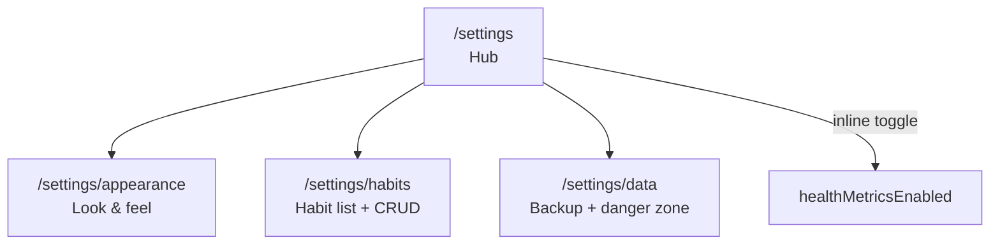

[Wiki](../../README.md) › [Features](../README.md) › [v1.7.0](README.md) › US-030

# US-030 — Settings Hub Restructure

> **Status: Shipped — v1.7.0**
>
> Replace the long single-page Settings scroll with a compact **hub** and focused **sub-routes**. Makes room for [US-028](./US-028-data-export-backup.md) (backup) and [US-029](./US-029-health-metrics.md) (health toggle) without more scroll fatigue.
>
> **As built:** Hub at `/settings` uses new `SettingsGroup` / `SettingsRow` / `SettingsToggleRow` components plus a shared `SettingsSubHeader` for back navigation. Sub-routes `settings/habits` and `settings/data`. Habits shows active count; Health metrics is an inline toggle on the hub. `BottomNav` already matched `/settings*`, so no nav change was needed.
>
> **Post-ship simplification:** The **Appearance** sub-route was removed (single-user app). Accent color, weight unit, density, and roundness now stay at their fixed defaults (lime accent, `lb`, comfortable, default) — `prefsStore` still applies them on boot but exposes no UI. The "Reset preferences" action was dropped with it (it only reset those appearance prefs). Orphaned `AccentColorPicker` and `SegmentedControl` components were deleted.

As a **user**, I want Settings to be easy to scan and navigate
so that I can find appearance options, habit management, and data actions without scrolling through one long page.

---

## Design North Star

> "A short menu, not a manual."

Settings is a **launcher**, not a dump of every control. Simple toggles that stand alone stay on the hub; multi-control screens and long lists get their own route.

---

## Problem

Today's `/settings` is one scrolling page with:

| Block                                   | Issue                                                 |
| --------------------------------------- | ----------------------------------------------------- |
| Accent, weight unit, density, roundness | Four separate sections — related but spread out       |
| Habits                                  | Full drag-reorder list + CRUD — dominates page height |
| Data                                    | Three actions with long explanatory copy              |

Adding **health metrics toggle** (US-029) and **export / restore** (US-028) on the same page would push it further past useful length.

---

## Solution — Hub + Sub-routes



### `/settings` — Hub (new default)

A single-column list of **rows**, grouped under short section headers. No segmented controls on this page.

| Section         | Row            | Behavior                                                                                                        |
| --------------- | -------------- | --------------------------------------------------------------------------------------------------------------- |
| **Look & feel** | Appearance     | Navigate → `/settings/appearance`. Trailing preview: current accent swatch + density label (e.g. "Comfortable") |
| **Tracking**    | Habits         | Navigate → `/settings/habits`. Trailing: active count (e.g. "6 active")                                         |
| **Tracking**    | Health metrics | **Inline toggle** (`healthMetricsEnabled`, US-029). One line + short subtitle; no sub-route                     |
| **Data**        | Data & backup  | Navigate → `/settings/data`                                                                                     |

Hub fits on one screen on typical phones without scrolling (or one short scroll).

### `/settings/appearance`

All visual / unit preferences in one place:

- Accent color (`AccentColorPicker`)
- Weight unit (`SegmentedControl` — lifting + body weight per US-029)
- Density
- Roundness

Use `PageHeader` with back affordance → `/settings`. Changes still apply instantly via `prefsStore`.

### `/settings/habits`

Move the **entire existing Habits block** from the current settings page here unchanged in behavior:

- Add / edit / delete / reorder / active toggle
- `HabitRow`, `HabitForm`, drag-and-drop

Use `PageHeader` title **Habits** with back → `/settings`. This is the same surface described in [US-009](../v1.3.0/US-009-habit-creation.md); only the **route** changes.

### `/settings/data`

Constructive actions first, destructive last:

| Order | Action              | Notes                                                                               |
| ----- | ------------------- | ----------------------------------------------------------------------------------- |
| 1     | Export backup       | US-028 Phase 1                                                                      |
| 2     | Restore from backup | US-028 Phase 1                                                                      |
| 3     | Reset preferences   | Secondary button; keeps workout data                                                |
| 4     | Clear workout data  | Danger; existing confirm dialog                                                     |
| 5     | Load debug data     | **Advanced** — visually de-emphasized (smaller type, bottom of page). Dev/demo only |

Copy on this page can stay longer than the hub; users opt in by navigating here.

---

## Key Decisions

| Topic               | Decision                                                                   |
| ------------------- | -------------------------------------------------------------------------- |
| **Hub vs scroll**   | Hub list on `/settings`; detail on sub-routes                              |
| **Habits**          | Own route — biggest length win                                             |
| **Health toggle**   | Stays on hub (single boolean, US-029)                                      |
| **Backup**          | Lives on `/settings/data`, not hub                                         |
| **Instant apply**   | No Save button anywhere — unchanged                                        |
| **Bottom nav**      | Settings tab still highlights for all `/settings/*` routes                 |
| **Back navigation** | Sub-pages use `PageHeader` back → hub (same pattern as `/workout`, `/log`) |
| **URL structure**   | Flat siblings under `settings/` — no nested depth beyond one level         |

---

## New / Shared Components

| Component           | Purpose                                                                              |
| ------------------- | ------------------------------------------------------------------------------------ |
| `SettingsRow`       | Tappable navigable row: `label`, optional `detail`, optional `preview` slot, chevron |
| `SettingsToggleRow` | `label`, optional `description`, `checked`, `onchange` — for hub toggles             |
| `SettingsGroup`     | Section header + vertical list of rows (spacing, divider)                            |

Extract from `settings/+page.svelte` during implementation; keep styles consistent with existing `settings-section` tokens.

---

## File Layout

```
src/routes/settings/
  +page.svelte              ← hub
  appearance/+page.svelte
  habits/+page.svelte
  data/+page.svelte
```

Optional: `settings/+layout.svelte` only if shared wrapper is needed (e.g. max-width). Not required for v1.

---

## Requirements

### 1. Hub

a. `/settings` shall render grouped navigation rows, not full preference controls (except health toggle).
b. Tapping **Appearance**, **Habits**, or **Data & backup** shall navigate to the corresponding sub-route.
c. The bottom nav **Settings** tab shall remain active for any path under `/settings`.
d. The hub shall fit without extensive scrolling on a standard phone viewport.

### 2. Appearance sub-route

a. `/settings/appearance` shall contain accent color, weight unit, density, and roundness.
b. A back control shall return to `/settings`.
c. All changes shall persist immediately to `cwout:prefs`.

### 3. Habits sub-route

a. `/settings/habits` shall provide the same habit CRUD and reorder behavior as today on Settings.
b. [US-009](../v1.3.0/US-009-habit-creation.md) acceptance criteria remain valid; only the path changes.

### 4. Data sub-route

a. `/settings/data` shall host clear workout data, reset preferences, and load debug data (existing behavior).
b. When US-028 ships, export and restore shall live here (not on the hub).
c. Destructive actions shall keep confirm dialogs.

### 5. Health metrics (US-029)

a. The hub shall show a **Health metrics** toggle when US-029 is implemented.
b. Toggle behavior per US-029 (hide UI, keep data).

### 6. Migration

a. No data migration — routing-only change.
b. Deep links to `/settings` continue to work (hub). No external links to sub-routes exist yet.

---

## Acceptance Criteria

1. Given the user opens Settings, when the hub renders, then appearance segmented controls are **not** on the same page as the habits list.
2. Given the user taps **Habits** on the hub, when `/settings/habits` loads, then they can add, reorder, and delete habits as before.
3. Given the user taps **Appearance**, when they change density, then the change applies app-wide immediately.
4. Given the user is on `/settings/data`, when they tap back, then they return to the hub.
5. Given the user is on `/settings/habits`, when the bottom nav renders, then Settings is still the active tab.
6. Given US-028 is shipped, when the user opens **Data & backup**, then export and restore are available without adding rows to the hub.

---

## Implementation Notes

| Step | Work                                                                               |
| ---- | ---------------------------------------------------------------------------------- |
| 1    | Add `SettingsRow`, `SettingsToggleRow`, `SettingsGroup`                            |
| 2    | Create hub `settings/+page.svelte` (replace current content)                       |
| 3    | Move appearance blocks → `settings/appearance/+page.svelte`                        |
| 4    | Move habits block → `settings/habits/+page.svelte`                                 |
| 5    | Move data block → `settings/data/+page.svelte`                                     |
| 6    | Update `BottomNav` active check: `pathname.startsWith('/settings')` if not already |
| 7    | Wire US-029 toggle on hub when implementing health metrics                         |
| 8    | Wire US-028 buttons on data page when implementing backup                          |

**Suggested order relative to other v1.7.0 work:** implement **US-030 first** (or in parallel with US-029/US-028) so new features land on the right surfaces.

---

## Out of Scope

| Item                                           | Notes                        |
| ---------------------------------------------- | ---------------------------- |
| Settings search                                | Unnecessary at current scale |
| Nested settings beyond one level               | Flat `settings/*` only       |
| Moving health metrics to its own settings page | Single toggle stays on hub   |
| Account / profile section                      | Client-only app              |

---

## Related Docs

- [v1.7.0 README](./README.md)
- [US-009 — Habit Creation & Management](../v1.3.0/US-009-habit-creation.md)
- [US-028 — Data Export, Backup & Device Sync](./US-028-data-export-backup.md)
- [US-029 — Health Metrics](./US-029-health-metrics.md)
- [Settings & Preferences](../../requirements/settings-preferences.md)
- [App Structure](../../implementation/app-structure.md)
