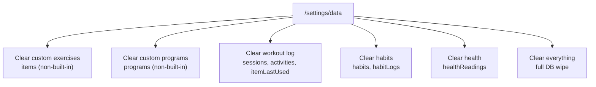

# US-032 — Granular Data Clearing

As a **user**, I want to clear each data section independently — custom exercises, custom programs, workout log, habits, and health readings —
so that I can, for example, wipe my workout history without losing my habit streaks, or reset my custom exercise catalog without losing my logged history.

---

## Design North Star

> "Clear what you mean, keep what you don't."

Today's "Clear workout data" button is all-or-nothing — it deletes the entire IndexedDB. Users tracking multiple disciplines (workouts, habits, health) shouldn't have to lose everything just to reset one.

---

## Problem

`resetWorkoutData()` (`src/lib/db/database.ts`) calls `deleteDatabase`, wiping every object store: `items`, `programs`, `sessions`, `itemLastUsed`, `activities`, `habits`, `habitLogs`, `healthReadings`. The [settings/data](../../../src/routes/settings/data/+page.svelte) page exposes exactly one "Clear workout data" button for this.

The object stores are already siloed by domain — nothing about the schema forces an all-or-nothing clear. It's a UI/API gap, not a data model gap.

---

## Solution

Workouts is not one bucket — it's three, matching how users actually think about the data: the exercises themselves, the programs built from them, and the log of what was actually done. Alongside Habits, Health, and a top-level "clear everything," that's six independently-clearable actions on `/settings/data`.

| Section              | Stores cleared                           | localStorage cleared                                                     | Built-ins restored on reload?                                 |
| -------------------- | ---------------------------------------- | ------------------------------------------------------------------------ | ------------------------------------------------------------- |
| **Custom exercises** | `items` (non-built-in only)              | —                                                                        | Yes — built-in items always remain / reseed via `initDB()`    |
| **Custom programs**  | `programs` (non-built-in only)           | —                                                                        | Yes — built-in programs always remain / reseed via `initDB()` |
| **Workout log**      | `sessions`, `activities`, `itemLastUsed` | `cwout:activeSession`, `cwout:activeProgramId`, `cwout:activeProgramIds` | N/A — no built-in log data                                    |
| **Habits**           | `habits`, `habitLogs`                    | —                                                                        | Yes — built-in habits reseed if the store is empty            |
| **Health**           | `healthReadings`                         | —                                                                        | No built-ins exist for health                                 |
| **Everything**       | All of the above                         | All of the above                                                         | Yes — same as today's full wipe                               |

Each section clears independently of the others. Notably:

- Clearing **Custom exercises** or **Custom programs** must never touch the **Workout log** — past sessions and activities are a historical record and stay exactly as logged, regardless of what happens to the exercise/program definitions that produced them.
- Clearing **Custom programs** must never touch **Custom exercises**, and vice versa.

### Referential integrity: exercises used in programs

A custom exercise can be referenced by one or more programs (built-in or custom). Deleting a single custom exercise already blocks if it's in use (see `isItemInUse` in [program.svelte.ts](../../../src/lib/stores/program.svelte.ts)). The bulk "Clear custom exercises" action takes the **opposite** approach: **warn, then allow.**

- Before clearing, the user is shown which of their custom exercises are currently used in one or more programs, and which programs those are.
- The user can proceed anyway. Cleared exercises leave a dangling `itemId` in any program that referenced them.
- This is already tolerated at runtime: building an active workout session silently skips a routine item whose `itemId` no longer resolves (`if (!item) continue;` in [session.svelte.ts](../../../src/lib/stores/session.svelte.ts)). The routine/program editor UI needs a "missing exercise" display state for the same case (currently unhandled there).

---

## Key Decisions

| Topic                           | Decision                                                                                                                                                                                                                               |
| ------------------------------- | -------------------------------------------------------------------------------------------------------------------------------------------------------------------------------------------------------------------------------------- |
| **Storage model**               | No schema change needed — object stores already map 1:1 to domains. Clearing uses per-store `IDBObjectStore.clear()` (or a filtered delete, for exercises/programs), not `deleteDatabase`.                                             |
| **Workouts split three ways**   | Custom exercises, custom programs, and workout log are three separate actions, not one "Workouts" bucket.                                                                                                                              |
| **Built-in vs custom**          | "Clear custom exercises" / "Clear custom programs" only remove records where `isBuiltIn` is false. Built-in content is never removable through this UI.                                                                                |
| **Log independence**            | Workout log (`sessions`, `activities`, `itemLastUsed`) is never affected by clearing exercises or programs, and clears independently of them too.                                                                                      |
| **Exercise-in-use handling**    | Bulk-clearing custom exercises used **warn-and-allow**, not the hard block used by single-exercise deletion. The user sees which programs are affected and can proceed; affected programs are left with a dangling exercise reference. |
| **"Everything" implementation** | Keeps the existing `deleteDatabase` + reload path (today's `clearWorkoutData`/`resetWorkoutData`, renamed) since it's simpler and equivalent in effect to clearing all sections at once.                                               |
| **Built-in reseed**             | Reload after any clear triggers `initDB()`, which reseeds built-in items/programs/habits exactly as it does today — no new reseed logic needed for the granular paths.                                                                 |
| **Confirm dialogs**             | Each section gets its own `ConfirmDialog`; the exercises dialog additionally lists affected programs when applicable.                                                                                                                  |

---

## Requirements

1. Per-section clearing
   a. The system shall provide independent actions to clear: Custom exercises, Custom programs, Workout log, Habits, and Health data.
   b. Clearing one section shall not remove or alter data belonging to any other section.
   c. Clearing Custom exercises and Clearing Custom programs shall not affect the Workout log in either direction.
   d. Clearing the Workout log shall also remove the in-progress session and active-program `localStorage` keys.
   e. "Clear custom exercises" and "Clear custom programs" shall only remove records where `isBuiltIn` is false; built-in content is never removed by these actions.
2. Exercise-in-use handling
   a. Before clearing custom exercises, the system shall check whether any of them are referenced by any program (built-in or custom).
   b. If any are in use, the confirmation shall list which exercises are affected and which programs reference them.
   c. The user shall be able to proceed with the clear despite the warning.
   d. After such a clear, any program that referenced a now-deleted exercise shall display that exercise as missing rather than erroring, both when building a workout session and when viewing/editing the program.
3. Clear everything
   a. The system shall provide a single action that clears all five sections at once.
   b. This action shall have its own confirmation, distinct from the per-section confirmations.
4. Built-in content
   a. After clearing Custom exercises, built-in exercises shall remain available (no reload required to see them, since built-ins are never removed).
   b. After clearing Custom programs, built-in programs shall remain available for the same reason.
   c. After clearing Habits, built-in habits shall be restored on the next load if the habit store is empty.
   d. Health has no built-in content to restore.
5. Confirmation & safety
   a. Each clear action (per-section and "everything") shall require explicit confirmation before executing.
   b. If a workout session is in progress, the Workout log confirmation shall warn that it will be discarded.
   c. Each action shall surface an error message and remain retryable if the underlying operation fails.

---

## Acceptance Criteria

1. Per-section clearing
   a. Given custom programs and a workout log both exist, when the user clears Custom programs, then the workout log is unaffected and only custom programs are removed.
   b. Given health readings exist, when the user clears Habits, then health readings are unaffected.
   c. Given an in-progress workout session, when the user clears the Workout log, then the active session is discarded and `cwout:activeSession` is removed.
   d. Given both built-in and custom exercises exist, when the user clears Custom exercises, then built-in exercises are still present and only custom ones are gone.
2. Exercise-in-use handling
   a. Given a custom exercise is used in a custom program, when the user opens "Clear custom exercises," then the confirmation names that exercise and the program(s) using it.
   b. Given the warning is shown, when the user confirms anyway, then the exercise is deleted and the program that referenced it now shows it as a missing exercise instead of erroring.
   c. Given no custom exercises are in use anywhere, when the user opens "Clear custom exercises," then no in-use warning is shown.
3. Clear everything
   a. Given data exists in every section, when the user confirms "Clear everything," then all object stores are emptied except built-in exercises, programs, and habits, which are present again after reload.
4. Built-in content
   a. Given the user clears Custom exercises, when they view the exercise list immediately after, then built-in exercises are still there with no reload needed.
   b. Given the user clears Habits, when the app reloads, then the default habit set is present again.
5. Confirmation & safety
   a. Given the user taps "Clear health data," when the confirm dialog appears, then it names only health readings as what will be removed.
   b. Given an IndexedDB clear operation fails, when the error occurs, then the settings page shows an error message and the user can retry without reloading.

---

## Related Docs

- [v1.8.0 README](./README.md)
- [US-028 — Data Export, Backup & Device Sync](../v1.7.0/US-028-data-export-backup.md)
- [US-030 — Settings Hub Restructure](../v1.7.0/US-030-settings-restructure.md)
- [Data Model](../../architecture/data-model.md)
- [Implementation Status](../../implementation/status.md)
