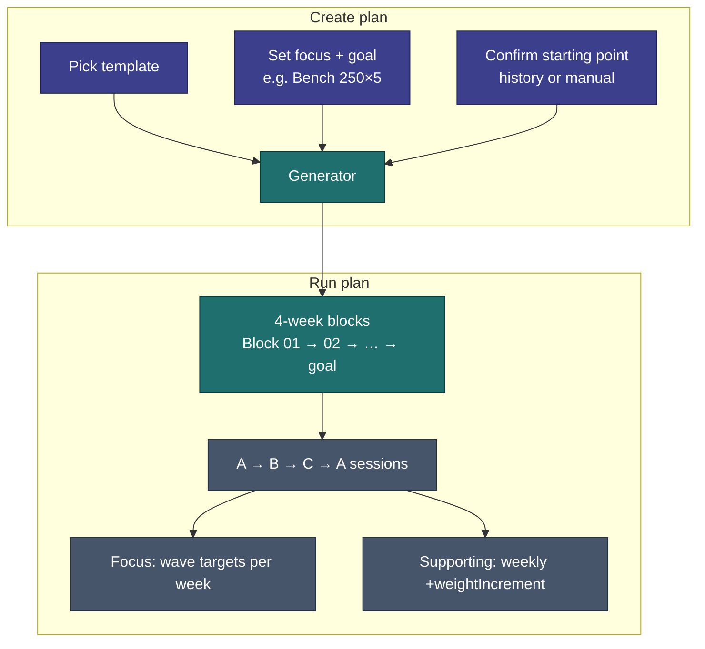
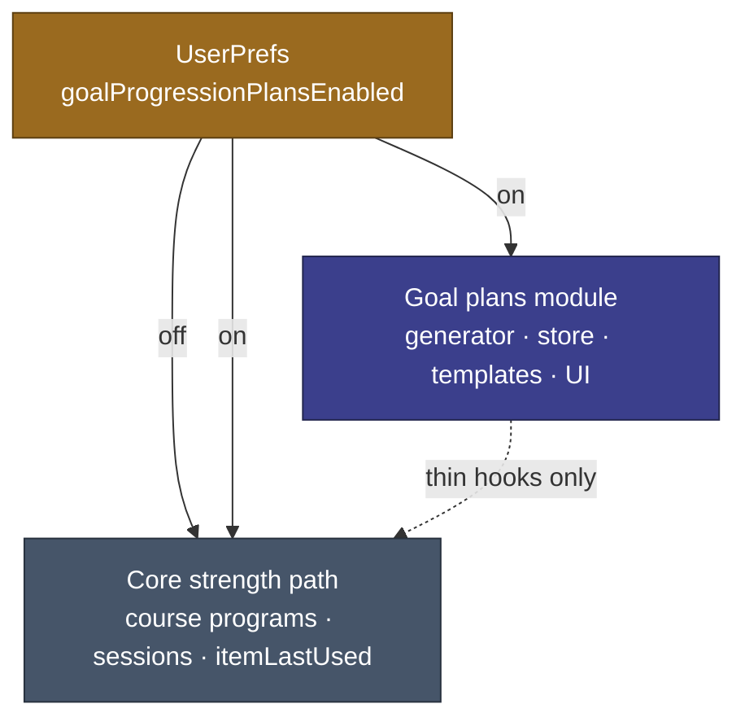

# US-033 — Goal Progression Plans

As a **fitness user**, I want to create a goal-driven strength plan from a template — with one focus lift on a wave-loading progression and supporting exercises that still get stronger each week —
so that I can work toward a specific target (e.g. bench 250×5) over several months without hand-authoring every week's weights, and repeat a block when my body needs more time.

---

## Design North Star

> "Set a goal. Follow the wave. Get stronger without breaking yourself."

---

## Problem

Today's strength programs ([Program Management](../../requirements/program-management.md), [Program Progression](../../implementation/program-progression.md)) rotate A/B/C routines and prefill weight from last session use. The user adjusts load manually. There is no wave-loading engine, no goal-to-plan generator, and no way to run an isolated "bench stint" with auto-calculated progression.

The [roadmap](../../roadmap/README.md) deferred a load periodization engine. Real usage showed the gap: strength building needs a repeating **build → build → peak → deload** cycle per focus lift, with lighter auto-progression everywhere else, and the ability to **repeat a block** without abandoning the plan.

---

## Solution Overview

Introduce **goal progression plans** — a new program type within the Strength discipline.

### Wave block (focus exercise)

Each block is **4 weeks** aligned to program week numbers:

| Week | Focus pattern (example)                                              |
| ---- | -------------------------------------------------------------------- |
| 1    | Baseline weight × higher reps (e.g. 150×10) — challenging but doable |
| 2    | +weight → fewer reps (e.g. 160×8)                                    |
| 3    | +weight → fewer reps (e.g. 170×6) — peak within block                |
| 4    | Deload — return to week-1 weight × reps                              |

Weight jumps between weeks use the focus item's `weightIncrement` (and/or generator rules). After week 4, the next block starts at a **higher baseline** (e.g. Block 02: 170×10 → 180×8 → 190×6 → deload). The generator chains blocks until the deload-week target reaches (or nears) the user's goal.

### Supporting exercises

Exercises that are not the focus still appear in routines A/B/C. They do **not** follow the full wave. Each program week they gain **`+weightIncrement`** from the prior week. Rep targets stay stable unless a separate decision is made at implementation time.

### Plan instances

Each stint is a **separate plan record** — e.g. "Max Bench 01" and "Max Bench 02" are two instances, possibly from the same template. Instances store enough metadata for future comparison visualizations even though v1.9.0 does not ship charts.

---

## Example

**Max Bench 01** — goal 200×5, starting 150×10, focus: Bench Press

| Block | Wk 1   | Wk 2  | Wk 3  | Wk 4 (deload) |
| ----- | ------ | ----- | ----- | ------------- |
| 01    | 150×10 | 160×8 | 170×6 | 150×10        |
| 02    | 170×10 | 180×8 | 190×6 | 170×10        |

If block 02 week 2 feels too heavy, the user **repeats block 02** from week 1 — same targets, plan timeline extends.

**Max Deadlift 01** — separate plan instance; goal 500×1; different template, focus, increments, and timeline.

---

## Optional Feature & Modularity

Goal progression plans are **opt-in**, following the same pattern as [health metrics](../v1.7.0/US-029-health-metrics.md):

| Topic               | Decision                                                                                                                                                                                                                                                                                   |
| ------------------- | ------------------------------------------------------------------------------------------------------------------------------------------------------------------------------------------------------------------------------------------------------------------------------------------ |
| **Settings toggle** | One master switch on `/settings` (e.g. `goalProgressionPlansEnabled` in `UserPrefs`, default `false`)                                                                                                                                                                                      |
| **Toggle off**      | Hide all goal-plan UI — creation, plan picker entries, prescribed targets, block repeat, plan history views. **Data stays in IndexedDB.**                                                                                                                                                  |
| **Toggle on**       | Goal-plan surfaces appear; user can create and run plans alongside unchanged course-program flows                                                                                                                                                                                          |
| **Course programs** | Strength Foundation etc. remain the default path when the toggle is off; no wave logic runs                                                                                                                                                                                                |
| **Removability**    | Implementation shall live in a **dedicated module** (generator, types, store, templates) with **thin integration points** at session/program UI — not woven through core stores. Disabling the toggle or deleting the module should not break course programs, session logging, or history |

**Why:** The feature is experimental until proven in real use. A toggle lets you (and other users) ignore it entirely; a modular boundary makes it straightforward to rip out if it does not earn its place.

---

## Key Decisions

| Topic                             | Decision                                                                                                   |
| --------------------------------- | ---------------------------------------------------------------------------------------------------------- |
| **Distinct from course programs** | Goal plans are a new type; Strength Foundation-style programs are unchanged                                |
| **One focus per plan**            | Exactly one focus exercise drives the wave engine per plan instance                                        |
| **Goal = weight × reps**          | User-defined per plan (250×5, 500×1, etc.) — not an abstract 1RM                                           |
| **Generator inputs**              | Focus exercise, goal, confirmed starting weight × reps, template exercise lists                            |
| **Generator output**              | Ordered progression blocks, weekly targets per exercise, estimated duration                                |
| **Starting point**                | History prefill when available + user confirm/override; required manual entry when no history              |
| **Increments**                    | Reuse existing `weightIncrement` on items — not a new field                                                |
| **Session rotation**              | A → B → C → A count-driven progression — same engine as today                                              |
| **Repeat scope**                  | Current 4-week block only                                                                                  |
| **Templates**                     | Built-in starter templates in v1.9.0; pro-authored templates later                                         |
| **Naming**                        | Auto-name + optional rename; format **TBD**                                                                |
| **Lifecycle**                     | Complete or Pause on end; inactivity = rest (no special state)                                             |
| **Concurrency**                   | One active goal plan at a time                                                                             |
| **Course program coexistence**    | Deferred — v1.9.0 treats the goal plan as the active strength plan                                         |
| **Optional feature**              | Master Settings toggle; default off; off hides UI, data persists (same contract as `healthMetricsEnabled`) |
| **Modularity**                    | Dedicated module + thin hooks; course-program path must work with toggle off and with module removed       |

---

## Requirements

1. Program type & templates
   a. The system shall support a **goal progression plan** as a distinct program type within the Strength discipline.
   b. The system shall ship at least one built-in **template** that pre-populates routines A/B/C with a sensible exercise list.
   c. The user shall be able to adjust the template's exercise list before generating the plan.
   d. Course programs (e.g. Strength Foundation) shall continue to work unchanged when selected instead of a goal plan.
2. Plan creation & generator
   a. The user shall select a focus exercise from the plan's exercise list.
   b. The user shall set a goal as **target weight × target reps** for the focus exercise.
   c. The system shall propose a starting weight × reps from session history for the focus exercise when history exists.
   d. The user shall confirm or override the starting point; when no history exists, the user shall enter it manually.
   e. The system shall generate an ordered series of **4-week progression blocks** with weekly weight × rep targets for the focus exercise.
   f. The system shall estimate plan duration (e.g. 3–6 months) from the number of blocks required to approach the goal from the starting point.
   g. The system shall generate weekly targets for all non-focus exercises using the light weekly `weightIncrement` progression.
   h. The system shall auto-generate a plan name with an option to rename before activation; the auto-name format is **TBD**.
3. Wave block behavior (focus)
   a. Each block shall span 4 program weeks with the pattern: build → build → peak → deload (higher weight / fewer reps, then return to week-1 load).
   b. Weight jumps shall respect the focus item's `weightIncrement` (and generator rounding rules).
   c. Each subsequent block shall start at a higher baseline than the previous block's week-1 target.
4. Supporting exercise behavior
   a. Non-focus exercises shall increase by their item's `weightIncrement` each program week within the plan.
   b. Non-focus exercises shall not follow the 4-week deload wave.
5. Session integration
   a. Goal plans shall use the same A → B → C → A routine rotation and count-driven week advance as existing programs.
   b. During a session, prescribed weekly targets shall be shown for each exercise (focus and supporting).
   c. Logging shall continue to use the existing sets × reps × weight flow for strength items.
6. Block repeat
   a. The user shall be able to **repeat the current progression block** from week 1 at any time.
   b. Repeating a block shall reset to that block's original weekly targets without rewinding to earlier blocks.
   c. Repeating a block shall extend the plan timeline; it shall not remove or alter completed session history.
7. Plan lifecycle & concurrency
   a. Exactly **one** goal progression plan may be **active** at a time.
   b. The user shall be able to mark a plan **Completed** when ending a stint (goal reached or user chooses to stop).
   c. The user shall be able to mark a plan **Paused** when explicitly setting it aside.
   d. Inactivity (rest weeks with no sessions) shall leave the plan at its current block and week — no automatic state change.
   e. Each plan instance shall retain its own history: focus, goal, starting point, template, blocks, repeat events, sessions, and lifecycle timestamps — for future visualization.
8. Increments on items
   a. Goal plan progression shall read each item's existing `weightIncrement` value.
   b. Built-in strength items shall ship sensible defaults (e.g. smaller increments for isolation lifts); custom items already allow user configuration.
9. Optional feature toggle & modularity
   a. Settings shall expose a master **Goal progression plans** toggle (e.g. `goalProgressionPlansEnabled` in `UserPrefs`, default `false`), consistent with [US-029 health metrics](../v1.7.0/US-029-health-metrics.md).
   b. When the toggle is off, all goal-plan UI shall be hidden — including creation, activation, prescribed targets, block repeat, and plan-management surfaces.
   c. When the toggle is off, goal-plan data shall remain in IndexedDB and return when the toggle is re-enabled.
   d. When the toggle is off, course programs and standard session logging shall behave exactly as they do today.
   e. Goal-plan logic shall live in a dedicated module (generator, types, store, templates) integrated via thin boundaries — not inlined through core `programStore` / `sessionStore` paths.
   f. Removing or disabling the goal-plans module shall not require changes to course-program progression, `itemLastUsed` prefill, or session finish/save flows.

---

## Acceptance Criteria

1. Program type & templates
   a. Given built-in templates exist, when the user starts creating a goal plan, then they can pick a template that pre-fills routines A/B/C.
   b. Given a template is selected, when the user removes an exercise before generating, then the generated plan excludes that exercise.
   c. Given Strength Foundation is active, when the user has not created a goal plan, then Foundation behavior is unchanged.
2. Plan creation & generator
   a. Given the user has logged bench press at 150×10, when they create a bench-focused plan, then 150×10 is proposed as the starting point.
   b. Given no history exists for the focus exercise, when the user creates a plan, then they must enter a starting weight × reps before generation proceeds.
   c. Given goal 250×5 and starting 125×10, when the plan is generated, then the estimated duration is longer than a plan from 200×5 to 250×5.
   d. Given a generated plan, when the user views week 3 of block 1, then the focus exercise shows a higher weight and lower reps than week 1.
3. Wave block behavior (focus)
   a. Given block 1 week 4 (deload), when the user views the focus target, then it matches block 1 week 1 weight × reps.
   b. Given block 1 is complete, when block 2 week 1 begins, then the focus baseline is higher than block 1 week 1.
4. Supporting exercise behavior
   a. Given front raises with `weightIncrement` 2.5 in week 1 at 15×12, when week 2 begins, then the prescribed weight is 17.5×12 (reps per implementation default).
   b. Given a non-focus exercise across a 4-week block, when week 4 ends, then its weight increased each week and never deloaded.
5. Session integration
   a. Given an active goal plan, when the user completes sessions in order, then routines rotate A → B → C → A as they do for course programs today.
   b. Given week 2 of a block, when the user starts a session, then each exercise shows that week's prescribed targets.
6. Block repeat
   a. Given the user is in block 3 week 2, when they choose to repeat the current block, then week 1 of block 3 targets are restored and week 2+ targets follow block 3's original schedule again.
   b. Given the user repeats a block, when they view session history, then sessions logged before the repeat are still present.
7. Plan lifecycle & concurrency
   a. Given a goal plan is active, when the user tries to activate a second goal plan, then the system prevents two concurrent active goal plans (handoff flow **TBD** — see Deferred).
   b. Given the user marks a plan Completed, when they view it later, then it is read-only history with its sessions and block progress intact.
   c. Given the user does not log sessions for three weeks, when they return, then the plan is still on the same block and week as before.
8. Plan instances
   a. Given the user finished Max Bench 01 and starts Max Bench 02, when they view plan history, then two separate plan records exist with independent timelines.
9. Optional feature toggle & modularity
   a. Given goal progression plans are disabled in Settings, when the user opens Practice or starts a session, then no goal-plan UI or prescribed wave targets appear.
   b. Given goal progression plans are disabled with existing plan data, when the user re-enables the toggle, then previous plans and their history are available again.
   c. Given goal progression plans are disabled, when the user runs Strength Foundation, then behavior matches today's course-program path (last-used prefill, manual adjustment).
   d. Given the goal-plans module is not loaded, when the user uses strength features, then course programs and session logging still work.

---

## Deferred / Out of Scope (v1.9.0)

| Item                                | Notes                                                                              |
| ----------------------------------- | ---------------------------------------------------------------------------------- |
| Plan-switching handoff UX           | Starting a new plan while another is active — require complete/pause vs auto-pause |
| Auto-name format                    | Auto + rename agreed; wording deferred                                             |
| Pro-authored templates              | Built-in starters only in v1.9.0                                                   |
| Plan comparison / Insights charts   | Capture data now; UI later                                                         |
| Supporting exercise rep adjustments | Weekly weight bump locked; rep behavior TBD at build time                          |
| Non-strength disciplines            | Goal plans are Strength-only in v1.9.0                                             |
| Calendar-based scheduling           | Progression stays count-driven                                                     |
| Retrofitting course programs        | No wave engine on Strength Foundation etc.                                         |

---

## Related Docs

- [v1.9.0 README](./README.md)
- [Program Progression](../../implementation/program-progression.md)
- [Program Management](../../requirements/program-management.md)
- [Data Model](../../architecture/data-model.md)
- [Glossary](../../glossary.md)
- [Roadmap](../../roadmap/README.md)
- [Implementation Status](../../implementation/status.md)
