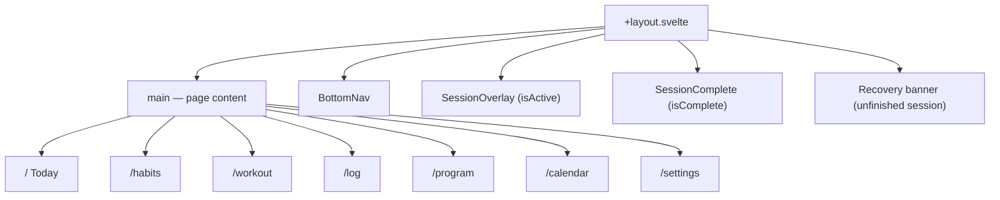
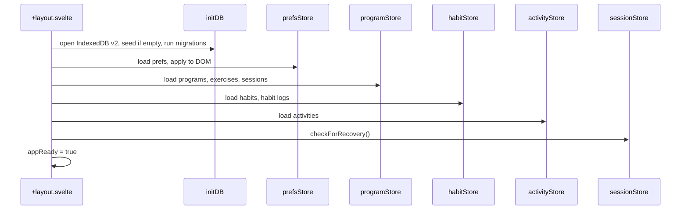

# App Structure

How the SvelteKit app is organized — routes, layout, and boot sequence.

---

## Routes

| Route       | File                           | Purpose                                             |
| ----------- | ------------------------------ | --------------------------------------------------- |
| `/`         | `routes/+page.svelte`          | Today — overview dashboard with summary cards       |
| `/habits`   | `routes/habits/+page.svelte`   | Habit log — progress rings, mood strip, date picker |
| `/workout`  | `routes/workout/+page.svelte`  | Workout — full session start/edit UI                |
| `/log`      | `routes/log/+page.svelte`      | Activity log — list and log non-workout activities  |
| `/program`  | `routes/program/+page.svelte`  | Program — workout cards, editor entry               |
| `/calendar` | `routes/calendar/+page.svelte` | History — month grid, stats, day summary            |
| `/settings` | `routes/settings/+page.svelte` | Settings — accent, weight unit, density, feel       |

Navigation via `BottomNav` (Today · Habits · Workout · History · Settings). Program is accessible from the Workout page.

---

## Root Layout

`routes/+layout.svelte` owns everything outside page content:



`routes/+layout.ts` sets `ssr = false` — fully client-rendered.

---

## Boot Sequence

On `onMount` in the layout:



1. `initDB()` — open IndexedDB (version 2), upsert exercises, seed programs + habits if empty, apply any pending migrations (e.g. patch dailyGoal onto existing built-in habits)
2. `prefsStore.load()` — read localStorage, apply accent/density/roundness to DOM
3. `programStore.load()` — load programs, exercises, sessions; pick active program
4. `habitStore.load()` — load habits and all habit logs
5. `activityStore.load()` — load all activity logs
6. `sessionStore.checkForRecovery()` — flag recoverable session if from today
7. Set `appReady = true` → render app

---

## Source Layout

```
src/
├── app.css
├── app.html
├── routes/
│   ├── +layout.svelte / .ts
│   ├── +page.svelte          (Today)
│   ├── habits/+page.svelte
│   ├── workout/+page.svelte
│   ├── log/+page.svelte
│   ├── program/+page.svelte
│   ├── calendar/+page.svelte
│   └── settings/+page.svelte
└── lib/
    ├── db/
    │   ├── types.ts
    │   ├── database.ts
    │   └── seed.ts
    ├── stores/
    │   ├── program.svelte.ts
    │   ├── session.svelte.ts
    │   ├── prefs.svelte.ts
    │   ├── habits.svelte.ts
    │   ├── activities.svelte.ts
    │   └── loggingContext.svelte.ts
    ├── components/
    │   └── *.svelte
    └── utils.ts
```

---

## Global Overlays

These render above any route — the user never navigates away during a session:

- **SessionOverlay** — full-screen dialog with exercise cards, timer, finish/abandon
- **SessionComplete** — celebration screen with volume/duration stats
- **WorkoutEditor** — full-screen editor launched from Program page (not a route)
- **LogSetSheet** — bottom sheet for stepper/numpad input during session

---

## Related

- [How It Works](behavior.md) — What happens on each screen
- [Components](components.md) — What each component does
- [State Management](state.md) — Store boot and data flow
- [Dev Guide](dev-guide.md) — Running the app locally
