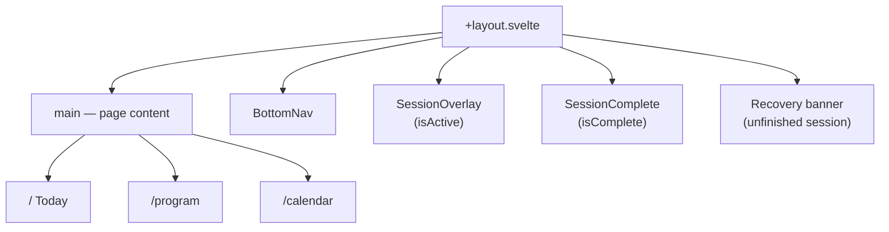
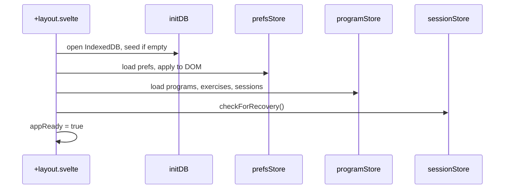
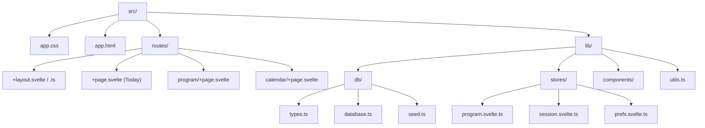

# App Structure

How the SvelteKit app is organized — routes, layout, and boot sequence.

---

## Routes

| Route | File | Purpose |
|-------|------|---------|
| `/` | `routes/+page.svelte` | Today — workout card, streak, week strip |
| `/program` | `routes/program/+page.svelte` | Program — workout cards, editor entry |
| `/calendar` | `routes/calendar/+page.svelte` | History — month grid, stats, day summary |

Navigation via fixed `BottomNav` (Today · Program · Calendar). No settings route yet.

---

## Root Layout

`routes/+layout.svelte` owns everything outside page content:

`routes/+layout.ts` sets `ssr = false` — fully client-rendered.

---

## Boot Sequence

On `onMount` in the layout:

1. `initDB()` — open IndexedDB, upsert exercises, seed programs if empty
2. `prefsStore.load()` — read localStorage, apply accent/density/roundness to DOM
3. `programStore.load()` — load programs, exercises, sessions; pick active program
4. `sessionStore.checkForRecovery()` — flag recoverable session if from today
5. Set `appReady = true` → render app

---

## Source Layout

---

## Global Overlays

These render above any route — the user never navigates away during a session:

- **SessionOverlay** — full-screen dialog with exercise cards, timer, finish/abandon
- **SessionComplete** — celebration screen with volume/duration stats
- **WorkoutEditor** — full-screen editor launched from Program page (not a route)
- **LogSetSheet** — bottom sheet for stepper/numpad input during session

---

## Related

- [How It Works](behavior.md) — What happens on each screen
- [Components](components.md) — What each component does
- [State Management](state.md) — Store boot and data flow
- [Dev Guide](dev-guide.md) — Running the app locally
