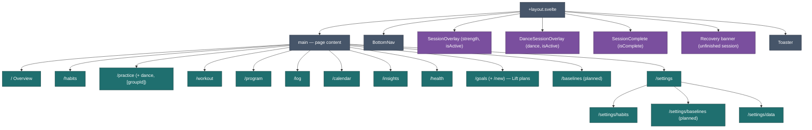

# App Structure

How the SvelteKit app is organized — routes, layout, and boot sequence.

---

## Routes

| Route                 | File                                     | Purpose                                                                                                                                              |
| --------------------- | ---------------------------------------- | ---------------------------------------------------------------------------------------------------------------------------------------------------- |
| `/`                   | `routes/+page.svelte`                    | Overview — dashboard with habit, practice, activity, and health summary cards                                                                        |
| `/habits`             | `routes/habits/+page.svelte`             | Habit log — progress rings, mood strip, date picker                                                                                                  |
| `/practice`           | `routes/practice/+page.svelte`           | Practice hub — active practice groups (Workout, Dance)                                                                                               |
| `/practice/dance`     | `routes/practice/dance/+page.svelte`     | Belly Dance — pick routine, preview, start session                                                                                                   |
| `/practice/[groupId]` | `routes/practice/[groupId]/+page.svelte` | Practice group detail (e.g. Workout) — active plans, manage                                                                                          |
| `/workout`            | `routes/workout/+page.svelte`            | Strength workout — full session start/edit UI                                                                                                        |
| `/program`            | `routes/program/+page.svelte`            | Programs — activate, create, edit routines (`?discipline=`)                                                                                          |
| `/log`                | `routes/log/+page.svelte`                | Activity log — list and log non-workout activities                                                                                                   |
| `/calendar`           | `routes/calendar/+page.svelte`           | History — month grid, stats, day summary                                                                                                             |
| `/insights`           | `routes/insights/+page.svelte`           | Insights — Chart.js charts with date-range picker                                                                                                    |
| `/health`             | `routes/health/+page.svelte`             | Health metrics — weight + BP logging ([US-029](../features/v1.7.0/US-029-health-metrics.md))                                                         |
| `/goals`              | `routes/goals/+page.svelte`              | Lift plans (Goal progression plans) — active / paused / completed ([US-033](../features/v1.9.0/US-033-goal-progression-plans.md))                    |
| `/goals/new`          | `routes/goals/new/+page.svelte`          | Create lift plan wizard                                                                                                                              |
| `/baselines`          | `routes/baselines/+page.svelte`          | Baselines daily logging + charts ([US-035](../features/v1.9.0/US-035-baselines-logging.md), [US-036](../features/v1.9.0/US-036-baselines-charts.md)) |
| `/settings`           | `routes/settings/+page.svelte`           | Settings **hub** — navigation to sub-pages ([US-030](../features/v1.7.0/US-030-settings-restructure.md))                                             |
| `/settings/overview`  | `routes/settings/overview/+page.svelte`  | Overview card order — drag or arrow buttons                                                                                                          |
| `/settings/habits`    | `routes/settings/habits/+page.svelte`    | Habit CRUD and reorder                                                                                                                               |
| `/settings/baselines` | `routes/settings/baselines/+page.svelte` | Baseline CRUD ([US-034](../features/v1.9.0/US-034-baselines-setup.md))                                                                               |
| `/settings/data`      | `routes/settings/data/+page.svelte`      | Backup/restore, clear data (incl. goal plans and Baselines), debug seed                                                                              |

Navigation via `BottomNav` (Overview · Practice · History · Insights · Settings). Workout, Program, Log, Habits, Health, and Baselines are reached from their summary cards and the Practice hub.

**Every tracking feature is opt-in and defaults off**, so most of these routes are gated. `habitsEnabled` guards `/habits` and `/settings/habits`; `activityLogEnabled` guards `/log`; `practiceEnabled` hides the Practice tab and guards `/practice`, `/practice/dance`, `/practice/[groupId]`, `/workout`, and `/program`; `/goals*` additionally needs Lift plans on; `/health` needs `healthMetricsEnabled`; `/baselines` and `/settings/baselines` need `baselinesEnabled`. Guards use `redirectWhenDisabled()` from `src/lib/featureGate.svelte.ts` — see [state.md](state.md#feature-flags-hide-ui-data-always-persists).

---

## Root Layout

`routes/+layout.svelte` owns everything outside page content:



`routes/+layout.ts` sets `ssr = false` — fully client-rendered.

---

## Boot Sequence

On `onMount` in the layout:


1. `initDB()` — open IndexedDB (version 9), upsert built-in items + programs, seed habits if empty, apply any pending migrations (e.g. patch dailyGoal onto existing built-in habits)
2. `prefsStore.load()` — read localStorage, apply accent/density/roundness to DOM
3. `programStore.load()` — load programs, items, sessions; pick active program per Discipline
4. `goalPlanStore.load()` — load goal progression plans _(US-033)_
5. `habitStore.load()` — load habits and all habit logs
6. `activityStore.load()` — load all activity logs
7. `healthStore.load()` — load health readings _(US-029)_
8. `sessionStore.checkForRecovery()` — flag recoverable session if from today
9. Set `appReady = true` → render app (or a reload prompt if boot threw — corrupt prefs fall back to defaults and do not block startup)

---

## Source Layout

```
src/
├── app.css
├── app.html
├── routes/
│   ├── +layout.svelte / .ts
│   ├── +page.svelte          (Overview)
│   ├── habits/+page.svelte
│   ├── practice/
│   │   ├── +page.svelte           (hub)
│   │   ├── dance/+page.svelte
│   │   └── [groupId]/+page.svelte
│   ├── workout/+page.svelte
│   ├── program/+page.svelte
│   ├── goals/
│   │   ├── +page.svelte
│   │   └── new/+page.svelte
│   ├── log/+page.svelte
│   ├── calendar/+page.svelte
│   ├── insights/+page.svelte
│   ├── health/+page.svelte
│   └── settings/
│       ├── +page.svelte           (hub)
│       ├── habits/+page.svelte
│       └── data/+page.svelte
├── service-worker.ts
└── lib/
    ├── db/
    │   ├── types.ts
    │   ├── database.ts
    │   └── seed.ts
    ├── goalPlans/                 (US-033 module)
    │   ├── types.ts
    │   ├── generator.ts
    │   ├── buildProgram.ts
    │   ├── templates.ts
    │   └── …
    ├── stores/
    │   ├── program.svelte.ts
    │   ├── session.svelte.ts
    │   ├── prefs.svelte.ts
    │   ├── habits.svelte.ts
    │   ├── activities.svelte.ts
    │   ├── health.svelte.ts
    │   ├── goalPlans.svelte.ts
    │   ├── loggingContext.svelte.ts
    │   └── toast.svelte.ts
    ├── components/
    │   ├── insights/*.svelte
    │   ├── goals/*.svelte
    │   └── *.svelte
    └── utils.ts
```

---

## Global Overlays

These render above any route — the user never navigates away during a session:

- **SessionOverlay** — full-screen dialog with exercise cards, timer, finish/abandon
- **SessionComplete** — celebration screen with volume/duration stats
- **WorkoutEditor** — full-screen editor launched from Program page (not a route)
- **LogSetSheet** — bottom sheet for stepper/numpad input during session

---

## Related

- [How It Works](behavior.md) — What happens on each screen
- [System Overview](../architecture/overview.md) — Architecture at a glance
- [Components](components.md) — What each component does
- [State Management](state.md) — Store boot and data flow
- [Implementation Status](status.md) — Built vs deferred
- [Dev Guide](dev-guide.md) — Running the app locally
