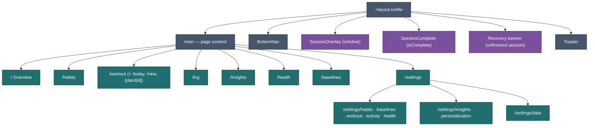
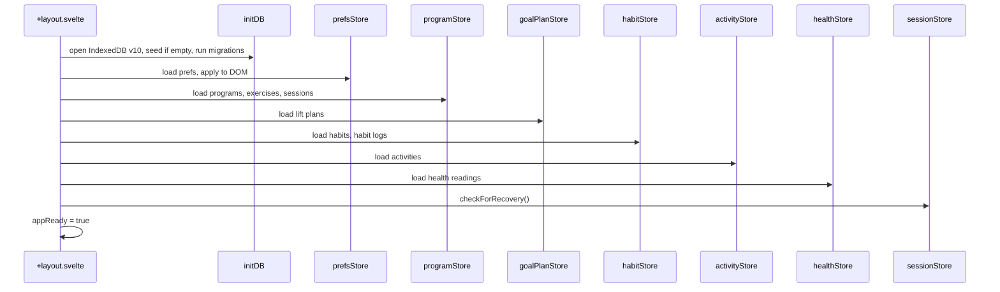

[Wiki](../README.md) › [Implementation](../README.md#ground--implementation) › App Structure

# App Structure

How the SvelteKit app is organized — routes, layout, and boot sequence.

---

## Routes

| Route                       | File                                           | Purpose                                                                                                                                              |
| --------------------------- | ---------------------------------------------- | ---------------------------------------------------------------------------------------------------------------------------------------------------- |
| `/`                         | `routes/+page.svelte`                          | Overview — dashboard with habit, workout, activity, and health summary cards                                                                         |
| `/habits`                   | `routes/habits/+page.svelte`                   | Habit log — progress rings, mood strip, date picker                                                                                                  |
| `/workout`                  | `routes/workout/+page.svelte`                  | Plans list — active plan on top (Start today's workout), other plans below, New plan ([US-052](../features/v1.10.0/US-052-one-workout-section.md))   |
| `/workout/today`            | `routes/workout/today/+page.svelte`            | Today's routine — full session start/edit UI                                                                                                         |
| `/workout/new`              | `routes/workout/new/+page.svelte`              | New plan wizard — template or scratch, routines, optional goal, review                                                                               |
| `/workout/plan/[id]`        | `routes/workout/plan/[id]/+page.svelte`        | One plan — weeks, routines, activate/pause/delete, goal panel if it has one                                                                          |
| `/log`                      | `routes/log/+page.svelte`                      | Activity log — list and log non-workout activities                                                                                                   |
| `/insights`                 | `routes/insights/+page.svelte`                 | Insights — TanStack charts from the `INSIGHT_CHARTS` list, each hideable ([US-043](../features/v1.10.0/US-043-insights-chart-visibility.md))         |
| `/health`                   | `routes/health/+page.svelte`                   | Health metrics — weight + BP logging ([US-029](../features/v1.7.0/US-029-health-metrics.md))                                                         |
| `/baselines`                | `routes/baselines/+page.svelte`                | Baselines daily logging + charts ([US-035](../features/v1.9.0/US-035-baselines-logging.md), [US-036](../features/v1.9.0/US-036-baselines-charts.md)) |
| `/settings`                 | `routes/settings/+page.svelte`                 | Settings **hub** — one row per feature ([US-045](../features/v1.10.0/US-045-settings-feature-hub.md))                                                |
| `/settings/habits`          | `routes/settings/habits/+page.svelte`          | Habits toggle, habit CRUD / reorder / colors, Mood colors                                                                                            |
| `/settings/baselines`       | `routes/settings/baselines/+page.svelte`       | Baselines toggle + CRUD ([US-037](../features/v1.10.0/US-037-flexible-baseline-metrics.md))                                                          |
| `/settings/workout`         | `routes/settings/workout/+page.svelte`         | One Workout toggle — covers plans, sessions, and goals ([US-052](../features/v1.10.0/US-052-one-workout-section.md))                                 |
| `/settings/activity`        | `routes/settings/activity/+page.svelte`        | Activity log toggle                                                                                                                                  |
| `/settings/health`          | `routes/settings/health/+page.svelte`          | Health metrics toggle                                                                                                                                |
| `/settings/insights`        | `routes/settings/insights/+page.svelte`        | Show / hide each Insights chart ([US-043](../features/v1.10.0/US-043-insights-chart-visibility.md))                                                  |
| `/settings/personalization` | `routes/settings/personalization/+page.svelte` | Appearance (theme), accent, weight unit, density, roundness, Overview card order ([US-046](../features/v1.10.0/US-046-personalization.md))           |
| `/settings/overview`        | `routes/settings/overview/+page.svelte`        | Overview card order — kept for old links; same editor as Personalization                                                                             |
| `/settings/data`            | `routes/settings/data/+page.svelte`            | Backup/restore, clear data (incl. plan goals and Baselines), debug seed                                                                              |

Navigation via `BottomNav` (Overview · Workout · Insights · Settings). The History tab and `/calendar` were removed in v1.10.0 ([US-047](../features/v1.10.0/US-047-retire-history.md)). Practice, Dance and the standalone Lift plans area were removed in the same release ([US-051](../features/v1.10.0/US-051-remove-belly-dance.md), [US-052](../features/v1.10.0/US-052-one-workout-section.md)) — `/practice*`, `/goals*` and `/program` are gone, with no redirects. Log, Habits, Health, and Baselines are reached from their summary cards.

**Every tracking feature is opt-in and defaults off**, so most of these routes are gated. `habitsEnabled` guards `/habits`; `activityLogEnabled` guards `/log`; `practiceEnabled` hides the Workout tab and guards every `/workout*` route (a plan's own goal, if it has one, needs no separate flag); `/health` needs `healthMetricsEnabled`; `/baselines` needs `baselinesEnabled`. Settings feature pages (`/settings/habits`, `/settings/baselines`, …) are **not** gated — they hold the switch that turns the feature on (v1.10.0). Guards use `redirectWhenDisabled()` from `src/lib/featureGate.svelte.ts` — see [state.md](state.md#feature-flags-hide-ui-data-always-persists).

---

## Root Layout

`routes/+layout.svelte` owns everything outside page content:



`routes/+layout.ts` sets `ssr = false` — fully client-rendered.

---

## Boot Sequence

On `onMount` in the layout:



1. `initDB()` — open IndexedDB (version 9), upsert built-in items + programs, seed habits if empty, apply any pending migrations (e.g. patch dailyGoal onto existing built-in habits)
2. `prefsStore.load()` — read localStorage, apply accent/density/roundness to DOM
3. `programStore.load()` — load programs, items, sessions; pick active program per Discipline
4. `goalPlanStore.load()` — load lift plans _(US-033)_
5. `habitStore.load()` — load habits and all habit logs
6. `activityStore.load()` — load all activity logs
7. `healthStore.load()` — load health readings _(US-029)_
8. `sessionStore.checkForRecovery()` — flag recoverable session if from today
9. Set `appReady = true` → render app (or a reload prompt if boot threw — corrupt prefs fall back to defaults and do not block startup)

---

## Source Layout

```
src/
├── app.css
├── app.html
├── routes/
│   ├── +layout.svelte / .ts
│   ├── +page.svelte          (Overview)
│   ├── habits/+page.svelte
│   ├── workout/
│   │   ├── +page.svelte           (plans list)
│   │   ├── today/+page.svelte
│   │   ├── new/+page.svelte
│   │   └── plan/[id]/+page.svelte
│   ├── log/+page.svelte
│   ├── insights/+page.svelte
│   ├── health/+page.svelte
│   └── settings/
│       ├── +page.svelte           (hub — one row per feature)
│       ├── habits/ baselines/ workout/ activity/ health/
│       ├── insights/ personalization/ overview/
│       └── data/+page.svelte
├── service-worker.ts
└── lib/
    ├── db/
    │   ├── types.ts
    │   ├── database.ts
    │   └── seed.ts
    ├── plans/                     (v1.10.0, US-052 — the Program/GoalPlan merge)
    │   ├── actions.ts             (activatePlan, pausePlan, runItAgain, allPlans)
    │   └── wizard.svelte.ts       (PlanWizard — the New Plan flow)
    ├── goalPlans/                 (US-033 module — the wave engine, unchanged storage)
    │   ├── types.ts
    │   ├── generator.ts
    │   ├── buildProgram.ts
    │   ├── templates.ts
    │   └── …
    ├── stores/
    │   ├── program.svelte.ts
    │   ├── session.svelte.ts
    │   ├── prefs.svelte.ts
    │   ├── habits.svelte.ts
    │   ├── activities.svelte.ts
    │   ├── health.svelte.ts
    │   ├── goalPlans.svelte.ts
    │   ├── loggingContext.svelte.ts
    │   └── toast.svelte.ts
    ├── charts/                    (v1.10.0 — TanStack Charts: ScrollChart, scale, theme, color)
    ├── insights/                  (v1.10.0 — chart list, pure aggregation, heat shading)
    ├── baselines/logic.ts
    ├── habitColors.ts
    ├── workoutNextUp.ts            (Overview "next up" headline/detail for the active plan)
    ├── components/
    │   ├── insights/*.svelte
    │   ├── plans/*.svelte         (v1.10.0 — the merged New Plan wizard + plan cards)
    │   ├── goals/*.svelte         (the wave-specific pieces: ActiveGoalPlanCard, GoalBlockTimeline, WeightRepsInputs)
    │   └── *.svelte
    └── utils.ts
```

---

## Global Overlays

These render above any route — the user never navigates away during a session:

- **SessionOverlay** — full-screen dialog with exercise cards, timer, finish/abandon
- **SessionComplete** — celebration screen with volume/duration stats
- **WorkoutEditor** — full-screen editor launched from a plan's detail page (not a route)
- **LogSetSheet** — bottom sheet for stepper/numpad input during session

---

## Related

- [How It Works](behavior.md) — What happens on each screen
- [System Overview](../architecture/overview.md) — Architecture at a glance
- [Components](components.md) — What each component does
- [State Management](state.md) — Store boot and data flow
- [Implementation Status](status.md) — Built vs deferred
- [Dev Guide](dev-guide.md) — Running the app locally
