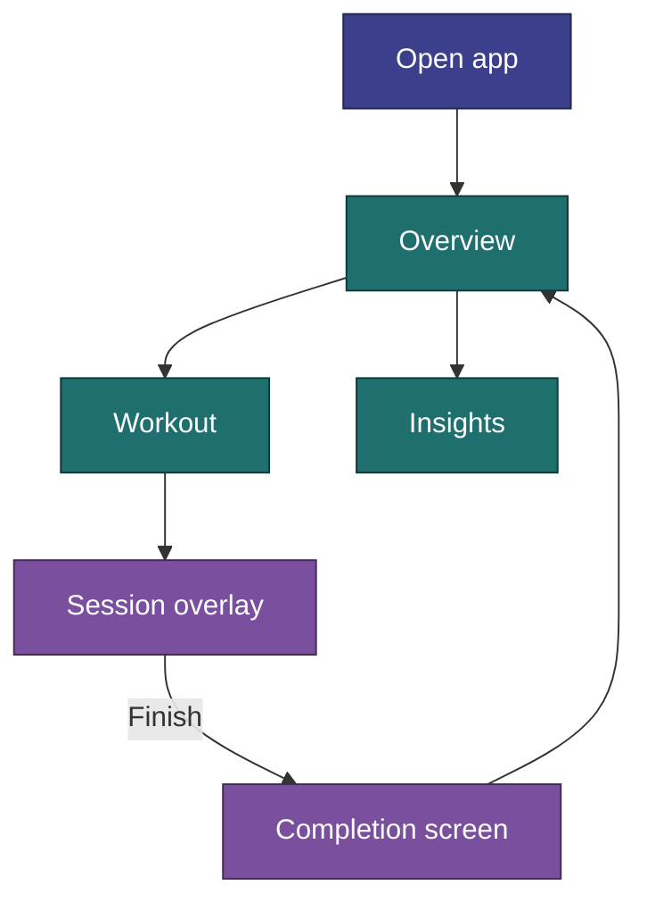
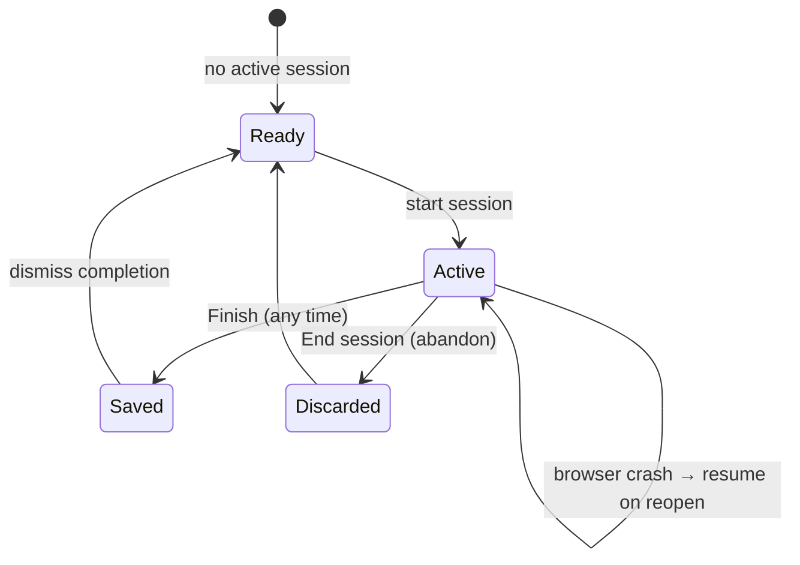
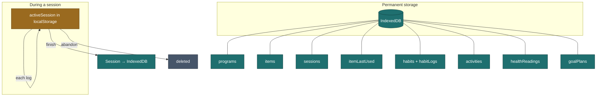

[Wiki](../README.md) › [Implementation](../README.md#ground--implementation) › How It Works

# How It Works

The mental model for CosmicWorkOut — what actually happens when you use the app. No code, just behavior.

---

## The Big Picture

CosmicWorkOut is a **single-user, local-only** movement tracker. There is no server, no account, and no sync — everything lives on your device. It tracks several kinds of things, each with its own logging style (see the [Glossary](../glossary.md) archetypes):

- **Workout** _(opt-in)_ — one multi-week plan at a time, guided one session at a time, with an optional goal lift (see [below](#workout-one-plan-with-an-optional-goal)). One Discipline ships today: **Strength**. (Belly Dance shipped as a second Discipline and was removed in v1.10.0 — [US-051](../features/v1.10.0/US-051-remove-belly-dance.md).)
- **Activities** — quick one-line records of things you did (Run, Bike, Pickleball, Yoga, …).
- **Habits** — daily counters, toggles, and a mood check-in.
- **Baselines** _(opt-in)_ — daily floors you log against, with growth charts.
- **Health metrics** — optional weight and blood-pressure readings (off by default).

The bottom nav has four tabs: **Overview**, **Workout** (only while the Workout section is on), **Insights**, **Settings**. Active sessions and completion screens appear as overlays — you never navigate away mid-session.

---

## The Global Logging Date

One idea ties the whole app together: a **global logging date**. A date picker in the page header sets which day you are logging for, and the Overview, habits, activities, health, and workout screens all read and write against it. It defaults to today and resets to today on reload. Backdating a session asks for confirmation first.

---

## Overview (Home)

The Overview is a dashboard for the selected date, not a single workout screen. It surfaces:

- **Habits** progress (rings / counters) for the day,
- **Workout** "next up" — the next routine for the active plan,
- **Activity** chips for anything logged that day,
- an optional **Health** card (only when health metrics are enabled),
- a **week strip** with per-day indicators (strength, activity, habits, health) and a week-streak badge.

Each card is a jumping-off point to its dedicated screen.

---

## Workout: One Plan, With an Optional Goal

**Workout** (`/workout`, opt-in via Settings) is where guided sessions live. As of v1.10.0 ([US-052](../features/v1.10.0/US-052-one-workout-section.md)) it replaced the old two-feature split — a Practice hub of programs, and a separate Lift plans section — with one concept: a **plan**, which may optionally carry a **goal** (one focus lift with a target weight × reps).

- **Exactly one plan is active at a time**, enforced by the app — the point is staying focused, not juggling plans. Starting another plan asks to switch, and pauses the current one.
- A new plan starts from a built-in **template** (copied so it's yours) or **from scratch**, then asks "Working toward a specific lift?" — a goal can only be set at creation, but can be **removed** later (the plan then keeps running as a plain plan to its end).
- Inactive (paused/done) plans are hidden from the main flow; their history is always preserved.
- Routes: `/workout` (plan list, active plan on top), `/workout/today` (today's routine, Start, Edit/Delete on the logged session), `/workout/new` (new-plan wizard), `/workout/plan/[id]` (one plan's weeks, routines, and goal wave if it has one).

### What "today's routine" means

The app does **not** know your weekly schedule. For the active plan it gives you the **next routine in sequence**, based on how many sessions you've already finished for that plan:

| You've completed | You see next       |
| ---------------- | ------------------ |
| 0 sessions       | Routine A (week 1) |
| 1 session        | Routine B          |
| 2 sessions       | Routine C          |
| 3 sessions       | Routine A (week 2) |

The index is `completedSessions % routineCount`. If you already logged a session **today**, the plan shows a "complete for today" state — one session per plan per calendar day. See [Program Progression](program-progression.md) for the full logic.

---

## Session Lifecycle

A session is written to local storage the moment it starts, so a crash never loses progress. The one shipped Discipline, **Strength**, logs its `exercises` section with the `setsReps` metric — tap set tiles to log weight × reps. (The Discipline model supports other section metrics, `measure` and `check`, for a future Discipline; Belly Dance used them before it was removed in v1.10.0 — [US-051](../features/v1.10.0/US-051-remove-belly-dance.md).)

### Logging a strength set

**Tap an uncompleted set:**

- If a weight is already known (from last session or an earlier set this session) → logs instantly, no sheet.
- If no weight yet (first time ever for this item) → opens a sheet with a number input, rounded to the nearest 2.5.

After any set is logged, the new weight cascades forward to all remaining uncompleted sets in that item. **Tap a completed set** to reopen the sheet and adjust; changes cascade forward too. Last-used weight/reps are remembered per item and pre-fill the next session.

Haptic feedback fires when you **complete an item** (all its sets done), not on individual taps.

### Finishing vs abandoning

| Action      | How                                            | What gets saved                                               |
| ----------- | ---------------------------------------------- | ------------------------------------------------------------- |
| **Finish**  | Footer button (says "Finish early" if partial) | Only completed work is saved as a Session. No confirm dialog. |
| **Abandon** | Back arrow → "End session" confirm             | Nothing saved. All progress lost.                             |

Both clear the in-progress session from local storage. Finishing shows a completion overlay with duration, volume, and counts (confetti plays).

---

## Habits & Mood

The **Habits** screen is a daily check-in for the selected date:

- Habit types are `times`, `minutes`, `count`, `boolean`, and `mood`.
- Built-in habits: Water, Coffee, Meditation, Writing, Reading — plus **Mood**, which is always active and not user-managed.
- Mood uses a **−5 … +5** scale and shows as an always-visible strip; the other habits are counters/toggles with progress rings against their daily goal.

Custom habits can be created, edited, reordered, and deactivated from Settings → Habits.

---

## Activities

The **Activity log** records non-structured movement: a **type** (Run, Walk, Bike, Swim, Hike, Pickleball, Tennis, Basketball, Yoga, Stretching, Cardio, Other), a **duration**, and an **intensity** (Easy / Moderate / Hard). No program, no session flow — just a quick entry on the logging date. Adding a new activity type is a config change, not new architecture.

---

## Reviewing and Fixing Past Days

There is no separate History screen (removed in v1.10.0 — [US-047](../features/v1.10.0/US-047-retire-history.md)). The two jobs it did are split:

- **Seeing the past** — Insights. Gaps and streaks show in the charts (All Habits heat chart, Showing Up, Weekly Volume).
- **Changing the past** — pick the date in a tracker's page header, then log or edit there. A logged session shows **Edit** and **Delete** on `/workout/today`.

---

## Insights

The **Insights** screen renders charts (TanStack Charts) with a range picker (this week, 7 days, month-to-date, year-to-date, custom):

- Mood vs habits, weekly training volume, activity-type breakdown, habit-balance radar.
- When health metrics are enabled: weight trend, blood-pressure trend, and summary stats.
- **Experimental (v1.10.0):** All-habits heat chart, baseline growth with best-day rings, showing-up rate, this week vs last week, day-of-week pattern, "on days when…", time of day.
- **Scrolling:** day charts keep a fixed ~7-days-per-phone spacing; longer ranges scroll sideways and open on the newest day. The value scale covers the whole range.
- **Show / hide:** each chart has ⋯ → Hide; Settings → Insights brings charts back.

---

## Health Metrics (opt-in)

Off by default. Enable the toggle in Settings to reveal the **Health** screen and its Overview card. You can log **weight** (one reading per day) and **blood pressure** (multiple per day, optionally with pulse). Readings stay in IndexedDB even if you later turn the toggle off — the toggle only hides the UI.

---

## Plans with a Goal (opt-in)

Off by default — the same `practiceEnabled` toggle that gates the whole Workout section (Settings → Workout). As of v1.10.0 ([US-052](../features/v1.10.0/US-052-one-workout-section.md)) a goal is just an option on a plan, set when the plan is created at `/workout/new` — there's no separate "Lift plans" toggle or route anymore.

A plan with a goal is a Strength plan aimed at one **focus exercise** and a **goal** (weight × reps). The app generates multi-week **wave blocks** (build → build → peak → deload), scaffolds an A/B/C backing program, and hides that program from generic plan pickers. Since only one plan is ever active, a plan with a goal is automatically the sole active Strength plan while it runs. You can pause, complete, or repeat a block, and remove the goal later to keep the plan running as a plain plan. Turning the Workout toggle off hides the UI; plan data stays in IndexedDB.

Vocabulary: [Glossary — Lift plan](../glossary.md#lift-plan) (the UI now just says "plan" + "goal" — see [US-049](../features/v1.10.0/US-049-lift-plan-rename.md) and [US-052](../features/v1.10.0/US-052-one-workout-section.md)). Spec: [US-033](../features/v1.9.0/US-033-goal-progression-plans.md) (original wave generator) and [US-052](../features/v1.10.0/US-052-one-workout-section.md) (merge into Workout).

---

## Data & Persistence

- **Programs, items, habits** — IndexedDB; built-in content is seeded and refreshed on boot.
- **Completed sessions, activities, habit logs, health readings, lift plans** — IndexedDB.
- **Last-used weight/reps** — IndexedDB, updated each set.
- **In-progress session, preferences, active plans** — localStorage.

You can **export** a full JSON backup and **restore** it (replace-only) from Settings → Data. A service worker precaches the app shell, so the app works offline and installs as a PWA on a secure context (HTTPS or `localhost`).

---

## Built-In Content

- **6 programs** — Strength course programs (Beginner / Intermediate 101–103). Belly Dance's 6 programs were removed in v1.10.0 ([US-051](../features/v1.10.0/US-051-remove-belly-dance.md)).
- **72 items** — strength exercises. Belly Dance's 39 moves + 10 warm-up/cool-down bookends were removed alongside it.
- **6 trackable habits + Mood** (always on).

Items and programs are upserted on every boot (built-in updates propagate; user records are untouched). Habits seed only on first run.

---

## Related

- [Glossary](../glossary.md) — Discipline, Item, Program, Lift plan, …
- [Program Progression](program-progression.md) — How the next routine and week are chosen
- [State Management](state.md) — Which store owns what
- [App Structure](app-structure.md) — Routes, layout, boot sequence
- [Data Model](../architecture/data-model.md) — Entities and IndexedDB stores
- [US-033 — Goal Progression Plans](../features/v1.9.0/US-033-goal-progression-plans.md) — Full lift-plan spec
- [Session Logging](../requirements/session-logging.md) — Target logging UX
- [Implementation Status](status.md) — Built vs deferred checklist
