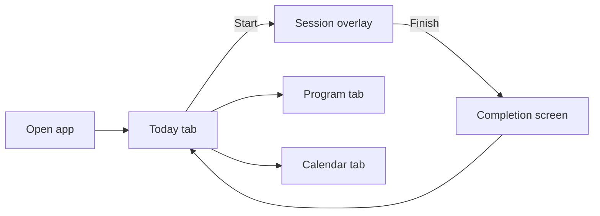
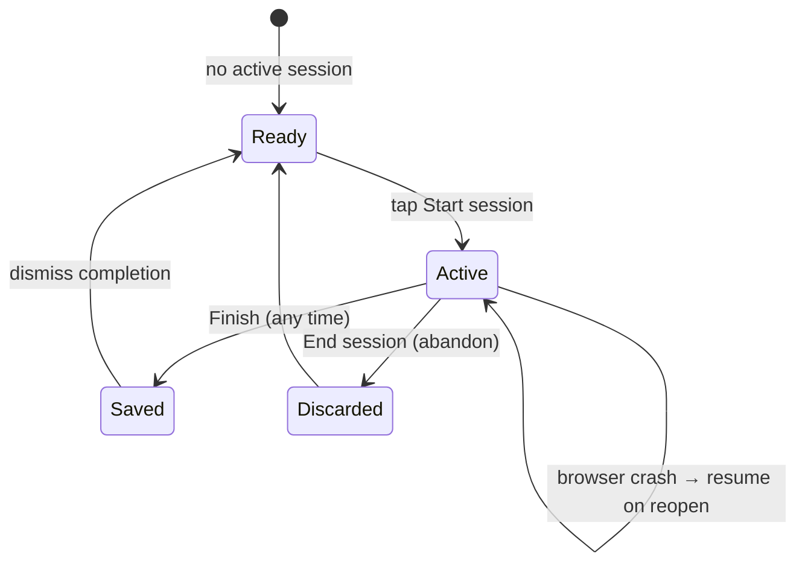
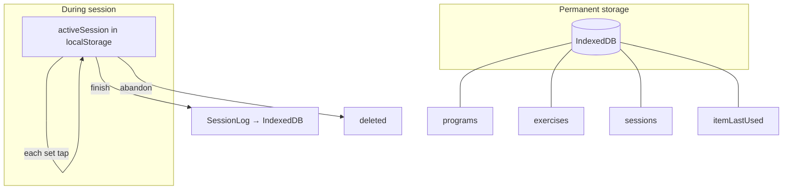

# How It Works

The mental model for CosmicWorkOut — what actually happens when you use the app. No code, just behavior.

---

## The Big Picture

CosmicWorkOut is a **single-user, local-only** workout log. You pick up where your program left off, log sets during a session, and review history on a calendar. There is no server, no account, and no sync.

Three tabs, always visible: **Today**, **Program**, **Calendar**. Active sessions and completion screens appear as overlays — you never navigate away mid-workout.

---

## What "Today" Means

**Today is not a calendar day assignment.** The app doesn't know you train Mon/Wed/Fri. It gives you the **next workout in sequence** based on how many sessions you've already finished.

| You've completed | You see next                    |
| ---------------- | ------------------------------- |
| 0 sessions       | Workout A (week 1)              |
| 1 session        | Workout B                       |
| 2 sessions       | Workout C                       |
| 3 sessions       | Workout A (week 2)              |
| 36 sessions      | Wraps back to week 1, workout A |

If you already logged a session **today**, the Today tab shows "Workout complete" — you can't start a second session on the same calendar day.

See [Program Progression](program-progression.md) for the full logic.

---

## Session Lifecycle

### Starting

Tap **Start session** on the Today card. A full-screen overlay opens with every exercise and its set tiles. The session is saved to local storage immediately so a browser crash won't lose it.

### Logging sets

**Tap an uncompleted set:**

- If a weight is already known (from last session or a previous set this session) → logs instantly, no sheet
- If no weight yet (first time ever for this exercise) → opens a sheet with a number input; value is rounded to the nearest 2.5 lb

After any set is logged, the new weight cascades forward to all remaining uncompleted sets in that exercise.

**Tap a completed set:** Opens the sheet to adjust weight or reps. Changes cascade forward to uncompleted sets.

**Weight memory:** Last logged weight/reps are saved per exercise. When you start a new session, sets are pre-filled with your last values — you just tap through.

**Incomplete set tiles** show a "+" and set number only. Weight and reps appear on the tile only after it's logged.

Haptic feedback fires when you **complete an exercise** (all sets done), not on individual set taps.

### Finishing early vs abandoning

These are different:

| Action      | How                                                          | What gets saved                                                                                       |
| ----------- | ------------------------------------------------------------ | ----------------------------------------------------------------------------------------------------- |
| **Finish**  | Footer button — says "Finish early · X/Y sets" if incomplete | Only **completed** sets are saved as a SessionLog. Unlogged sets are dropped. No confirmation dialog. |
| **Abandon** | Back arrow → "End session" confirm                           | **Nothing** saved. All progress lost.                                                                 |

Both clear the in-progress session from local storage.

### After finish

A completion overlay shows duration, volume, and set count, with a confetti celebration. You can return to Today or jump to Calendar.

---

## Program Tab

Shows your **active program** with a week progress bar and workout cards (A, B, C from week 1 as templates).

| What you can do                                | What you can't do yet            |
| ---------------------------------------------- | -------------------------------- |
| See workout names, focus areas, exercise chips | Browse all 12 weeks individually |
| Edit a workout's exercises, sets, reps         | Switch to a different program    |
| Add a new workout (propagates to all weeks)    | Create a brand-new program       |
| See which workout is "today" via badge         | Copy a built-in before editing   |

Edits match workouts **by name** across all 12 weeks — changing "Lower + Lateral Power" updates every week's copy. Historical session logs are not affected.

**Known limitation:** Renaming a workout title in the editor doesn't persist on save for existing workouts — the original name is used as the lookup key.

---

## Calendar Tab

Monthly grid showing which days you trained. Tap a completed day to see a read-only summary (duration, exercises, sets, volume).

**Day colors today:**

| Status      | Meaning                                        |
| ----------- | ---------------------------------------------- |
| Accent fill | You logged a session that day (active program) |
| Outlined    | Today                                          |
| Muted       | Future dates                                   |
| Plain       | Past dates with no session                     |

Scheduled, rest, and skipped days are **not shown** — only actual logged sessions.

### Stats (top of calendar)

- **Sessions** — count this month for active program
- **Volume** — total lbs this month (numeric weights only)
- **Day streak** — consecutive days with _any_ session going backward from today (up to 90 days), not filtered by program

### Today page streak

Shows **total distinct weeks** (all time, all programs) that contain at least one session — labeled "wk streak." This is not a consecutive-week counter.

---

## Data & Persistence

- **Programs & exercises** — IndexedDB, seeded on first launch
- **Completed sessions** — IndexedDB, written on finish only
- **Last-used weight/reps** — IndexedDB, updated each set
- **In-progress session** — localStorage, updated each set
- **Preferences** — localStorage, loaded at boot

A service worker (`src/service-worker.ts`) precaches the app shell, so the app works offline and is installable as a PWA (secure context only).

---

## Preferences

All preferences are editable via the **Settings tab** (`/settings`). Stored in `cwout:prefs` (localStorage).

| Pref          | Default       | Effect                        |
| ------------- | ------------- | ----------------------------- |
| `accentColor` | `#b2f042`     | UI accent + ink color         |
| `density`     | `comfortable` | Tile height, card gaps        |
| `roundness`   | `default`     | Border radius scale           |
| `weightUnit`  | `lb`          | Display label on tiles/sheets |

**Per-item weight increment** (2.5 / 5 / 10) is set on the item itself, not in global prefs. Defaults to 5.

---

## Built-In Content

- **12 programs:** 6 Strength + 6 Belly Dance course programs (Beginner/Intermediate 101–103)
- **121 items:** 72 strength exercises + 39 belly dance moves + 10 warm-up/cool-down bookends
- **7 habits:** Meditation, Writing, Reading, Water, Coffee, Alcohol, Mood
- On boot: items and programs always upserted (built-in field updates propagate, user records untouched); habits seed only on first run

---

## What's Not Built

See [Implementation Status](status.md) for the full checklist. The app's core flows, Discipline model, insights, and PWA are all shipped; the Journal page was built in v1.3 and later removed. Remaining ideas are tracked per-version in [`docs/features/`](../features/).

---

## Exercise Units

Exercises can use different weight types. The log sheet adapts:

- **lb/kg** — numeric weight; first-time entry is a number input, subsequent sets use a stepper (increment configured per exercise)
- **band** — Light / Med / Heavy selector (stored as string)
- **bodyweight** — reps only; weight displays as "BW"

Volume calculation only includes numeric weights (bands and bodyweight don't add to total volume).

---

## Related

- [Program Progression](program-progression.md) — Schedule math
- [State Management](state.md) — Which store owns what
- [Session Logging](../requirements/session-logging.md) — Target UX spec
- [Implementation Status](status.md) — Built vs gap checklist
