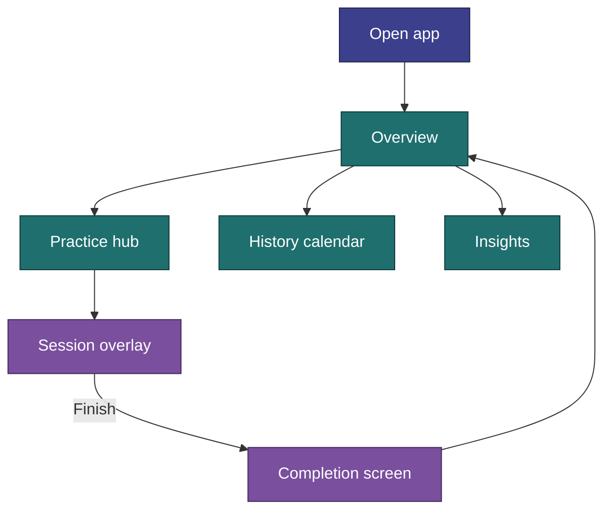
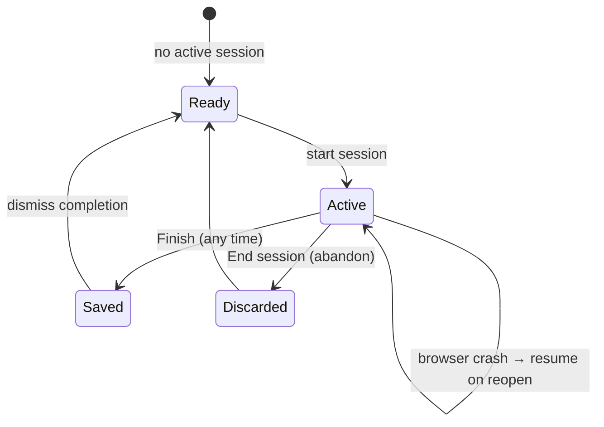
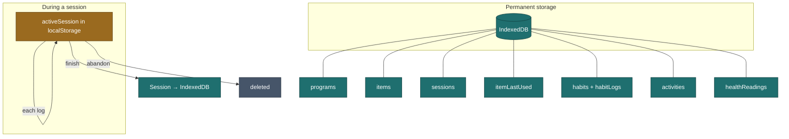

# How It Works

The mental model for CosmicWorkOut — what actually happens when you use the app. No code, just behavior.

---

## The Big Picture

CosmicWorkOut is a **single-user, local-only** movement tracker. There is no server, no account, and no sync — everything lives on your device. It tracks four kinds of things, each with its own logging style (see the [Glossary](../glossary.md) archetypes):

- **Structured practice** — multi-week programs you're guided through, one session at a time. Two Disciplines ship today: **Strength** and **Belly Dance**.
- **Activities** — quick one-line records of things you did (Run, Bike, Pickleball, Yoga, …).
- **Habits** — daily counters, toggles, and a mood check-in.
- **Health metrics** — optional weight and blood-pressure readings (off by default).

Five tabs are always visible in the bottom nav: **Overview**, **Practice**, **History**, **Insights**, **Settings**. Active sessions and completion screens appear as overlays — you never navigate away mid-session.

---

## The Global Logging Date

One idea ties the whole app together: a **global logging date**. A date picker in the page header sets which day you are logging for, and the Overview, habits, activities, health, and practice screens all read and write against it. It defaults to today and resets to today on reload. Backdating a session asks for confirmation first.

---

## Overview (Home)

The Overview is a dashboard for the selected date, not a single workout screen. It surfaces:

- **Habits** progress (rings / counters) for the day,
- **Practice** "next up" — the next routine for each active plan,
- **Activity** chips for anything logged that day,
- an optional **Health** card (only when health metrics are enabled),
- a **week strip** with per-day indicators (strength, dance, activity, habits, health) and a week-streak badge.

Each card is a jumping-off point to its dedicated screen.

---

## Practice: Disciplines, Groups, and Plans

**Practice** is where guided sessions live. It is organized into **groups** — broad buckets like **Workout** (Strength) and **Dance** (Belly Dance). Each group runs one or more active **plans** (Programs).

- You can have **one active plan per Discipline** at a time — a Strength plan and a Belly Dance plan can both be active, and you run them on whatever days you like. The app never binds a Discipline to specific weekdays.
- Inactive groups and plans are hidden from the main flow; their history is always preserved when paused.

### What "today's routine" means

The app does **not** know your weekly schedule. For each active plan it gives you the **next routine in sequence**, based on how many sessions you've already finished for that plan:

| You've completed | You see next                    |
| ---------------- | ------------------------------- |
| 0 sessions       | Routine A (week 1)              |
| 1 session        | Routine B                       |
| 2 sessions       | Routine C                       |
| 3 sessions       | Routine A (week 2)              |

The index is `completedSessions % routineCount`, computed **per Discipline**. If you already logged a session for a plan **today**, that plan shows a "complete for today" state — one session per plan per calendar day. See [Program Progression](program-progression.md) for the full logic.

---

## Session Lifecycle

A session is written to local storage the moment it starts, so a crash never loses progress. **Strength** and **Belly Dance** share this lifecycle but log differently, because each Discipline's sections use different **metrics**:

- **Strength** items use `setsReps` — tap set tiles to log weight × reps.
- **Belly Dance** routines have four sections: warm-up and cool-down are **check** (done / not done), while conditioning and moves are **measure** (enter a duration or a rep count live). Warm-up and cool-down are **bookends** — they inherit Routine A's lists unless a routine overrides them.

### Logging a strength set

**Tap an uncompleted set:**

- If a weight is already known (from last session or an earlier set this session) → logs instantly, no sheet.
- If no weight yet (first time ever for this item) → opens a sheet with a number input, rounded to the nearest 2.5.

After any set is logged, the new weight cascades forward to all remaining uncompleted sets in that item. **Tap a completed set** to reopen the sheet and adjust; changes cascade forward too. Last-used weight/reps are remembered per item and pre-fill the next session.

Haptic feedback fires when you **complete an item** (all its sets done), not on individual taps.

### Finishing vs abandoning

| Action      | How                                            | What gets saved                                            |
| ----------- | ---------------------------------------------- | ---------------------------------------------------------- |
| **Finish**  | Footer button (says "Finish early" if partial) | Only completed work is saved as a Session. No confirm dialog. |
| **Abandon** | Back arrow → "End session" confirm             | Nothing saved. All progress lost.                          |

Both clear the in-progress session from local storage. Finishing shows a completion overlay with duration, volume, and counts (confetti plays).

---

## Habits & Mood

The **Habits** screen is a daily check-in for the selected date:

- Habit types are `times`, `minutes`, `count`, `boolean`, and `mood`.
- Built-in habits: Water, Coffee, Meditation, Writing, Reading — plus **Mood**, which is always active and not user-managed.
- Mood uses a **−5 … +5** scale and shows as an always-visible strip; the other habits are counters/toggles with progress rings against their daily goal.

Custom habits can be created, edited, reordered, and deactivated from Settings → Habits.

---

## Activities

The **Activity log** records non-structured movement: a **type** (Run, Walk, Bike, Swim, Hike, Pickleball, Tennis, Basketball, Yoga, Stretching, Cardio, Other), a **duration**, and an **intensity** (Easy / Moderate / Hard). No program, no session flow — just a quick entry on the logging date. Adding a new activity type is a config change, not new architecture.

---

## History Calendar

A monthly grid showing what you did each day. Days carry small dots for the kinds of things logged (strength, dance, activity, health, mood), and a habit-fill background shows how much of the day's habits you hit.

- Month stats summarize the period.
- Tapping a day opens an actions sheet: review session summaries, edit habits, and add/edit/delete activities or sessions for that day.

Only actual logged data is shown — there are no "scheduled" or "rest" day styles.

---

## Insights

The **Insights** screen renders charts (Chart.js) with a range picker (7 days, month-to-date, year-to-date, custom):

- Mood vs habits, weekly training volume, activity-type breakdown, habit-balance radar, top-exercise progress.
- When health metrics are enabled: weight trend, blood-pressure trend, and summary stats.

---

## Health Metrics (opt-in)

Off by default. Enable the toggle in Settings to reveal the **Health** screen and its Overview card. You can log **weight** (one reading per day) and **blood pressure** (multiple per day, optionally with pulse). Readings stay in IndexedDB even if you later turn the toggle off — the toggle only hides the UI.

---

## Data & Persistence

- **Programs, items, habits** — IndexedDB; built-in content is seeded and refreshed on boot.
- **Completed sessions, activities, habit logs, health readings** — IndexedDB.
- **Last-used weight/reps** — IndexedDB, updated each set.
- **In-progress session, preferences, active plans** — localStorage.

You can **export** a full JSON backup and **restore** it (replace-only) from Settings → Data. A service worker precaches the app shell, so the app works offline and installs as a PWA on a secure context (HTTPS or `localhost`).

---

## Built-In Content

- **12 programs** — 6 Strength + 6 Belly Dance course programs (Beginner / Intermediate 101–103).
- **121 items** — 72 strength exercises + 39 belly dance moves + 10 warm-up/cool-down bookends.
- **6 trackable habits + Mood** (always on).

Items and programs are upserted on every boot (built-in updates propagate; user records are untouched). Habits seed only on first run.

---

## Related

- [Program Progression](program-progression.md) — How the next routine and week are chosen
- [State Management](state.md) — Which store owns what
- [App Structure](app-structure.md) — Routes, layout, boot sequence
- [Session Logging](../requirements/session-logging.md) — Target logging UX
- [Implementation Status](status.md) — Built vs deferred checklist
