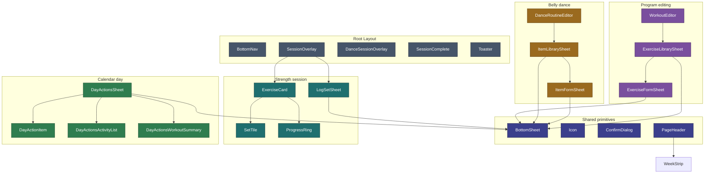

# Components

Inventory of the **52** UI components in `src/lib/components/` (plus `components/insights/`). Each is a self-contained Svelte 5 file with scoped styles and typed `$props()`. Generated against the code on branch `feature/v1.6.0`.

> **Three components are currently dead code** (zero imports anywhere): `HabitWidgets`, `HomeDanceCard`, `HomeWorkoutCard`. They are listed below for completeness and flagged for removal — see [the June 2026 audit](../maintenance/audit-2026-06.md).

---

## Shared primitives

Reusable building blocks with no feature knowledge.

| Component          | Purpose                                                                                                                             |
| ------------------ | ----------------------------------------------------------------------------------------------------------------------------------- |
| `Icon`             | Single SVG icon component, keyed by name. Imported by 11 files — but **61 inline `<svg>` blocks still bypass it** (cleanup target). |
| `BottomSheet`      | The slide-up `<dialog>` panel with backdrop; `showModal()` for focus trapping. **Base for 14 sheets.**                              |
| `ConfirmDialog`    | Yes/no confirmation modal (abandon session, delete, copy-built-in). Used by 7 callers.                                              |
| `ValueDialog`      | Numeric exact-value entry modal (`title`, `unit`, `initialValue`, `onsave`).                                                        |
| `SegmentedControl` | Generic `role="radiogroup"` segmented toggle (`options`, typed value).                                                              |
| `ProgressRing`     | Circular SVG progress indicator (exercise cards, habit cards).                                                                      |
| `PageHeader`       | Standard page title bar; embeds `WeekStrip`. Used by 7 routes.                                                                      |
| `Toaster`          | Global toast notification host (mounted in layout).                                                                                 |

---

## Navigation & layout

Mounted in the root layout (`+layout.svelte`).

| Component             | Purpose                                                                   |
| --------------------- | ------------------------------------------------------------------------- |
| `BottomNav`           | Fixed tab bar (collapses to a side rail ≥720px).                          |
| `SessionOverlay`      | Full-screen **strength** active session: timer, progress, exercise list.  |
| `DanceSessionOverlay` | Full-screen **belly dance** active session (metric-aware: check/measure). |
| `SessionComplete`     | Post-session stats overlay with confetti celebration.                     |

---

## Today / home cards

The home page is a dashboard of summary cards built on a shared `HomeCard` shell.

| Component             | Purpose                                                                 |
| --------------------- | ----------------------------------------------------------------------- |
| `HomeCard`            | Base card shell (header, icon, body slot) the other home cards compose. |
| `HomeActivityCard`    | Activity-log summary card.                                              |
| `HomeHabitsCard`      | Habit-progress summary card.                                            |
| `HomePracticeHubCard` | Practice/plans entry card.                                              |
| `PracticeGroupCard`   | A practice group (Workout / Dance) tile on the home/practice surface.   |
| `HabitWidgets`        | **Dead** (297 LOC, no imports) — scrollable habit mini-card strip.      |
| `HomeDanceCard`       | **Dead** (86 LOC, no imports) — dance summary card.                     |
| `HomeWorkoutCard`     | **Dead** (90 LOC, no imports) — workout summary card.                   |

---

## Habits (`/habits`)

| Component           | Purpose                                                         |
| ------------------- | --------------------------------------------------------------- |
| `HabitCard`         | A single habit with progress ring, +/− stepper, boolean toggle. |
| `HabitRow`          | Compact habit row variant.                                      |
| `HabitForm`         | Create / edit a custom habit (Settings).                        |
| `HabitHistorySheet` | Editable habit sheet for a past calendar day (add/subtract/toggle/exact-value, same controls as `/habits`). |

---

## Strength session flow

| Component       | Purpose                                                             |
| --------------- | ------------------------------------------------------------------- |
| `WorkoutPicker` | Horizontal A/B/C routine tabs with a "suggested" indicator.         |
| `TodayWorkout`  | Routine preview card (item list + Start button).                    |
| `ExerciseCard`  | One exercise: header + set tiles + completion animation.            |
| `SetTile`       | A single set button — "+" until logged, then weight × reps.         |
| `LogSetSheet`   | Weight/reps stepper + first-time numpad; adapts to the item's unit. |

---

## Program & routine editing (`/program`)

| Component              | Purpose                                                                    |
| ---------------------- | -------------------------------------------------------------------------- |
| `WorkoutEditor`        | Full-screen routine editor (name, items, sets/reps).                       |
| `ExerciseLibrarySheet` | Browse/filter the strength item library by category.                       |
| `ExerciseFormSheet`    | Create or edit a custom strength item.                                     |
| `ProgramSelectSheet`   | List all programs; activate one (built-ins copy-first).                    |
| `CreateProgramSheet`   | 2-step full-screen flow — details then routine names; scaffolds all weeks. |

`ProgramSelectSheet` and `CreateProgramSheet` are also used on `/workout` for the program-complete state.

---

## Practice & Belly Dance (`/practice`, `/practice/dance`, `/practice/[groupId]`)

| Component            | Purpose                                                   |
| -------------------- | --------------------------------------------------------- |
| `AddPracticeSheet`   | Add a plan/practice (activate a program into a group).    |
| `DanceRoutineEditor` | Edit a belly dance routine across its four sections.      |
| `ItemLibrarySheet`   | Browse/filter the Discipline-scoped item library (dance). |
| `ItemFormSheet`      | Create or edit a custom dance item.                       |

---

## Activity log (`/log`)

| Component          | Purpose                                                            |
| ------------------ | ------------------------------------------------------------------ |
| `ActivityLogSheet` | Add / edit / delete an activity entry (type, duration, intensity). |

---

## Calendar & day detail (`/calendar`)

| Component                  | Purpose                                                        |
| -------------------------- | -------------------------------------------------------------- |
| `DaySummarySheet`          | Read-only session detail for a completed day.                  |
| `DayActionsSheet`          | Actions for a tapped day (view/edit/add across disciplines).   |
| `DayActionItem`            | A single action row inside `DayActionsSheet`.                  |
| `DayActionsActivityList`   | Activity entries for the day, inside `DayActionsSheet`.        |
| `DayActionsWorkoutSummary` | Workout/session summary for the day, inside `DayActionsSheet`. |

---

## Streaks

| Component         | Purpose                                                                |
| ----------------- | ---------------------------------------------------------------------- |
| `WeekStrip`       | 7-day mini calendar of this week's session activity (in `PageHeader`). |
| `WeekStreakBadge` | Consecutive-weeks consistency badge (home + calendar).                 |

---

## Settings (`/settings`)

| Component              | Purpose                                                                                                     |
| ---------------------- | ----------------------------------------------------------------------------------------------------------- |
| `AccentColorPicker`    | Accent-color swatch picker; writes `prefsStore.accentColor`.                                                |
| `SettingsRow`          | Hub navigable row with label, detail, chevron ([US-030](../features/v1.7.0/US-030-settings-restructure.md)) |
| `SettingsToggleRow`    | Hub row with inline switch (e.g. health metrics)                                                            |
| `SettingsGroup`        | Section header + grouped rows on hub                                                                        |

Habit management components (`HabitRow`, `HabitForm`) moved to `/settings/habits` with US-030.

---

## Insights (`/insights`)

Chart.js wrappers + a shared range control. See [v1.5.0 features](../features/v1.5.0/README.md).

| Component           | Purpose                                   |
| ------------------- | ----------------------------------------- |
| `ChartMoodHabits`   | Mood vs. coffee/water multi-axis line.    |
| `ChartWeeklyVolume` | Weekly training-volume bar chart.         |
| `ChartActivityMix`  | Activity-type breakdown doughnut.         |
| `ChartHabitRadar`   | Habit-balance radar.                      |
| `RangeBar`          | Date-range chip bar shared by the charts. |

> The exercise-progress chart (US-027) is rendered inline on the `/insights` route rather than as a standalone component.

---

## Component hierarchy (key paths)

---

## Item unit handling

`LogSetSheet` adapts input by the item's `unit`:

| Unit         | Input                                       |
| ------------ | ------------------------------------------- |
| `lb` / `kg`  | Numeric weight stepper or first-time numpad |
| `band`       | Light / Med / Heavy selector                |
| `bodyweight` | Reps only (weight shown as BW)              |

---

## Habit input types

`HabitCard` renders different controls per `habit.type`:

| Type              | Input                                                |
| ----------------- | ---------------------------------------------------- |
| `count` / `times` | +/− stepper; exact-value `ValueDialog`               |
| `minutes`         | +/− stepper (5-min steps); exact-value `ValueDialog` |
| `boolean`         | Single toggle                                        |
| `mood`            | Inline radio strip, −5…+5, saves on tap              |

---

## Related

- [How It Works](behavior.md) — What each screen does
- [App Structure](app-structure.md) — Where components are mounted
- [June 2026 Audit](../maintenance/audit-2026-06.md) — Dead-code + reuse findings
- [Design tokens](../../src/app.css) — CSS custom properties
