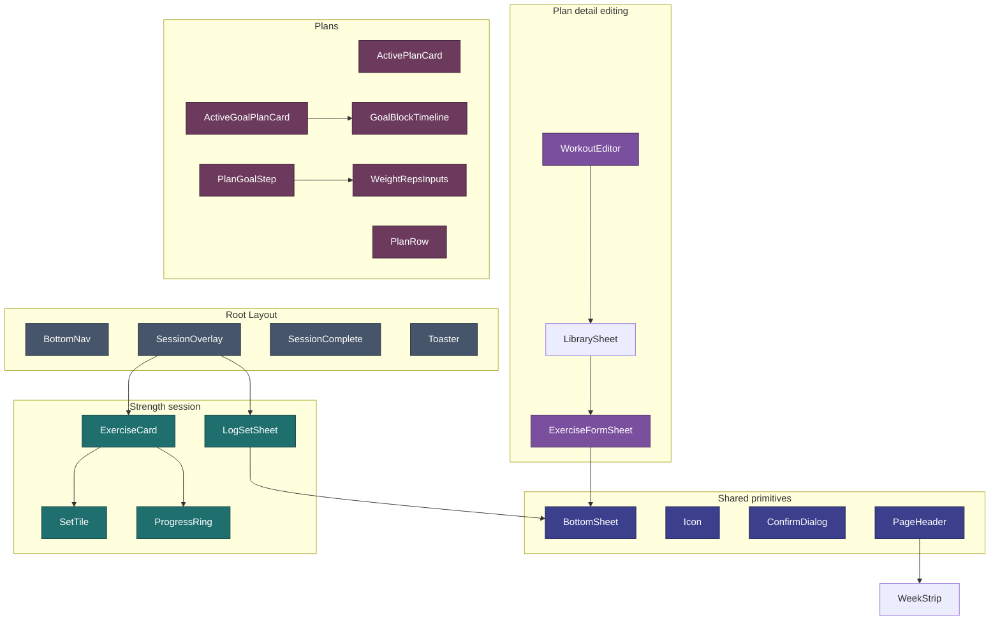

[Wiki](../README.md) › [Implementation](../README.md#ground--implementation) › Components

# Components

Inventory of the UI components in `src/lib/components/` (plus `components/insights/`, `components/goals/`, and `components/plans/`). Each is a self-contained Svelte 5 file with scoped styles and typed `$props()`. Updated for v1.10.0 (US-051 Remove Belly Dance, US-052 One Workout Section).

---

## Shared primitives

Reusable building blocks with no feature knowledge.

| Component       | Purpose                                                                                                                             |
| --------------- | ----------------------------------------------------------------------------------------------------------------------------------- |
| `Button`        | Dialog/modal action button. `variant` primary \| ghost \| danger, plus `grow`, `bold`. Used by 4 callers.                           |
| `Chip`          | Pill-shaped filter/choice button. `active`, `caps`, `small`, and `select` (toggle \| radio \| tab) for the right ARIA. 4 callers.   |
| `FieldLabel`    | Form field label with optional muted `hint`. Renders `<label for>` or a `` caption. Used by 11 callers.                       |
| `DialogTitle`   | Heading at the top of a modal surface (`as` p \| h2). Used by 6 callers.                                                            |
| `SheetBody`     | Flex-column wrapper inside `BottomSheet`. Used by 8 sheets.                                                                         |
| `SheetHeader`   | Sheet title row: title, optional action buttons, close button. Used by 8 sheets.                                                    |
| `BottomSheet`   | The slide-up `<dialog>` panel with backdrop; `showModal()` for focus trapping. **Base for 15 sheets.**                              |
| `ConfirmDialog` | Yes/no confirmation modal (abandon session, delete, copy-built-in). Used by 8 callers.                                              |
| `ValueDialog`   | Numeric exact-value entry modal (`title`, `unit`, `initialValue`, `onsave`). Used by 3 callers.                                     |
| `Icon`          | Single SVG icon component, keyed by name. Imported by 15 files — but **48 inline `<svg>` blocks still bypass it** (cleanup target). |
| `ProgressRing`  | Circular SVG progress indicator (exercise cards, habit cards).                                                                      |
| `PageHeader`    | Standard page title bar; embeds `WeekStrip`. Used by 11 routes.                                                                     |
| `Toaster`       | Global toast notification host (mounted in layout).                                                                                 |

The first six are the **UI primitive layer** the [June 2026 audit](../maintenance/audit-2026-06.md#3-css)
called for — wrapper components rather than global utility classes, per Decision 4. A pattern
that recurs across components belongs here; `app.css` stays tokens, reset and app shell only.
See [Styling](dev-guide.md#styling-tokens-and-primitive-components).

---

## Navigation & layout

Mounted in the root layout (`+layout.svelte`).

| Component             | Purpose                                                                   |
| --------------------- | ------------------------------------------------------------------------- |
| `BottomNav`           | Fixed tab bar (collapses to a side rail ≥720px).                          |
| `SessionOverlay`      | Full-screen active session: timer, progress, exercise list.               |
| `SessionComplete`     | Post-session stats overlay with confetti celebration.                     |

---

## Today / home cards

The home page is a dashboard of summary cards built on a shared `HomeCard` shell.

| Component             | Purpose                                                                 |
| --------------------- | ----------------------------------------------------------------------- |
| `HomeCard`            | Base card shell (header, icon, body slot) the other home cards compose. |
| `HomeActivityCard`    | Activity-log summary card.                                              |
| `HomeHabitsCard`      | Habit-progress summary card.                                            |
| `HomePracticeHubCard` | Workout entry card — file/prop names lag the "Workout" rename (v1.10.0, US-052). |

---

## Habits (`/habits`)

| Component   | Purpose                                                         |
| ----------- | --------------------------------------------------------------- |
| `HabitCard` | A single habit with progress ring, +/− stepper, boolean toggle. |
| `HabitRow`  | Compact habit row variant.                                      |
| `HabitForm` | Create / edit a custom habit (Settings).                        |

---

## Strength session flow

| Component       | Purpose                                                             |
| --------------- | ------------------------------------------------------------------- |
| `WorkoutPicker` | Horizontal A/B/C routine tabs with a "suggested" indicator.         |
| `TodayWorkout`  | Routine preview card (item list + Start button).                    |
| `ExerciseCard`  | One exercise: header + set tiles + completion animation.            |
| `SetTile`       | A single set button — "+" until logged, then weight × reps.         |
| `LogSetSheet`   | Weight/reps stepper + first-time numpad; adapts to the item's unit. |

---

## Plan detail & routine editing (`/workout/plan/[id]`)

| Component           | Purpose                                                                                                                                     |
| -------------------- | -------------------------------------------------------------------------------------------------------------------------------------------- |
| `WorkoutEditor`      | Full-screen routine editor (name, items, sets/reps); takes an explicit `programId` so it always edits the plan being viewed, active or not. |
| `LibrarySheet`       | Browse/filter the exercise library.                                                                                                          |
| `ExerciseFormSheet`  | Create or edit a custom strength item.                                                                                                       |

### Configuring `LibrarySheet`

The sheet owns the chrome — search, filter chips, expandable rows, add/edit/delete —
and reads item-specific config from a `LibraryConfig` built in
[`$lib/itemLibrary.ts`](../../src/lib/itemLibrary.ts): `strengthLibrary()`, the only
builder since Belly Dance was removed (v1.10.0, US-051). The config supplies the copy,
which items belong in the list, how free-text search matches, the chip filter rows,
and how one row renders (dot color, subtitle, tag, optional right-hand readout).

---

## Plans (`/workout`, `/workout/new`, `/workout/plan/[id]`) — v1.10.0, US-052

A **plan** is a Program, optionally paired with a GoalPlan (the wave the old "Lift
plan" generated). Storage stays two records; these components are where the two read
as one thing. `components/plans/` holds the merge; `components/goals/` keeps only the
wave-specific pieces a goal-bearing plan still needs.

| Component          | Purpose                                                                                                        |
| -------------------- | ----------------------------------------------------------------------------------------------------------- |
| `ActivePlanCard`    | Active plan **without** a goal: week X of Y, today's routine, Start, Pause, Run it again / New plan on finish. |
| `PlanRow`           | A non-active plan in the "Other plans" list — works for a plain plan or a paused/completed goal.               |
| `PlanWizardSteps`   | Step indicator for the New Plan wizard (`start → routines → goal → review`).                                   |
| `PlanStartStep`     | Pick a built-in template (copied) or start from scratch; name + weeks.                                         |
| `PlanRoutinesStep`  | Edit A/B/C exercise slots — no focus constraint, used with or without a goal.                                  |
| `PlanGoalStep`      | "Working toward a specific lift?" No/Yes; if Yes, pick the focus (from the routines already built) and enter start/goal weight × reps. |
| `PlanReviewStep`    | Plan name + summary; wave block preview only when a goal was set.                                              |

Wizard state lives in `$lib/plans/wizard.svelte.ts` (`PlanWizard`). Activating,
pausing, and restarting a plan go through `$lib/plans/actions.ts`, which dispatches to
`programStore` or `goalPlanStore` depending on whether the plan has a goal, and keeps
"exactly one plan is ever active" true either way.

Kept from the old lift-plan wizard, under `components/goals/`:

| Component            | Purpose                                                            |
| --------------------- | ------------------------------------------------------------------- |
| `WeightRepsInputs`   | Shared weight × reps pair inputs — used by `PlanGoalStep`.          |
| `ActiveGoalPlanCard` | Active plan **with** a goal: rename, now/finished state, actions.   |
| `GoalBlockTimeline`  | Wave-block progress strip, in `ActiveGoalPlanCard` and the plan detail page. |

---

## Activity log (`/log`)

| Component          | Purpose                                                            |
| ------------------ | ------------------------------------------------------------------ |
| `ActivityLogSheet` | Add / edit / delete an activity entry (type, duration, intensity). |

---

## Streaks

| Component         | Purpose                                                                |
| ----------------- | ---------------------------------------------------------------------- |
| `WeekStrip`       | 7-day mini calendar of this week's session activity (in `PageHeader`). |
| `WeekStreakBadge` | Consecutive-weeks consistency badge (home).                            |

---

## Settings (`/settings`)

| Component              | Purpose                                                                                                     |
| ---------------------- | ----------------------------------------------------------------------------------------------------------- |
| `AccentColorPicker`    | Accent-color swatch picker; writes `prefsStore.accentColor`.                                                |
| `SettingsRow`          | Hub navigable row with label, detail, chevron ([US-030](../features/v1.7.0/US-030-settings-restructure.md)) |
| `SettingsToggleRow`    | Hub row with inline switch (e.g. health metrics)                                                            |
| `SettingsGroup`        | Section header + grouped rows on hub                                                                        |
| `ColorSwatches`        | Preset color swatches (habit colors, accent color) — v1.10.0                                                |
| `SegmentedControl`     | Single-choice button row (Personalization) — v1.10.0                                                        |
| `OverviewLayoutEditor` | Overview card order; on Personalization and `/settings/overview` — v1.10.0                                  |

Habit management components (`HabitRow`, `HabitForm`) moved to `/settings/habits` with US-030.

---

## Insights (`/insights`)

TanStack Charts components + a shared range control. The page renders from `INSIGHT_CHARTS` (`src/lib/insights/charts.ts`). See [v1.10.0](../features/v1.10.0/README.md).

| Component             | Purpose                                                             |
| --------------------- | ------------------------------------------------------------------- |
| `InsightCard`         | Card chrome: title, "Experimental" badge, ⋯ → Hide.                 |
| `ChartMoodHabits`     | Mood vs coffee/water, two value rails.                              |
| `ChartAllHabits`      | Heat chart: strips (all) / calendar grid (one habit). Experimental. |
| `ChartBaselineGrowth` | Baseline metrics vs baseline lines, best-day rings. Experimental.   |
| `ChartShowUpRate`     | % of days logged per week. Experimental.                            |
| `ChartWeekVsWeek`     | This week vs same days last week (table). Experimental.             |
| `ChartDayOfWeek`      | Average per weekday. Experimental.                                  |
| `ChartOnDaysWhen`     | Outcome average on condition days vs other days. Experimental.      |
| `ChartTimeOfDay`      | Baseline entries by hour. Experimental.                             |
| `ChartWeeklyVolume`   | Weekly training-volume bars.                                        |
| `ChartActivityMix`    | Activity-type donut with HTML legend.                               |
| `ChartHabitRadar`     | Habit-balance radar.                                                |
| `ChartHealthWeight`   | Weight line.                                                        |
| `ChartHealthBP`       | Blood-pressure lines.                                               |
| `ChipPicker`          | Single-choice chips for picking a baseline / metric / habit.        |
| `RangeBar`            | Date-range chip bar shared by the charts.                           |

Shared chart plumbing lives in `src/lib/charts/` — `ScrollChart` (fixed-spacing sideways scroll, pinned rails), `scale.ts`, `theme.ts`, `color.ts`.

---

## Component hierarchy (key paths)

---

## Item unit handling

`LogSetSheet` adapts input by the item's `unit`:

| Unit         | Input                                       |
| ------------ | ------------------------------------------- |
| `lb` / `kg`  | Numeric weight stepper or first-time numpad |
| `band`       | Light / Med / Heavy selector                |
| `bodyweight` | Reps only (weight shown as BW)              |

---

## Habit input types

`HabitCard` renders different controls per `habit.type`:

| Type              | Input                                                |
| ----------------- | ---------------------------------------------------- |
| `count` / `times` | +/− stepper; exact-value `ValueDialog`               |
| `minutes`         | +/− stepper (5-min steps); exact-value `ValueDialog` |
| `boolean`         | Single toggle                                        |
| `mood`            | Inline radio strip, −5…+5, saves on tap              |

---

## Related

- [How It Works](behavior.md) — What each screen does
- [App Structure](app-structure.md) — Where components are mounted
- [June 2026 Audit](../maintenance/audit-2026-06.md) — Dead-code + reuse findings
- [Design tokens](../../src/app.css) — CSS custom properties
