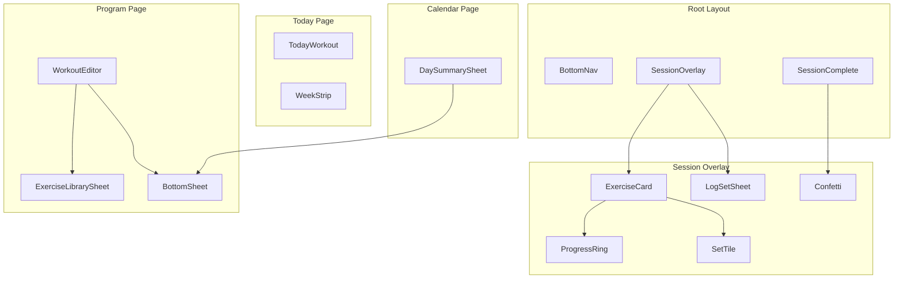
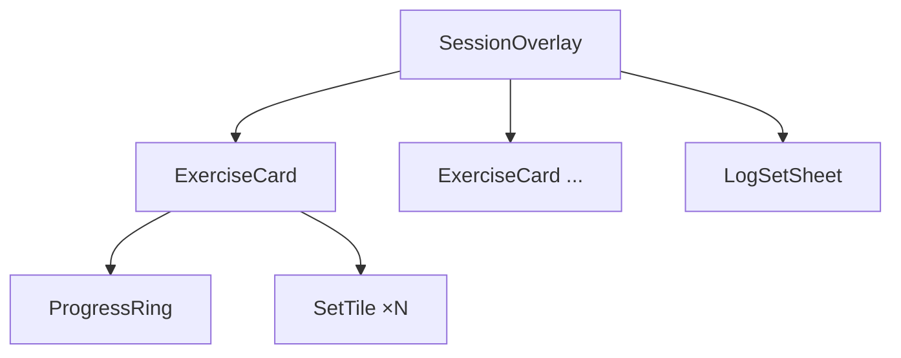

# Components

Inventory of UI components in `src/lib/components/`. Each is a self-contained Svelte file with scoped styles.

---

## Navigation & Layout

| Component | Used by | Purpose |
|-----------|---------|---------|
| `BottomNav` | Layout | Fixed 3-tab nav (Today, Program, Calendar) |
| `BottomSheet` | Multiple | Reusable slide-up panel with backdrop |

---

## Today Page

| Component | Purpose |
|-----------|---------|
| `TodayWorkout` | Workout preview card with exercise list + Start button |
| `WeekStrip` | 7-day mini calendar showing this week's activity |

---

## Session Flow

| Component | Purpose |
|-----------|---------|
| `SessionOverlay` | Full-screen active session: timer, progress bar, exercise list |
| `ExerciseCard` | Exercise header + set tiles + completion animation |
| `SetTile` | Set button — shows "+" until logged, then weight × reps |
| `LogSetSheet` | Stepper/numpad input for weight and reps |
| `ProgressRing` | Circular progress indicator on exercise card |
| `SessionComplete` | Post-workout stats overlay |
| `Confetti` | Celebration particles (respects `completionFeel`) |

---

## Program Page

| Component | Purpose |
|-----------|---------|
| `WorkoutEditor` | Full-screen workout editor (name, exercises, sets/reps) |
| `ExerciseLibrarySheet` | Browse/filter exercise library by category |

---

## Calendar Page

| Component | Purpose |
|-----------|---------|
| `DaySummarySheet` | Read-only session detail for a completed day |

---

## Component Hierarchy

### Session flow detail

---

## Exercise Unit Handling

`LogSetSheet` adapts input by exercise unit:

| Unit | Input |
|------|-------|
| `lb` / `kg` | Numeric weight stepper or numpad |
| `band` | Light / Med / Heavy selector |
| `bodyweight` | Reps only (weight shown as BW) |

---

## Related

- [How It Works](behavior.md) — What each screen does
- [App Structure](app-structure.md) — Where components are mounted
- [Session Logging](../requirements/session-logging.md) — Interaction requirements
- [Design tokens](../../src/app.css) — CSS custom properties
