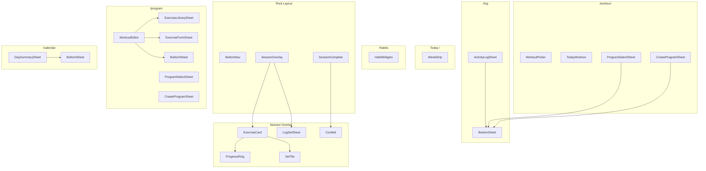

# Components

Inventory of UI components in `src/lib/components/`. Each is a self-contained Svelte file with scoped styles.

---

## Navigation & Layout

| Component     | Used by  | Purpose                                                                            |
| ------------- | -------- | ---------------------------------------------------------------------------------- |
| `BottomNav`   | Layout   | Fixed 5-tab nav (Today · Habits · Workout · History · Settings)                    |
| `BottomSheet` | Multiple | Reusable slide-up `<dialog>` panel with backdrop; `showModal()` for focus trapping |

---

## Today Page (`/`)

| Component   | Purpose                                                  |
| ----------- | -------------------------------------------------------- |
| `WeekStrip` | 7-day mini calendar showing this week's session activity |

The today page is a summary-only dashboard. No bespoke components — it links to `/habits`, `/workout`, and `/log`.

---

## Habits Page (`/habits`)

| Component      | Purpose                                                                                             |
| -------------- | --------------------------------------------------------------------------------------------------- |
| `HabitWidgets` | Compact horizontal scrollable strip of habit mini-cards with progress rings (used in home overview) |

The habits page (`/habits`) is self-contained in its route file. It renders:

- A date/week strip as `<fieldset>` with radio inputs
- An inline mood strip as `<fieldset>` with radio inputs (always visible, saves on tap)
- A responsive CSS grid of habit cards with SVG progress rings, +/− steppers, boolean toggles, and an exact-value `<dialog>` modal

Accessibility: uses semantic `<fieldset>/<legend>/<label>/<input>` patterns throughout; focus trapping via native `<dialog>`.

---

## Workout Page (`/workout`)

| Component       | Purpose                                                           |
| --------------- | ----------------------------------------------------------------- |
| `WorkoutPicker` | Horizontal strip of workout tabs (A/B/C) with suggested indicator |
| `TodayWorkout`  | Workout preview card with exercise list + Start button            |

---

## Session Flow

| Component         | Purpose                                                        |
| ----------------- | -------------------------------------------------------------- |
| `SessionOverlay`  | Full-screen active session: timer, progress bar, exercise list |
| `ExerciseCard`    | Exercise header + set tiles + completion animation             |
| `SetTile`         | Set button — shows "+" until logged, then weight × reps        |
| `LogSetSheet`     | Stepper/numpad input for weight and reps                       |
| `ProgressRing`    | Circular progress indicator on exercise card                   |
| `SessionComplete` | Post-workout stats overlay                                     |
| `Confetti`        | Celebration particles (respects `completionFeel`)              |

---

## Program Page (`/program`)

| Component              | Purpose                                                                           |
| ---------------------- | --------------------------------------------------------------------------------- |
| `WorkoutEditor`        | Full-screen workout editor (name, exercises, sets/reps)                           |
| `ExerciseLibrarySheet` | Browse/filter exercise library by category                                        |
| `ExerciseFormSheet`    | Create or edit a custom exercise                                                  |
| `ProgramSelectSheet`   | List all programs; choose one to activate (built-ins get copied first)            |
| `CreateProgramSheet`   | 2-step full-screen flow — program details then workout names; scaffolds all weeks |

`ProgramSelectSheet` and `CreateProgramSheet` are also used on the `/workout` page for the program-complete state.

---

## Activity Log Page (`/log`)

| Component          | Purpose                                                          |
| ------------------ | ---------------------------------------------------------------- |
| `ActivityLogSheet` | Bottom sheet for adding, editing, and deleting an activity entry |

---

## Calendar Page (`/calendar`)

| Component         | Purpose                                      |
| ----------------- | -------------------------------------------- |
| `DaySummarySheet` | Read-only session detail for a completed day |

---

## Component Hierarchy

---

## Exercise Unit Handling

`LogSetSheet` adapts input by exercise unit:

| Unit         | Input                            |
| ------------ | -------------------------------- |
| `lb` / `kg`  | Numeric weight stepper or numpad |
| `band`       | Light / Med / Heavy selector     |
| `bodyweight` | Reps only (weight shown as BW)   |

---

## Habit Input Types

The habits page renders different input controls per `habit.type`:

| Type      | Input                                                            |
| --------- | ---------------------------------------------------------------- |
| `count`   | +/− stepper buttons; long tap opens exact-value `<dialog>`       |
| `minutes` | +/− stepper (5-min steps); long tap opens exact-value `<dialog>` |
| `boolean` | Single toggle button (styled checkbox)                           |
| `mood`    | Inline radio strip with 11 options (-5 to +5), saves on tap      |

---

## Related

- [How It Works](behavior.md) — What each screen does
- [App Structure](app-structure.md) — Where components are mounted
- [Session Logging](../requirements/session-logging.md) — Interaction requirements
- [Design tokens](../../src/app.css) — CSS custom properties
