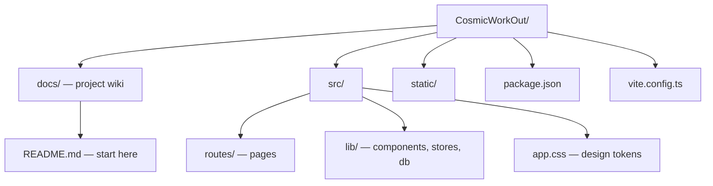

# Dev Guide

How to run, build, and navigate the codebase.

---

## Quick Start

```sh
npm install
npm run dev        # http://localhost:5678 (opens browser)
```

The dev script includes `--host`, so the server is also accessible on your local network — useful for testing on a real mobile device: `http://<your-machine-ip>:5678`.

Other scripts:

| Command           | Purpose                           |
| ----------------- | --------------------------------- |
| `npm run build`   | Production build                  |
| `npm run preview` | Preview production build          |
| `npm run check`   | TypeScript + Svelte type checking |
| `npm run lint`    | Prettier + ESLint                 |
| `npm run format`  | Auto-format with Prettier         |

---

## Project Layout



---

## Key Files to Know

| File                         | Why it matters                  |
| ---------------------------- | ------------------------------- |
| `src/routes/+layout.svelte`  | App boot, global overlays       |
| `src/lib/db/database.ts`     | IndexedDB open, read, write     |
| `src/lib/db/seed.ts`         | Built-in exercises and programs |
| `src/lib/db/types.ts`        | All data interfaces             |
| `src/lib/stores/*.svelte.ts` | Application state               |
| `src/app.css`                | Design tokens and global styles |

---

## Adding a Built-In Exercise

1. Add entry to `builtInExercises` in `seed.ts`
2. Exercises upsert on boot — no migration needed
3. Add to a workout in `makeWorkoutA/B/C()` if it should appear in the default program

---

## Debugging Data

Open browser DevTools → Application → IndexedDB → `cosmic-workout`. LocalStorage keys are prefixed `cwout:`.

To reset workout data in-app: Settings → Data → **Clear workout data**. To reset preferences only: Settings → Data → **Reset preferences**.

For a full manual reset via DevTools: delete the IndexedDB database and clear localStorage, then reload.

---

## Related

- [App Structure](app-structure.md) — Routes and boot flow
- [Tech Stack](../architecture/tech-stack.md) — Framework choices
- [Implementation Status](status.md) — What's built
