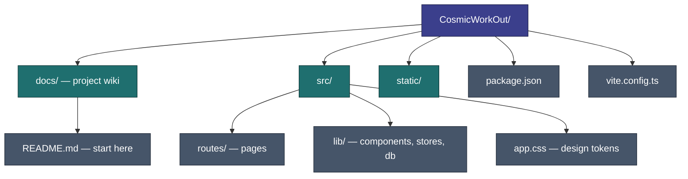

# Dev Guide

How to run, build, and navigate the codebase.

---

## Quick Start

```sh
npm install
npm run dev        # http://localhost:5678 (opens browser)
```

The dev script includes `--host`, so the server is also accessible on your local network — useful for testing on a real mobile device: `http://<your-machine-ip>:5678`.

Other scripts:

| Command              | Purpose                                     |
| -------------------- | ------------------------------------------- |
| `npm run build`      | Production build                            |
| `npm run preview`    | Preview production build                    |
| `npm run check`      | TypeScript + Svelte type checking           |
| `npm run test`       | Pure-logic unit tests (see below)           |
| `npm run docs:links` | Check wiki relative links + heading anchors |
| `npm run lint`       | Prettier + ESLint                           |
| `npm run format`     | Auto-format with Prettier                   |

---

## Project Layout



---

## Key Files to Know

| File                          | Why it matters                                 |
| ----------------------------- | ---------------------------------------------- |
| `src/routes/+layout.svelte`   | App boot, global overlays                      |
| `src/lib/db/database.ts`      | IndexedDB open, read, write                    |
| `src/lib/db/seed.ts`          | Built-in exercises and programs                |
| `src/lib/db/types.ts`         | All data interfaces                            |
| `src/lib/stores/*.svelte.ts`  | Application state                              |
| `src/app.css`                 | Design tokens and global styles                |
| `src/lib/itemLibrary.ts`      | Per-Discipline `LibrarySheet` config           |
| `src/lib/db/backupPayload.ts` | Backup envelope, validation, restore preflight |

---

## Testing

`npm test` runs Node's built-in test runner over `*.test.ts` files with type
stripping — no framework, no browser, no new dependencies. Covered today:
goal-plan generation, baseline aggregation, Overview card ordering, and the
backup/restore payload path.

Tests therefore reach **pure modules only**. A file is testable when it imports
nothing at runtime beyond other pure modules — `import type` from `$lib/...` is
fine (type stripping erases it), but a runtime `$lib` import or a `.svelte.ts`
store is not resolvable and will fail.

> When logic worth testing sits behind IndexedDB or the DOM, split the decision
> out into a pure module and leave the plumbing behind. That is why
> `backupPayload.ts` exists apart from `backup.ts`: restore is the one failure the
> user cannot recover from, so the checks that run before `clearWorkoutData()` are
> tested even though the transactions around them are not.

Add a new test directory to the `test` script's globs in `package.json`.

---

## Styling: tokens and primitive components

Three layers, in order of preference:

1. **Design tokens** (`:root` in `app.css`) — colours, spacing, radii, easing. Never
   hard-code a value a token already covers.
2. **Primitive components** (`lib/components/`) — `Button`, `Chip`, `FieldLabel`,
   `DialogTitle`, `SheetBody`, `SheetHeader`. A recurring visual pattern becomes a
   component that owns its own scoped CSS. See [Components](components.md#shared-primitives).
3. **Scoped component CSS** — everything genuinely local to one component.

**`app.css` is global-only:** tokens, reset, `.sr-only`, focus ring, app shell, `.page`,
keyframes. Per [Decision 4](../maintenance/audit-2026-06.md#decisions-locked-2026-06-22),
shared UI patterns are **wrapper components, not global utility classes** — a global
`.btn`/`.chip` layer was tried and reverted in September 2026.

Two consequences worth knowing:

> **A parent cannot restyle a child component's markup.** Scoped selectors carry a
> `.svelte-*` hash, and an element rendered by a child component does not carry the
> parent's hash. So a primitive needs a real prop for anything a caller must vary —
> never a `class` pass-through, which silently does nothing.

> **Tag selectors stop at the component boundary too.** `.field > label { … }` will not
> reach a `<label>` rendered by `FieldLabel`. Style the primitive from the inside.

---

## Adding a Built-In Exercise

1. Add entry to `builtInExercises` in `seed.ts`
2. Exercises upsert on boot — no migration needed
3. Add to a workout in `makeWorkoutA/B/C()` if it should appear in the default program

---

## Conventions (Working Agreement)

How code gets written in this repo — for any contributor, human or AI.

- **Clean, modern code.** Svelte 5 runes, current idioms; match the style of the surrounding file.
- **No new dependencies.** Solve it with what's already in `package.json` unless there's a compelling, discussed reason to add a package.
- **Small, focused components.** Prefer composition over large multi-purpose components — see [Components](components.md).
- **Implement, then review.** For a multi-step task, work through the whole thing and present it for review at the end rather than stopping for sign-off between steps. Surface a question mid-stream only when a decision is genuinely blocking and ambiguous.
- **Docs are the project's memory.** When a decision is locked or behavior changes, update the relevant doc in `docs/` so it reflects reality — see [Documenting decisions](../README.md#documenting-decisions). Deferred ideas go on the [roadmap](../roadmap/README.md).

---

## Debugging Data

Open browser DevTools → Application → IndexedDB → `cosmic-workout`. LocalStorage keys are prefixed `cwout:`.

To reset workout data in-app: Settings → Data → **Clear workout data**. To reset preferences only: Settings → Data → **Reset preferences**.

For a full manual reset via DevTools: delete the IndexedDB database and clear localStorage, then reload.

---

## Related

- [App Structure](app-structure.md) — Routes and boot flow
- [Tech Stack](../architecture/tech-stack.md) — Framework choices
- [Implementation Status](status.md) — What's built
