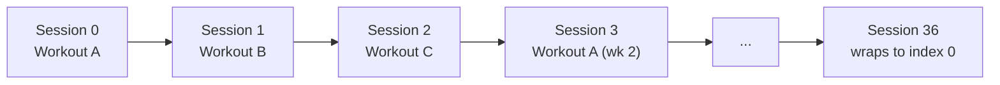
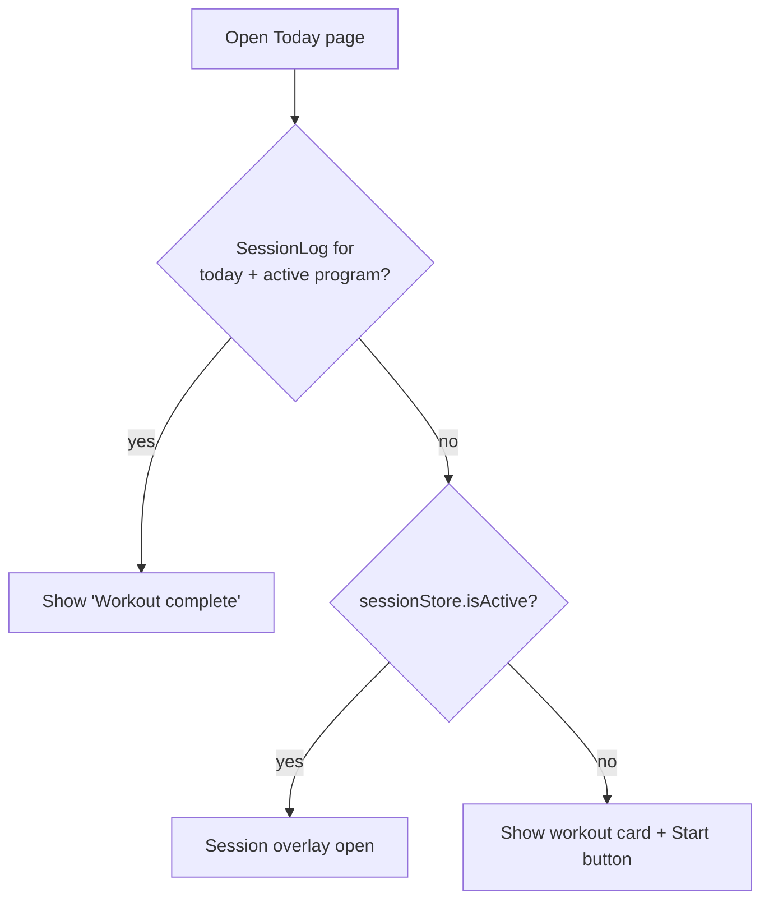

# Program Progression

How the app decides which workout is "today" and how week numbers advance.

---

## Linear Progression (Not Calendar-Based)

The app does **not** map workouts to calendar days. Instead, it walks through the program sequentially based on how many sessions you've completed.



```
todaysWorkout = allWorkouts[completedSessionCount % allWorkouts.length]
```

- `allWorkouts` = every workout across all 12 weeks (36 total for Strength Foundation)
- `completedSessionCount` = finished sessions for the active program
- After session 36, it wraps back to workout index 0

This means you can train on any day of the week — the app always gives you the next workout in sequence.

---

## Week Number

```typescript
currentWeekNumber = floor(completedSessionCount / daysPerWeek) + 1;
// capped at durationWeeks
```

For a 3-day/week program: sessions 0–2 → week 1, sessions 3–5 → week 2, etc.

---

## Workout Letter

```typescript
currentWorkoutLetter = char(65 + (completedSessionCount % daysPerWeek));
// 0→A, 1→B, 2→C
```

Position within the current week cycle, independent of which workout template is next.

---

## Today Already Done



If a `SessionLog` exists for today's date + active program, the Today page shows a "Workout complete" state instead of the start button. You cannot log two sessions on the same day.

---

## Program Page Display

The Program page shows **week 1 workout templates** (canonical A/B/C cards), not the specific week's instance.

Status badges are computed by finding each template's position in the flattened `allWorkouts` array (all 36 workouts) and comparing against `todaysWorkout`'s index:

| Badge         | Condition                                                 |
| ------------- | --------------------------------------------------------- |
| **Today**     | Template ID matches `todaysWorkout.id`                    |
| **Done**      | Template's index in `allWorkouts` is before today's index |
| **Scheduled** | Template's index is after today's index                   |

Workout edits via `saveWorkoutExercises()` propagate to **all weeks** by matching workout **name** (not ID).

---

## Implications

- Skipping a day doesn't shift the schedule — next open still shows the next workout
- No "rest day" or "skipped" status in progression logic
- Calendar shows actual session dates, not projected schedule

---

## Per-Discipline progression 🟡 (v1.4.0)

The logic above is unchanged — it just runs **per Discipline**. v1.4.0 tracks one active program per Discipline, so strength and belly dance each compute their own `todaysRoutine`, `currentWeek`, and streak from their own session counts. Two deliberate non-goals, locked in [US-015](../features/v1.4.0/US-015-discipline-engine-foundation.md#decisions--non-goals-locked):

- **Count-driven, never calendar-driven.** No day-of-week scheduling — the user logs whichever Discipline they want on a given day, and each recommends its next routine by count (A → B → C).
- **No load periodization.** Weeks are not auto-progressed; weight carries forward via the per-item last-used prefill and is adjusted manually.

---

## Related

- [How It Works](behavior.md) — Plain-language mental model
- [Data Model](../architecture/data-model.md) — Program, Workout, SessionLog types
- [Program Management](../requirements/program-management.md) — Editing requirements
- [State Management](state.md) — `programStore` derived values
