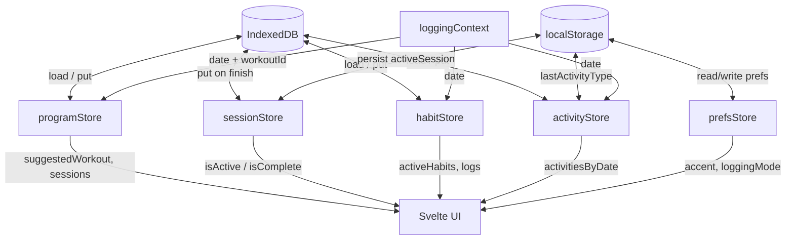

# State Management

Six Svelte 5 class stores hold all application state. No external state library.

---

## programStore

**File:** `src/lib/stores/program.svelte.ts`

Owns the long-lived workout data — programs, exercises, sessions, and derived schedule logic.

| State           | Source                   | Purpose                  |
| --------------- | ------------------------ | ------------------------ |
| `programs`      | IndexedDB                | All programs             |
| `exercises`     | IndexedDB                | Exercise library         |
| `sessions`      | IndexedDB                | Completed session logs   |
| `activeProgram` | IndexedDB + localStorage | Currently active program |

**Key derived values:**

- `suggestedWorkoutInCurrentWeek` — next workout in linear progression
- `workoutsForCurrentWeek` — all workouts for the current week (for WorkoutPicker)
- `sessionForDate(date)` — completed session for a given date (if any)
- `currentWeekNumber` — derived from session count
- `exerciseMap` — `Map<id, Exercise>` for fast lookups
- `isProgramComplete` — true when all sessions are logged
- `weekStreak` — consecutive weeks meeting daysPerWeek target

**Key actions:**

- `load()` — boot-time data load
- `saveWorkoutExercises(name, exercises)` — update workout across all weeks
- `addWorkout(workout)` — add new workout template to all weeks
- `refreshSessions()` — reload sessions after finish
- `getWorkoutById(id)` — lookup by ID
- `getWorkoutForSession(session)` — lookup workout for a completed session

---

## sessionStore

**File:** `src/lib/stores/session.svelte.ts`

Owns the ephemeral active session lifecycle.

| State              | Storage      | Purpose                            |
| ------------------ | ------------ | ---------------------------------- |
| `active`           | localStorage | In-progress session                |
| `isActive`         | derived      | True when a session is in progress |
| `isComplete`       | memory       | Triggers completion overlay        |
| `completedSession` | memory       | Stats for completion screen        |

**Key actions:**

- `start(workout, program, exerciseMap, opts)` — build ActiveSession from workout template; `opts.date` sets the session date
- `editSession(session, workout, exerciseMap)` — reopen a completed session for editing
- `completeSet(ex, set)` — instant mode: mark set done at current weight/reps
- `logSet(ex, set, weight, reps)` — sheet mode: mark set done with explicit values
- `finish(durationSeconds?)` — save completed sets only to IndexedDB, clear active
- `abandon()` — discard without saving to IndexedDB
- `checkForRecovery()` / `recoverSession()` — crash recovery

Every set write calls `persist()` → `localStorage:cwout:activeSession`.

---

## prefsStore

**File:** `src/lib/stores/prefs.svelte.ts`

User preferences. Loaded once at boot, saved on every change.

| Pref             | Default       | Applied via                          |
| ---------------- | ------------- | ------------------------------------ |
| `accentColor`    | `#b2f042`     | `--color-accent` CSS var + ink color |
| `loggingMode`    | `instant`     | SessionOverlay tap behavior          |
| `completionFeel` | `full`        | Confetti on/off                      |
| `density`        | `comfortable` | `data-density` on `<html>`           |
| `roundness`      | `default`     | `data-roundness` on `<html>`         |
| `weightUnit`     | `lb`          | Display in SetTile, LogSetSheet      |

All settings are editable via `/settings`.

---

## habitStore

**File:** `src/lib/stores/habits.svelte.ts`

Owns habits and their daily logs.

| State    | Source    | Purpose                          |
| -------- | --------- | -------------------------------- |
| `habits` | IndexedDB | All habit definitions            |
| `logs`   | IndexedDB | All habit log entries (all time) |

**Key derived values:**

- `activeHabits` — sorted by `sortOrder`, filtered to `active === true`
- `getLog(habitId)` — log entry for `habitId` on the current context date
- `loggedCountForDate(date)` — count of habits with any value logged on a date

**Key actions:**

- `load()` — boot-time data load
- `setDate(date)` — switch which date logs are read from
- `increment(habitId)` — add 1 to a count/times habit for the current date
- `decrement(habitId)` — subtract 1 (min 0)
- `toggle(habitId)` — flip boolean habit between 0 and 1
- `setDuration(habitId, minutes)` — set minutes value directly
- `setExact(habitId, value)` — set any numeric value directly
- `setMood(habitId, value)` — set mood value (-5 to +5)

---

## activityStore

**File:** `src/lib/stores/activities.svelte.ts`

Owns non-workout activity logs (runs, walks, yoga, etc.).

| State          | Source       | Purpose                                |
| -------------- | ------------ | -------------------------------------- |
| `activities`   | IndexedDB    | All activity log entries               |
| `lastUsedType` | localStorage | Pre-selects type on new activity sheet |

**Key derived values:**

- `activitiesByDate` — `Map<dateStr, ActivityLog[]>` for fast per-date lookup
- `todayActivities` — shorthand for today's activities

**Key actions:**

- `load()` — boot-time data load
- `add(data)` — create new activity entry
- `update(activity)` — overwrite existing entry
- `remove(id)` — delete entry

---

## loggingContext

**File:** `src/lib/stores/loggingContext.svelte.ts`

Global context shared across pages: the date being logged for and the selected workout.

| State       | Default            | Purpose                                   |
| ----------- | ------------------ | ----------------------------------------- |
| `date`      | today's date (ISO) | Which day all pages read/write logs for   |
| `workoutId` | null               | Overrides suggested workout on `/workout` |

**Key actions:**

- `setDate(date)` — change the active logging date
- `resetToToday()` — snap back to today
- `setWorkoutId(id)` — select a specific workout on `/workout`

This store has **no persistence** — it resets to today on every page load. The home page also syncs it from the `?date=` query param.

---

## Data Flow Diagram

---

## Related

- [How It Works](behavior.md) — What stores do in practice
- [Data Model](../architecture/data-model.md) — Type definitions
- [Program Progression](program-progression.md) — Schedule derivation
- [Session Logging](../requirements/session-logging.md) — User-facing flow
