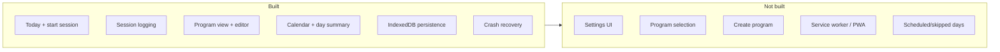

# Implementation Status

What's built today vs. what's still requirements-only. Updated to match the codebase.

---

## Core Flows

| Feature | Status | Notes |
|---------|--------|-------|
| Today view + start session | ✅ Built | Shows workout card, week strip, done state |
| Session logging (instant mode) | ✅ Built | One-tap set completion |
| Session logging (stepper/numpad) | ✅ Built | Opens LogSetSheet on tap |
| Finish / abandon session | ✅ Built | Finish saves completed sets only; abandon has confirm dialog |
| Crash recovery | ✅ Built | Resume/discard banner on boot |
| Session complete overlay | ✅ Built | Stats, confetti (configurable) |
| Program view + week progress | ✅ Built | Workout cards from week 1 templates |
| Workout editor | ✅ Built | Edit exercises, add new workouts |
| Exercise library browser | ✅ Built | Category-filtered sheet in editor |
| Calendar + day summary | ✅ Built | Month grid, tap completed days |
| IndexedDB persistence | ✅ Built | Raw API wrapper, seed data |
| Preferences store | ✅ Built | Accent, logging mode, density, etc. |

---

## Not Built Yet

| Feature | Status | Doc reference |
|---------|--------|---------------|
| Settings UI | ❌ Not built | Store exists, no `/settings` route |
| Program selection screen | ❌ Not built | Auto-selects first program |
| Create new program | ❌ Not built | Only edit workouts in active program |
| Copy built-in program | ❌ Not built | Built-in is editable in-place |
| Custom exercise CRUD | ❌ Not built | Library is read-only in UI |
| Service worker / PWA | ❌ Not built | Planned in offline strategy |
| Scheduled/skipped day status | ❌ Not built | Calendar shows completed/today only |
| Weekly consistency streak | ⚠️ Partial | Today: distinct-week count; Calendar: consecutive-day count — neither matches spec |
| Browse all program weeks | ❌ Not built | Program page shows week 1 templates only |
| Workout rename on edit | ⚠️ Broken | Title edit doesn't persist for existing workouts |

---

## Built-In Content

- **1 program:** Strength Foundation (12 weeks, 3 days/week, workouts A/B/C)
- **31 exercises** across 8 categories (Hinge, Squat, Push, Pull, Lateral, Rotational, Power, Carry)
- Seeded from `src/lib/db/seed.ts`

---

## Related

- [How It Works](behavior.md) — Full behavioral mental model
- [App Structure](app-structure.md) — Routes and layout
- [State Management](state.md) — Store details
- [Requirements](../requirements/) — Full user stories per feature area
