# Implementation Status

What's built today vs. what's still requirements-only. Updated to match the codebase.

```mermaid
flowchart LR
    subgraph built ["Built"]
        T[Today + start session]
        L[Session logging]
        P[Program view + editor]
        C[Calendar + day summary]
        D[IndexedDB persistence]
        R[Crash recovery]
        S[Settings UI]
        SEL[Program selection + copy]
        NEW[Create program]
        EX[Custom exercise CRUD]
        WK[Browse all weeks]
        STK[Streak — correct logic]
        SKP[Scheduled/skipped days]
    end

    subgraph gap ["Not built"]
        PWA[Service worker / PWA]
    end

    built --> gap
```

---

## Core Flows

| Feature | Status | Notes |
|---------|--------|-------|
| Today view + start session | ✅ Built | Shows workout card, week strip, done state |
| Session logging — smart tap (instant or first-time entry) | ✅ Built | Instant if weight known; opens sheet for first-time weight entry |
| Session logging — adjust completed set | ✅ Built | Tap any completed tile to reopen sheet; cascades forward |
| Weight remembered across sessions (exerciseLastUsed) | ✅ Built | Pre-fills on session start |
| Per-exercise weight increment (2.5 / 5 / 10) | ✅ Built | Configured on exercise form; weights round to nearest 2.5 |
| Finish / abandon session | ✅ Built | Finish saves completed sets only; abandon has confirm dialog |
| Crash recovery | ✅ Built | Resume/discard banner on boot |
| Session complete overlay | ✅ Built | Stats, confetti (configurable) |
| Program view + week progress | ✅ Built | Workout cards from week 1 templates |
| Workout editor | ✅ Built | Edit exercises, add new workouts |
| Exercise library browser | ✅ Built | Category-filtered sheet in editor |
| Calendar + day summary | ✅ Built | Month grid, tap completed days |
| IndexedDB persistence | ✅ Built | Raw API wrapper, seed data |
| Preferences store | ✅ Built | Accent, density, roundness, completion feel, weight unit |

---

## Not Built Yet

| Feature | Status | Doc reference |
|---------|--------|---------------|
| Service worker / PWA | ❌ Not built | Planned in offline strategy |

## Recently Completed

| Feature | Notes |
|---------|-------|
| Settings UI | `/settings` route — accent color (swatches + hex), weight unit, completion feel, density, roundness |
| Program selection screen | Bottom sheet listing all programs; built-in programs use "Use copy" (deep-clones before activating) |
| Create new program | 2-step full-screen flow — details then workout names; scaffolds all weeks |
| Copy built-in before editing | Guard dialog prompts copy+switch when editing a built-in program |
| Custom exercise CRUD | Create/edit/delete in ExerciseLibrarySheet; built-in exercises are read-only |
| Browse all program weeks | Week picker chevrons on program page; shows workouts for any week |
| Weekly consistency streak | Correct logic: consecutive weeks where sessions ≥ daysPerWeek; single calculation used on both Today and Calendar |
| Scheduled/skipped day status | Calendar infers training days-of-week from session history (≥ 2× daysPerWeek samples); shows scheduled (future) and missed (past) day indicators with legend |
| Workout rename on edit | Fixed: `saveWorkout` now persists name/letter/focus alongside exercises, matched by original name across all weeks |
| Density/roundness setters | `prefsStore.setDensity()` and `setRoundness()` added |

---

## Built-In Content

- **1 program:** Strength Foundation (12 weeks, 3 days/week, workouts A/B/C)
- **31 exercises** across 8 categories (Hinge, Squat, Push, Pull, Lateral, Rotational, Power, Carry)
- Seeded from `src/lib/db/seed.ts`

---

## Related

- [How It Works](behavior.md) — Full behavioral mental model
- [App Structure](app-structure.md) — Routes and layout
- [State Management](state.md) — Store details
- [Requirements](../requirements/) — Full user stories per feature area
