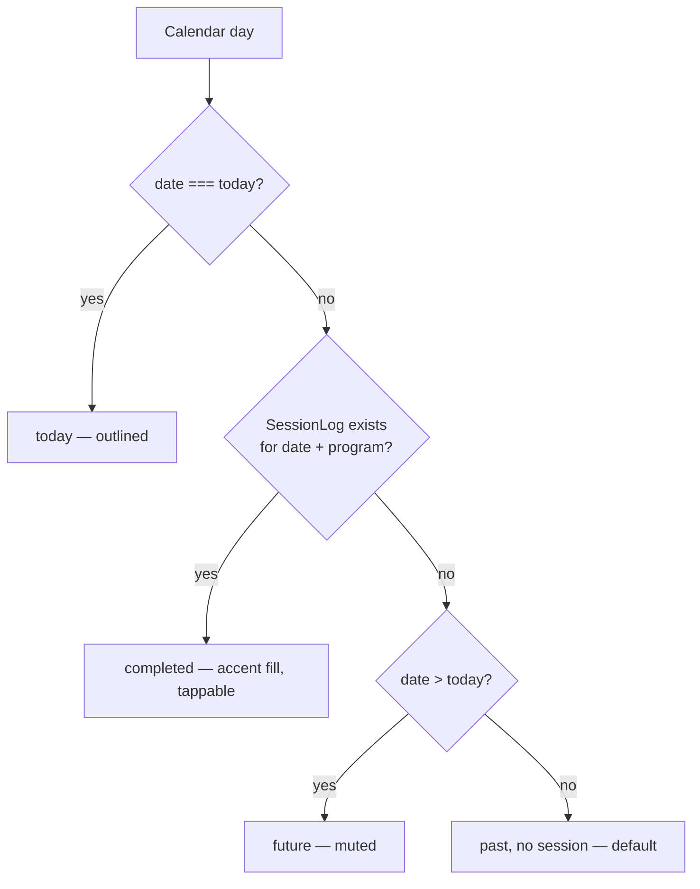
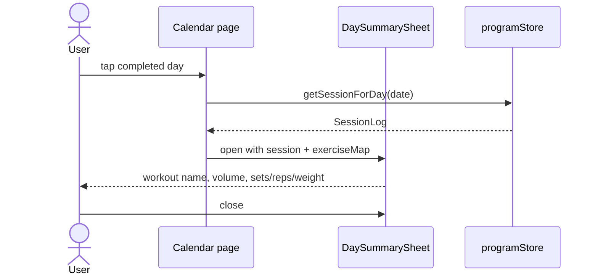

# History & Calendar

Viewing past sessions and tracking progress over time.

**Tied to:** [Data Model](../architecture/data-model.md) | [App Structure](../implementation/app-structure.md)

---

## Implementation Status

| Story | Status |
|-------|--------|
| Monthly calendar with navigation | ✅ Built |
| Completed day highlighting | ✅ Built |
| Day summary sheet (read-only) | ✅ Built |
| Month stats (sessions, volume, streak) | ✅ Built |
| Week strip on Today page | ✅ Built |
| Scheduled/rest/skipped day status | ❌ Not built |
| Weekly consistency streak | ⚠️ Wrong logic | See "Streak behavior" below |
| Week strip program filter | ⚠️ Partial | Shows all sessions, not active-program only |
| Edit past sessions | ❌ By design for v1 |

---

## Goal

Users can look back at their workout history to see what they've done, confirm they're on track, and review individual session details.

---

## Day Status Logic (Implemented)

Scheduled, rest, and skipped statuses are **not yet implemented** — see open questions below.

---

## Streak Behavior (Built Today)

Two different streak calculations exist — neither matches the target spec:

| Location | What it shows | How it works |
|----------|---------------|--------------|
| **Today header** | "X wk streak" | Count of distinct ISO weeks containing any session (all programs, all time) |
| **Calendar stats** | "Day streak" | Consecutive days with any session, walking backward from today (max 90 days) |

Target spec: consecutive weeks where all scheduled workouts were completed. Not built.

The **week strip** on Today shows this week's activity but does **not** filter by active program.

---

## User Stories

### Viewing the Calendar

> As a user, I want to see a monthly calendar that shows which days I trained, so I can see my consistency at a glance.

- Calendar shows current month by default
- Each day is colored by status:
  - **Completed** — filled with accent color
  - **Today** — outlined/highlighted
  - **Scheduled** — subtle indicator (upcoming training day per program)
  - **Rest** — no indicator
  - **Skipped** — muted/crossed indicator
- I can navigate to previous months
- Day statuses are derived from the active program schedule + session logs in IndexedDB

---

### Viewing a Day Summary

> As a user, I want to tap a completed day and see what I did, so I can review the session.

- Tapping a completed day opens a summary sheet
- Summary shows: workout name, date, total volume, exercises logged with sets/reps/weight
- I cannot edit a past session from this view (read-only in v1)

---

### Seeing My Streak / Consistency

> As a user, I want to know how many weeks I've trained consistently, so I stay motivated.

**Target:** Consecutive weeks where all scheduled workouts were completed.

**Built today:** Placeholder streak indicators with different logic on Today vs Calendar — see table above.

---

## Constraints

- History is read-only in v1 — no editing past sessions
- Calendar must work fully offline — all data comes from IndexedDB
- Performance: month rendering should not be slow even if IndexedDB has years of sessions

---

## Open Questions

- Should the calendar show the full program schedule (future scheduled days) or only past + today? **Today: only actual logged sessions.**
- Program switching is not built yet — calendar filters completed days by active program only.
- Skipped days are not implemented.

---

## Out of Scope for v1

- Volume trend graphs / sparklines (v2)
- Personal records (v2)
- Program completion percentage progress bar (v2)
- Export or sharing session data

---

## Related

- [How It Works](../implementation/behavior.md) — Calendar and streak behavior
- [Data Model — SessionLog](../architecture/data-model.md)
- [Session Logging](session-logging.md) — How sessions are created
- [Program Management](program-management.md) — Where the schedule comes from
