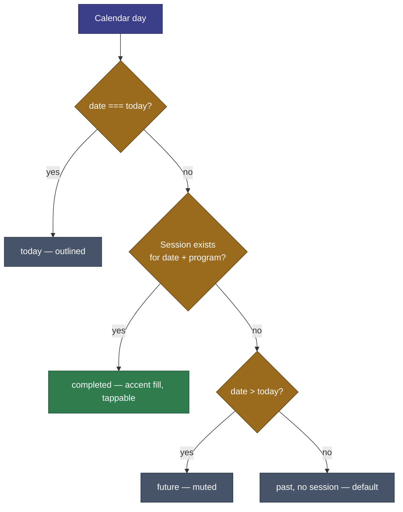
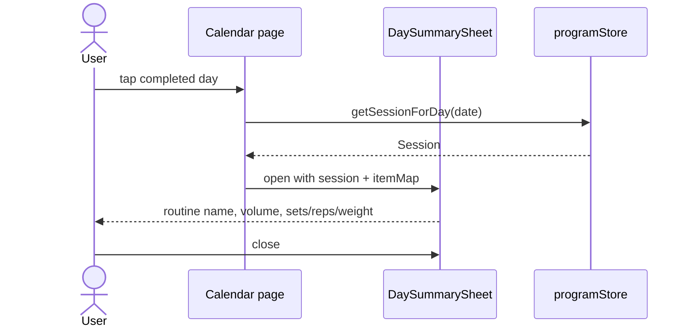

# History & Calendar

Viewing past sessions and tracking progress over time.

**Tied to:** [Data Model](../architecture/data-model.md) | [App Structure](../implementation/app-structure.md)

---

## Implementation Status

> **See [Implementation Status](../implementation/status.md)** for the full checklist.

| Area                              | Status   |
| --------------------------------- | -------- |
| Monthly calendar + navigation     | Built |                                 |
| Completed day highlighting        | Built |                                 |
| Day summary sheet                 | Built |                                 |
| Edit/delete sessions & activities | Built |                                 |
| Habit heatmap on calendar         | Built |                                 |
| Week strip on home                | Built |                                 |
| Weekly consistency streak         | Built | Per active program / discipline |
| Backfill past days                | Built | Date picker + calendar tap      |

Insights charts (volume trends, etc.) shipped in v1.5.0 — see [/insights](../implementation/app-structure.md).

---

## Goal

Users can look back at their workout history to see what they've done, confirm they're on track, and review individual session details.

---

## Day Status Logic (Implemented)

Scheduled, rest, and skipped **calendar cell styles** beyond completed/today/past are not implemented — see [roadmap](../roadmap/README.md) if needed after user testing.

---

## Streak Behavior (Built Today)

| Location         | What it shows | How it works                                                              |
| ---------------- | ------------- | ------------------------------------------------------------------------- |
| **Home header**  | Week streak   | `computeWeekStreak` — consecutive weeks with sessions ≥ `daysPerWeek`     |
| **Practice hub** | Combined streak | Cross-discipline streak when multiple plans are active                  |

See `programStore.weekStreakFor` and `combinedWeekStreak` in [State Management](../implementation/state.md).

---

## User Stories

### Viewing the Calendar

> As a user, I want to see a monthly calendar that shows which days I trained, so I can see my consistency at a glance.

- Calendar shows current month by default
- Each day is colored by status:
  - **Completed** — filled with accent color
  - **Today** — outlined/highlighted
  - **Scheduled** — subtle indicator (upcoming training day per program)
  - **Rest** — no indicator
  - **Skipped** — muted/crossed indicator
- I can navigate to previous months
- Day statuses are derived from the active program schedule + session logs in IndexedDB

---

### Viewing a Day Summary

> As a user, I want to tap a completed day and see what I did, so I can review the session.

- Tapping a completed day opens a summary sheet
- Summary shows: routine name, date, total volume, items logged with sets/reps/weight
- Past sessions and activities can be edited or deleted from this view

---

### Seeing My Streak / Consistency

> As a user, I want to know how many weeks I've trained consistently, so I stay motivated.

**Built today:** A week streak (`computeWeekStreak`) counts consecutive weeks with sessions meeting `daysPerWeek`, shown on the home header; the Practice hub shows a combined cross-discipline streak when multiple plans are active — see table above.

---

## Constraints

- History supports edit and delete from the day summary sheet
- Calendar must work fully offline — all data comes from IndexedDB
- Performance: month rendering should not be slow even if IndexedDB has years of sessions

---

## Open Questions

Resolved for now — revisit after user testing. Add items to [roadmap](../roadmap/README.md) if feedback demands them.

---

## Out of Scope

Volume trends and export shipped in v1.5.0 Insights and v1.7.0 backup. Other deferred ideas: [roadmap](../roadmap/README.md).

---

## Related

- [How It Works](../implementation/behavior.md) — Calendar and streak behavior
- [Data Model — Session](../architecture/data-model.md)
- [Session Logging](session-logging.md) — How sessions are created
- [Program Management](program-management.md) — Where the schedule comes from
