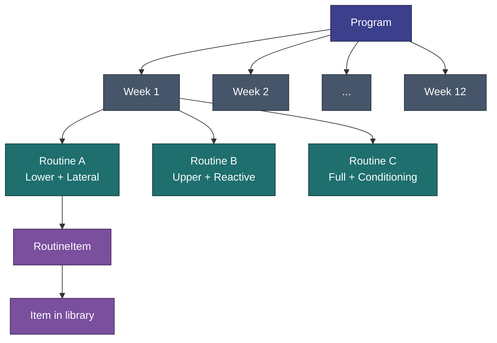
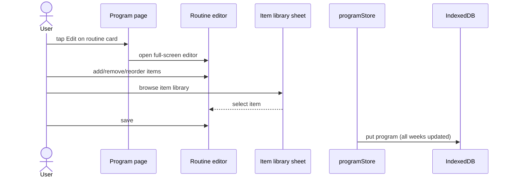

[Wiki](../README.md) › [5k — Requirements](../README.md#5k--requirements) › Program Management

# Program Management

Defining, selecting, and editing fitness programs.

**Tied to:** [Data Model](../architecture/data-model.md) | [Program Progression](../implementation/program-progression.md)

---

## Implementation Status

> **See [Implementation Status](../implementation/status.md)** for the full checklist. Summary below.

| Area                         | Status |
| ---------------------------- | ------ | ------------------------------------------------------------------------------ |
| Program picker / switching   | Built  |                                                                                |
| Create program from scratch  | Built  |                                                                                |
| Copy built-in before editing | Built  |                                                                                |
| Custom item CRUD             | Built  |                                                                                |
| Browse all program weeks     | Built  |                                                                                |
| Multi-plan activation        | Removed | Practice groups ([US-021](../features/v1.4.0/US-021-practice-groups-plans.md)) let more than one plan run at once; v1.10.0 ([US-052](../features/v1.10.0/US-052-one-workout-section.md)) made exactly one plan active, always |

**Roadmap:** week-by-week schedule preview in program picker — [roadmap](../roadmap/README.md#ux-polish).

---

## Goal

Users can follow any structured fitness program — one they select from built-in options or one they build themselves. A program is a multi-week plan with a defined number of training days per week and specific exercises per day.

---

## Built-In Programs

The app ships with a small set of ready-to-use programs. These act as starting points — users should be able to copy and modify them, not just run them as-is.

Currently shipped: **6 built-in "course" programs** — Strength Beginner/Intermediate 101–103, seeded from `src/lib/db/seed.ts` (the 6 Belly Dance course programs were removed in v1.10.0, [US-051](../features/v1.10.0/US-051-remove-belly-dance.md)).

Built-in programs are read-only: editing one prompts a copy-first guard that clones the program before any change is saved.

---

## User Stories

### Selecting a Program

> As a user, I want to see what programs are available and activate one, so I know what to do each week.

**Built today:** `/workout` lists plans (a template-based plan, a from-scratch plan, or a plan with a goal); activating one stores its id in `cwout:activeProgramIds`. As of v1.10.0 ([US-052](../features/v1.10.0/US-052-one-workout-section.md)) exactly one plan is ever active — `setActiveProgram()` replaces the id outright instead of appending, and the old per-Discipline `ProgramSelectSheet` is gone. Switching plans asks for confirmation and pauses the current one, preserving all history. Built-in programs deep-clone before activating.

---

### Viewing a Program

> As a user, I want to browse my active program's full schedule, so I understand what's coming up.

**Built today:**

- Routine cards (A/B/C) for the selected week, shown with item chips
- Week progress bar (derived from session count)
- Today / done / scheduled badges on routine cards
- Week picker chevrons to browse every week individually

---

### Creating a Program

> As a user, I want to build a custom program from scratch, so I'm not limited to built-in options.

- I can create a new program with a name, total weeks, and days per week
- The app scaffolds empty workout slots (e.g., "Week 1 – Day A, B, C")
- I fill each slot with exercises from the exercise library
- I can name each workout however I want ("Push", "Pull", "Legs", or "Monday")

---

### Editing a Program

> As a user, I want to modify my active program, so I can adjust it as my fitness evolves.

- I can edit any workout in my program: add exercises, remove exercises, change sets/reps
- Editing a built-in program prompts me to create a copy first
- Changes are saved immediately; no publish/draft concept
- Editing does not retroactively change historical session logs

---

### Managing the Exercise Library

> As a user, I want to add my own exercises, so I'm not limited to what ships with the app.

- I can create a custom exercise: name, unit (lb/kg/band/bodyweight), default sets/reps
- I can edit or delete custom exercises
- Built-in exercises cannot be deleted (but can be excluded from programs)
- When adding exercises to a workout, I can browse, search, and filter the library by category

---

## Constraints

- A program must have at least 1 week and 1 training day per week
- Maximum is not defined — don't artifically cap it
- A workout must have at least 1 exercise
- Programs can coexist in storage; **exactly one is ever active** (v1.10.0, [US-052](../features/v1.10.0/US-052-one-workout-section.md))

---

## Answered by Current Behavior

- **Exactly one active program, enforced.** The single active plan id is stored in `cwout:activeProgramIds`; activating a different plan pauses the current one (v1.10.0, [US-052](../features/v1.10.0/US-052-one-workout-section.md) — the point is staying focused).
- **Skipping days doesn't shift the schedule.** Next open always shows the next routine in linear sequence.
- **Editing mid-cycle doesn't change history.** Completed Sessions keep their original data; edits affect future sessions only.

---

## Related

- [Data Model](../architecture/data-model.md) — Program, Week, Routine, Item types
- [Session Logging](session-logging.md) — How programs drive the logging flow
- [History & Past Days](history-calendar.md) — Streaks and past sessions
