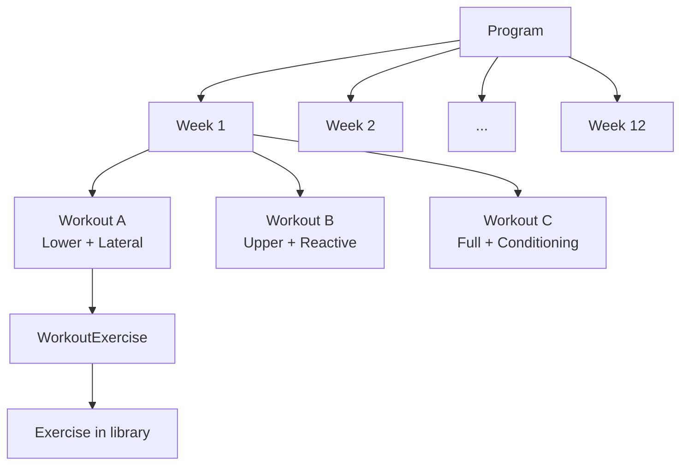
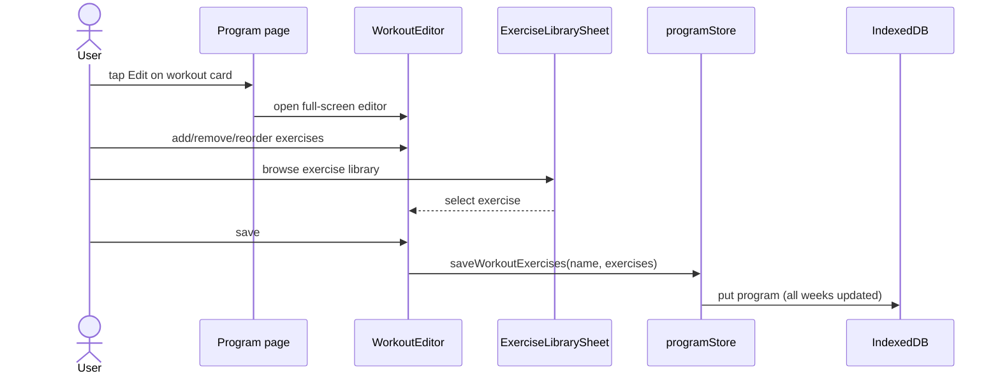

# Program Management

Defining, selecting, and editing fitness programs.

**Tied to:** [Data Model](../architecture/data-model.md) | [Program Progression](../implementation/program-progression.md)

---

## Implementation Status

> **See [Implementation Status](../implementation/status.md)** for the full checklist. Summary below.

| Area                         | Status   |
| ---------------------------- | -------- |
| Program picker / switching   | ✅ Built |
| Create program from scratch  | ✅ Built |
| Copy built-in before editing | ✅ Built |
| Custom item CRUD             | ✅ Built |
| Browse all program weeks     | ✅ Built |
| Multi-plan activation        | ✅ Built | Practice groups ([US-021](../features/v1.4.0/US-021-practice-groups-plans.md)) |

**Roadmap:** week-by-week schedule preview in program picker — [roadmap](../roadmap/README.md#ux-polish).

---

## Goal

Users can follow any structured fitness program — one they select from built-in options or one they build themselves. A program is a multi-week plan with a defined number of training days per week and specific exercises per day.

---

## Built-In Programs

The app ships with a small set of ready-to-use programs. These act as starting points — users should be able to copy and modify them, not just run them as-is.

Currently shipped:

- **Strength Foundation (12 weeks, 3 days/week)** — workouts A (Lower + Lateral), B (Upper + Reactive), C (Full + Conditioning). Seeded from `src/lib/db/seed.ts`.

Built-in programs are intended to be read-only with copy-to-edit, but today they are editable in-place via the workout editor.

---

## User Stories

### Selecting a Program

> As a user, I want to see what programs are available and activate one, so I know what to do each week.

**Built today:** First program in IndexedDB auto-selected on boot and stored in `cwout:activeProgramId`. No selection UI.

**Target:** Program picker screen; ability to switch programs while preserving history.

---

### Viewing a Program

> As a user, I want to browse my active program's full schedule, so I understand what's coming up.

**Built today:**

- Week 1 workout templates (A/B/C) shown as cards with exercise chips
- Week progress bar (derived from session count)
- Today / done / scheduled badges on workout cards

**Target (not yet):**

- Navigate and browse all weeks individually

---

### Creating a Program

> As a user, I want to build a custom program from scratch, so I'm not limited to built-in options.

- I can create a new program with a name, total weeks, and days per week
- The app scaffolds empty workout slots (e.g., "Week 1 – Day A, B, C")
- I fill each slot with exercises from the exercise library
- I can name each workout however I want ("Push", "Pull", "Legs", or "Monday")

---

### Editing a Program

> As a user, I want to modify my active program, so I can adjust it as my fitness evolves.

- I can edit any workout in my program: add exercises, remove exercises, change sets/reps
- Editing a built-in program prompts me to create a copy first
- Changes are saved immediately; no publish/draft concept
- Editing does not retroactively change historical session logs

---

### Managing the Exercise Library

> As a user, I want to add my own exercises, so I'm not limited to what ships with the app.

- I can create a custom exercise: name, unit (lb/kg/band/bodyweight), default sets/reps
- I can edit or delete custom exercises
- Built-in exercises cannot be deleted (but can be excluded from programs)
- When adding exercises to a workout, I can browse, search, and filter the library by category

---

## Constraints

- A program must have at least 1 week and 1 training day per week
- Maximum is not defined — don't artifically cap it
- A workout must have at least 1 exercise
- Programs can coexist in storage; only one is "active" at a time

---

## Answered by Current Behavior

- **One active program at a time.** Stored in `cwout:activeProgramId`. Auto-selects first program on boot.
- **Skipping days doesn't shift the schedule.** Next open always shows the next workout in linear sequence.
- **Editing mid-cycle doesn't change history.** Completed SessionLogs keep their original data; edits affect future sessions only.

---

## Related

- [Data Model](../architecture/data-model.md) — Program, Week, Workout, Exercise types
- [Session Logging](session-logging.md) — How programs drive the logging flow
- [History & Calendar](history-calendar.md) — How program completion is visualized
