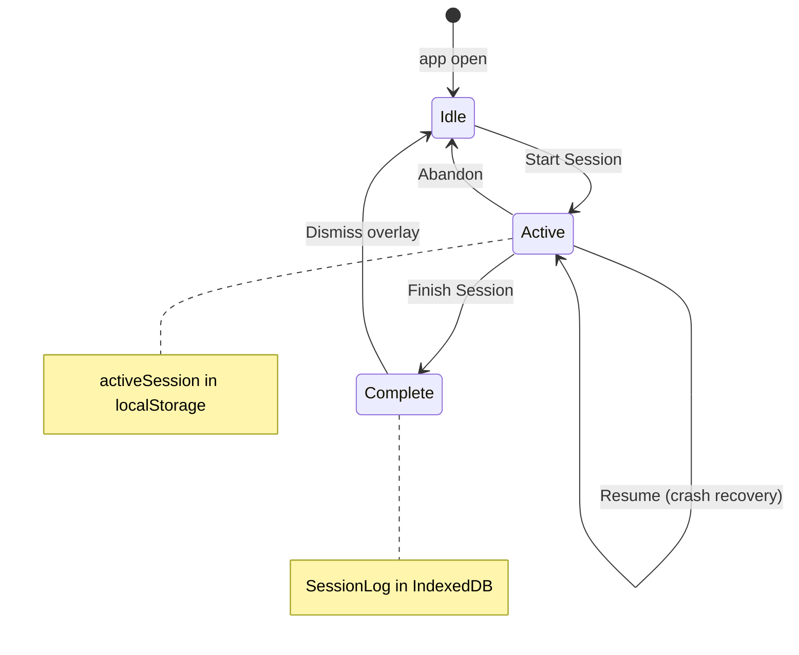
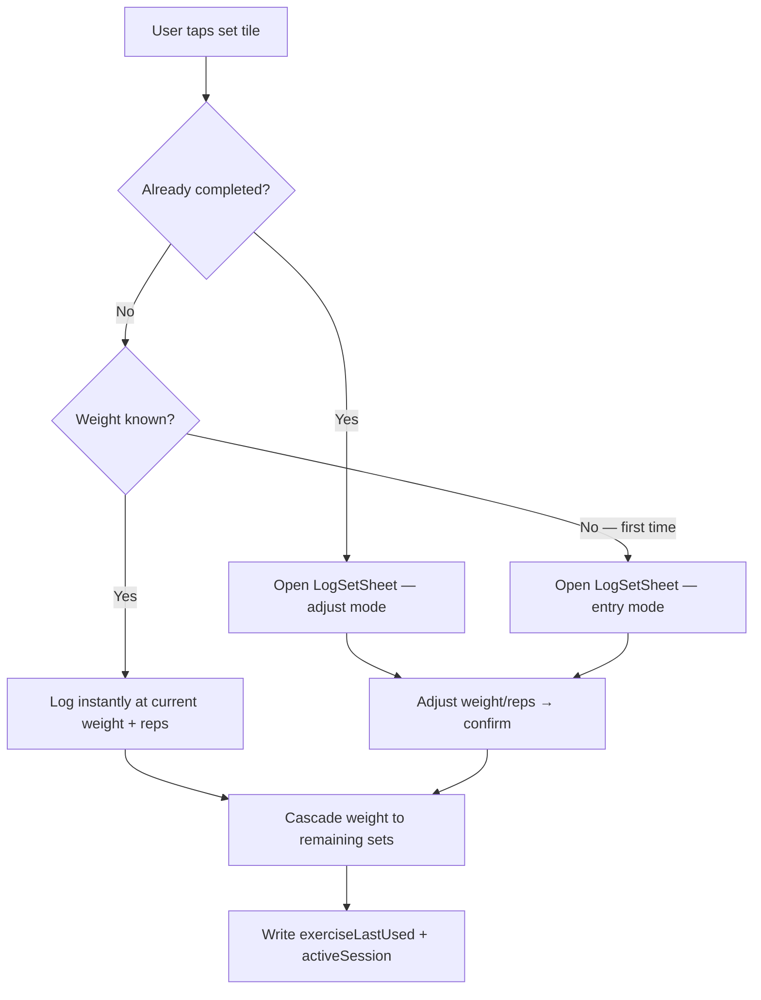

# Session Logging

The core action of the app — recording a completed workout.

**Tied to:** [Data Model](../architecture/data-model.md) | [State Management](../implementation/state.md) | [Components](../implementation/components.md)

---

## Implementation Status

| Story                                                   | Status   | Notes                                        |
| ------------------------------------------------------- | -------- | -------------------------------------------- |
| Start session from Today                                | ✅ Built |                                              |
| Smart tap: instant if weight known, sheet if first time | ✅ Built |                                              |
| First-time weight entry (number input)                  | ✅ Built | Autofocuses, rounds to nearest 2.5           |
| Weight carries forward within session                   | ✅ Built | Cascades to uncompleted sets                 |
| Weight remembered across sessions                       | ✅ Built | Via `exerciseLastUsed`                       |
| Tap completed set to adjust                             | ✅ Built | Sheet reopens; cascades to remaining sets    |
| Per-exercise weight increment (2.5 / 5 / 10)            | ✅ Built | Set on exercise, default 5                   |
| Exercise completion animation + haptics                 | ✅ Built |                                              |
| Finish session + completion overlay                     | ✅ Built | No confirm dialog; saves completed sets only |
| Abandon session                                         | ✅ Built | Back arrow → confirm; nothing saved          |
| Crash recovery (resume/discard)                         | ✅ Built |                                              |
| Set tile shows weight before log                        | ❌       | Shows "+" only until completed               |
| Haptic on set tap                                       | ❌       | Haptic only on exercise completion           |

---

## Goal

Logging a set should take under 5 seconds, one-handed. Everything else in the logging flow is secondary to this constraint.

---

## Session Lifecycle



---

## User Stories

### Starting a Session

> As a user, I want to start today's workout with one tap from the home screen, so I don't waste time navigating.

- The Today view shows today's scheduled workout
- A single "Start Session" CTA begins the session
- The active session overlay appears immediately — no loading state
- The session is written to `activeSession` in localStorage immediately (crash recovery)

---

### Logging a Set

> As a user, I want to log a set with one tap so I can do it between sets without breaking focus. If weight changes, I should be able to update it quickly.



**Weight known** = exercise has `lb/kg` weight > 0, or `band`/`bodyweight` (no numeric weight needed).

**First-time entry:** Number input autofocuses. Value is rounded to the nearest 2.5 lb on save.

**Weight cascade:** After any set is logged or adjusted, the new weight propagates forward to all uncompleted sets in that exercise. Completed sets keep their original value.

**Tap animation sequence:**

```
tap → scale down (0.93) immediately
  → white flash overlay (opacity 0.4→0, 280ms)
  → tile bg transitions to accent (220ms ease-out)
  → spring pop: scale 0.93→1.06→1 (220ms)
  → weight/reps text fades in
```

---

### Completing an Exercise

> As a user, I want to see a clear signal when I've finished all sets for an exercise, so I know to move on.

When the last set for an exercise is logged:

- Card border pulses accent (ripple animation)
- Checkmark fades in with spring pop
- Card background gets a subtle accent tint
- Haptic: `navigator.vibrate([12, 40, 18])`

---

### Finishing a Session

> As a user, I want to finish my session and see a completion moment, so I feel the workout is done.

**Built today:**

- Footer button always visible — label changes to "Finish early · X/Y sets" when incomplete
- **No confirmation dialog** — tap finishes immediately
- Only completed sets are saved; unlogged sets are silently dropped
- SessionLog written to IndexedDB, activeSession cleared, completion overlay shown

**Target (not yet):**

- Confirmation prompt when finishing with unlogged sets

---

### Abandoning a Session

> As a user, I want to discard an in-progress session if I need to stop early, so my history isn't cluttered with incomplete entries.

- Back arrow in session header triggers "End this session?" confirmation
- Nothing is saved to IndexedDB
- On confirm: `activeSession` cleared, SessionLog not written to permanent storage
- Partial session data is lost — this is intentional and expected

---

### Resuming a Crashed Session

> As a user, I want to resume an interrupted session without re-logging sets I already did, so I don't lose my work.

- On app boot, if `cwout:activeSession` exists in localStorage and `date === today`, offer to resume
- Resuming restores the session overlay with all previously logged sets pre-filled
- Discarding clears the key and starts fresh

See [Offline Strategy — Crash Recovery](../architecture/offline-strategy.md).

---

## Constraints

- Every set write must hit localStorage (`activeSession`) immediately — no batching
- `prefers-reduced-motion` is handled globally in `app.css` (animations/transitions reduced to ~0)
- All tap targets minimum 44×44px
- No network dependency at any point in the logging flow

---

## Out of Scope for v1

Deferred items on [roadmap](../roadmap/README.md): rest timer, progressive overload nudges, PR detection, per-item session notes.

---

## Related

- [How It Works](../implementation/behavior.md) — Actual session behavior today
- [Data Model — SessionLog, LoggedSet](../architecture/data-model.md)
- [Offline Strategy — Crash Recovery](../architecture/offline-strategy.md)
- [Program Management](program-management.md) — Where the workout definition comes from
- [Settings & Preferences](settings-preferences.md) — Completion feel, weight unit
- [History & Calendar](history-calendar.md) — Where completed sessions go
