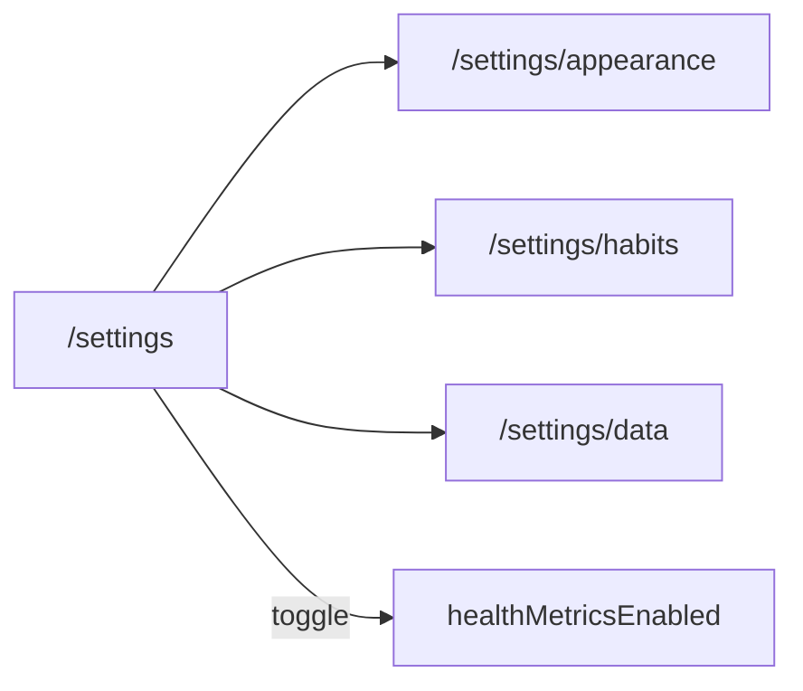
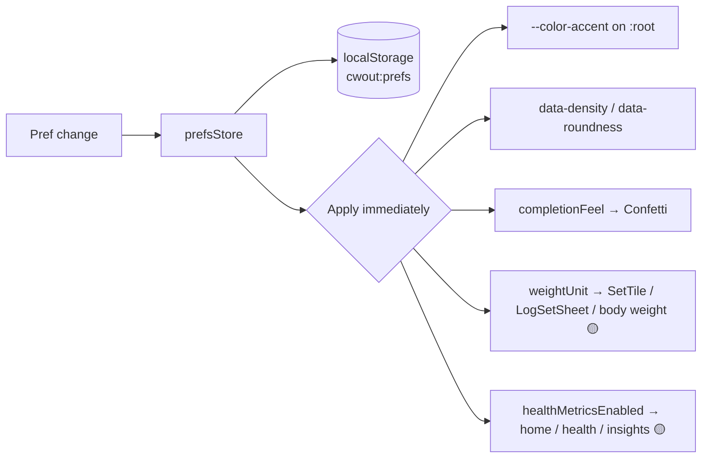

# Settings & Preferences

User-configurable behavior and appearance.

**Tied to:** [Data Model — UserPrefs](../architecture/data-model.md) | [State Management](../implementation/state.md)

---

## Implementation Status

| Story                                        | Status     |
| -------------------------------------------- | ---------- | ----------------------------------------------------------------------------------------------------- |
| Preferences store + localStorage persistence | ✅ Built   |
| Settings UI / route (`/settings`)            | ✅ Built   |
| Accent color (presets + custom hex)          | ✅ Built   |
| Density / roundness via data attributes      | ✅ Built   |
| Completion feel toggles confetti             | ✅ Built   |
| Weight unit in display/input                 | ✅ Built   |
| Per-exercise weight increment (2.5 / 5 / 10) | ✅ Built   | Set on the exercise form, not in global prefs                                                         |
| Clear workout data (settings)                | ✅ Built   | Wipes IndexedDB + session state; keeps prefs                                                          |
| Reset preferences to defaults (settings)     | ✅ Built   | Resets `cwout:prefs`; workout data untouched                                                          |
| Health metrics master toggle                 | ❌ Planned | [US-029](../features/v1.7.0/US-029-health-metrics.md) — inline on Settings hub                        |
| Settings hub restructure                     | ❌ Planned | [US-030](../features/v1.7.0/US-030-settings-restructure.md) — sub-routes for appearance, habits, data |

---

## Settings Information Architecture

> **Planned — [US-030](../features/v1.7.0/US-030-settings-restructure.md).** Replaces the current single long scroll.

| Route                  | Contents                                                                                                          |
| ---------------------- | ----------------------------------------------------------------------------------------------------------------- |
| `/settings`            | **Hub** — navigation rows + health metrics toggle                                                                 |
| `/settings/appearance` | Accent, weight unit, density, roundness                                                                           |
| `/settings/habits`     | Habit CRUD, reorder, active toggle ([US-009](../features/v1.3.0/US-009-habit-creation.md))                        |
| `/settings/data`       | Export / restore ([US-028](../features/v1.7.0/US-028-data-export-backup.md)), reset prefs, clear data, debug seed |

The hub stays short; destructive and infrequent actions live on **Data & backup**.

---

## Goal

A small set of meaningful preferences that change how the app feels and behaves — nothing more. No settings for the sake of settings.

---

## User Stories

### Choosing an Accent Color

> As a user, I want to pick an accent color that feels like mine.

- Color picker with a set of predefined options (at minimum: lime, lavender, red, blue, orange)
- Custom hex input optional
- When the accent is light (luminance > 140): text on accent surfaces uses dark ink (`#101010`). When dark: white ink (`#ffffff`).
- Color applies immediately across all UI surfaces — buttons, completed set tiles, rings, etc.

---

### Choosing Weight Units

> As a user, I want to track weight in my preferred unit (lbs or kg).

- Toggle between `lb` and `kg`
- Applies to all display and input throughout the app
- Historical logs store the raw number — unit preference determines how it's displayed

---

### Adjusting Completion Feel

> As a user, I want to tone down animations if I find them distracting.

- **Full** (default) — confetti on session complete, full ring animation on exercise complete
- **Subtle** — skip confetti, use minimal completion indicators

Separate from `prefers-reduced-motion` (which is a system setting). This is a conscious user choice within a normally-animated context.

---

### Adjusting Visual Density

> As a user, I want the UI to feel comfortable on my specific device.

Three values in storage (applied via `data-density` on `<html>`):

- **comfortable** (default) — standard tile height and gaps
- **compact** — tighter spacing
- **spacious** — more room between elements

---

### Adjusting Roundness

> As a user, I want the UI to match my aesthetic preference.

Three values in storage (applied via `data-roundness` on `<html>`):

- **default** — standard border radius
- **sharp** — smaller radius everywhere
- **soft** — larger, rounder corners

---

## Constraints

- Preferences are stored in `localStorage` — synchronous reads, always available
- Changes apply instantly — no "Save" button
- No account, no sync — preferences are device-local

---

## Out of Scope for v1

Deferred items on [roadmap](../roadmap/README.md): per-exercise rest timer, notifications, light mode (dark-only by design — see [Design Principles](../vision/principles.md)).

---

## Related

- [Data Model — UserPrefs](../architecture/data-model.md)
- [Session Logging](session-logging.md) — Where weight increment and completion feel are applied
- [Design Principles](../vision/principles.md) — Why dark-only and small surface area
- [US-030 — Settings Hub Restructure](../features/v1.7.0/US-030-settings-restructure.md)
