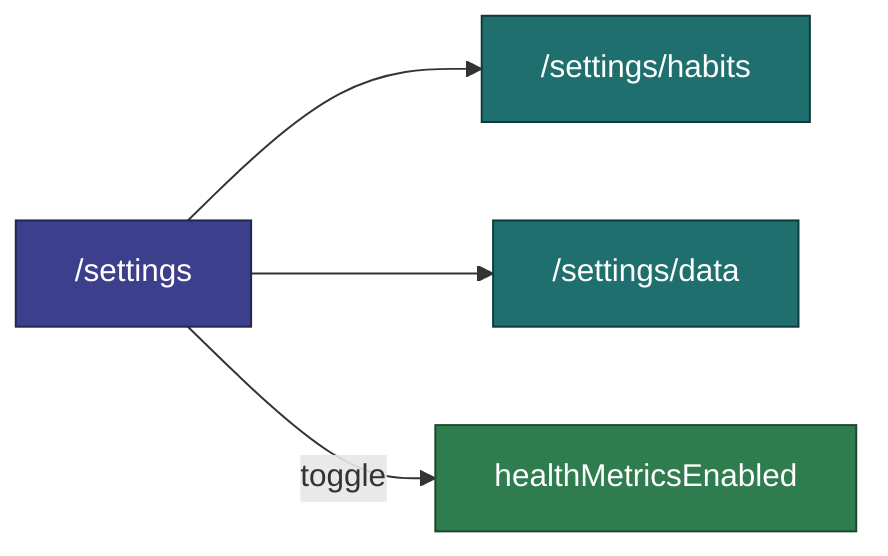
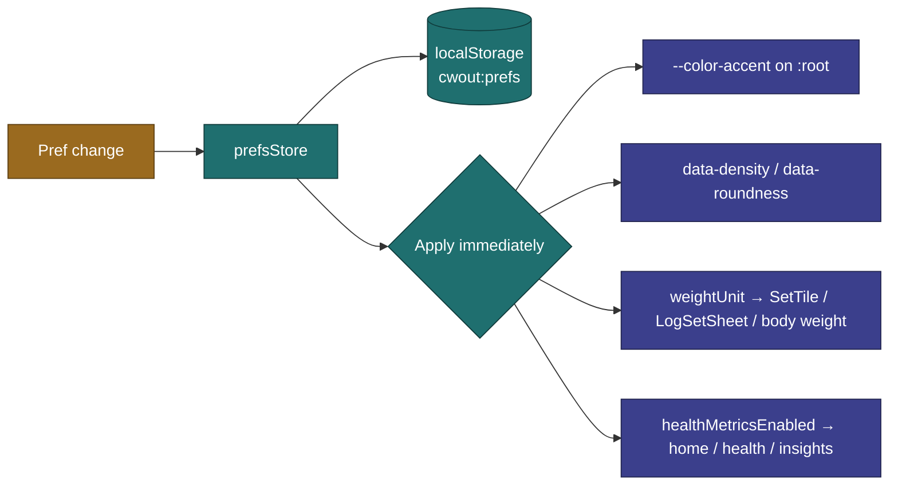

# Settings & Preferences

User-configurable behavior and appearance.

**Tied to:** [Data Model — UserPrefs](../architecture/data-model.md) | [State Management](../implementation/state.md)

---

## Implementation Status

| Story                                        | Status    | Notes                                                                                                                                            |
| -------------------------------------------- | --------- | ------------------------------------------------------------------------------------------------------------------------------------------------ |
| Preferences store + localStorage persistence | Built     | `prefsStore` ↔ `cwout:prefs`                                                                                                                     |
| Settings hub + sub-routes (`/settings`)      | Shipped   | Hub + `/settings/habits`, `/settings/data` ([US-030](../features/v1.7.0/US-030-settings-restructure.md)); `/settings/baselines` planned (US-034) |
| Health metrics master toggle                 | Shipped   | On the Settings hub ([US-029](../features/v1.7.0/US-029-health-metrics.md))                                                                      |
| Lift plans master toggle                     | Shipped   | On the Settings hub ([US-033](../features/v1.9.0/US-033-goal-progression-plans.md)); UI name **Lift plans**                                      |
| Baselines master toggle + Settings CRUD      | Planned   | [US-034](../features/v1.9.0/US-034-baselines-setup.md)                                                                                           |
| Weight unit applied in display/input         | Built     | Default `lb`; applied throughout                                                                                                                 |
| Accent / density / roundness applied on boot | Built     | Read from stored prefs and applied; see appearance-UI note below                                                                                 |
| Appearance settings page                     | Removed   | `/settings/appearance` UI dropped in US-030; prefs keep applying their stored/default values                                                     |
| Completion feel toggle                       | Not built | No `completionFeel` pref; the completion confetti always plays                                                                                   |
| Per-item weight increment (2.5 / 5 / 10)     | Built     | Set on the item form, not in global prefs                                                                                                        |
| Clear workout data                           | Built     | On `/settings/data`; wipes IndexedDB + session state                                                                                             |
| Reset preferences to defaults                | Built     | `prefsStore.resetToDefaults()`                                                                                                                   |

> **Appearance UI note:** `accentColor`, `density`, `roundness`, and `weightUnit` all exist in `prefsStore` and apply on boot, but the dedicated appearance page was removed in US-030 — there is currently no in-app UI to change them, so they use their stored/default values. The accent-color and completion-feel user stories below describe the **target** UX, not what is currently surfaced.

---

## Settings Information Architecture

Shipped in [US-030](../features/v1.7.0/US-030-settings-restructure.md) — a short hub with sub-routes instead of one long scroll.

| Route                 | Contents                                                                                             |
| --------------------- | ---------------------------------------------------------------------------------------------------- |
| `/settings`           | **Hub** — navigation rows + health / lift-plan / (planned) baselines toggles                         |
| `/settings/habits`    | Habit CRUD, reorder, active toggle ([US-009](../features/v1.3.0/US-009-habit-creation.md))           |
| `/settings/baselines` | **Planned** — Baseline CRUD ([US-034](../features/v1.9.0/US-034-baselines-setup.md))                 |
| `/settings/data`      | Export / restore ([US-028](../features/v1.7.0/US-028-data-export-backup.md)), clear data, debug seed |

The hub stays short; destructive and infrequent actions live on **Data & backup**. There is no appearance page — see the Appearance UI note above.

---

## Goal

A small set of meaningful preferences that change how the app feels and behaves — nothing more. No settings for the sake of settings.

---

## User Stories

### Choosing an Accent Color

> As a user, I want to pick an accent color that feels like mine.

- Color picker with a set of predefined options (at minimum: lime, lavender, red, blue, orange)
- Custom hex input optional
- When the accent is light (luminance > 140): text on accent surfaces uses dark ink (`#101010`). When dark: white ink (`#ffffff`).
- Color applies immediately across all UI surfaces — buttons, completed set tiles, rings, etc.

---

### Choosing Weight Units

> As a user, I want to track weight in my preferred unit (lbs or kg).

- Toggle between `lb` and `kg`
- Applies to all display and input throughout the app
- Historical logs store the raw number — unit preference determines how it's displayed

---

### Adjusting Completion Feel

> As a user, I want to tone down animations if I find them distracting.

- **Full** (default) — confetti on session complete, full ring animation on exercise complete
- **Subtle** — skip confetti, use minimal completion indicators

Separate from `prefers-reduced-motion` (which is a system setting). This is a conscious user choice within a normally-animated context.

---

### Adjusting Visual Density

> As a user, I want the UI to feel comfortable on my specific device.

Three values in storage (applied via `data-density` on `<html>`):

- **comfortable** (default) — standard tile height and gaps
- **compact** — tighter spacing
- **spacious** — more room between elements

---

### Adjusting Roundness

> As a user, I want the UI to match my aesthetic preference.

Three values in storage (applied via `data-roundness` on `<html>`):

- **default** — standard border radius
- **sharp** — smaller radius everywhere
- **soft** — larger, rounder corners

---

## Constraints

- Preferences are stored in `localStorage` — synchronous reads, always available
- Changes apply instantly — no "Save" button
- No account, no sync — preferences are device-local

---

## Out of Scope for v1

Deferred items on [roadmap](../roadmap/README.md): per-exercise rest timer, notifications, light mode (dark-only by design — see [Design Principles](../vision/principles.md)).

---

## Related

- [Data Model — UserPrefs](../architecture/data-model.md)
- [Session Logging](session-logging.md) — Where weight increment and completion feel are applied
- [Design Principles](../vision/principles.md) — Why dark-only and small surface area
- [US-030 — Settings Hub Restructure](../features/v1.7.0/US-030-settings-restructure.md)
