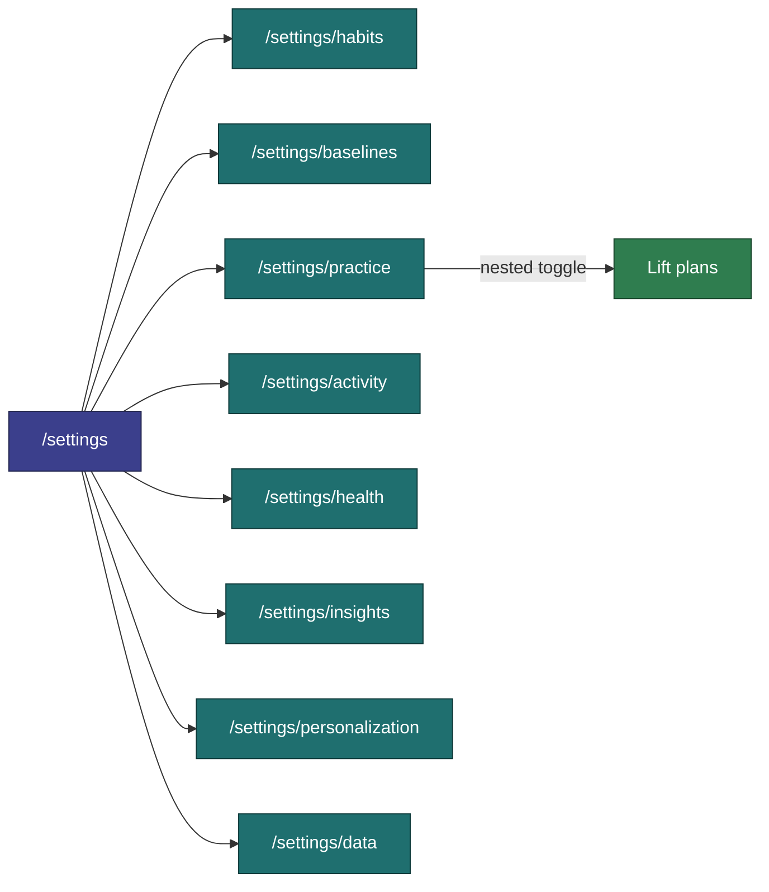
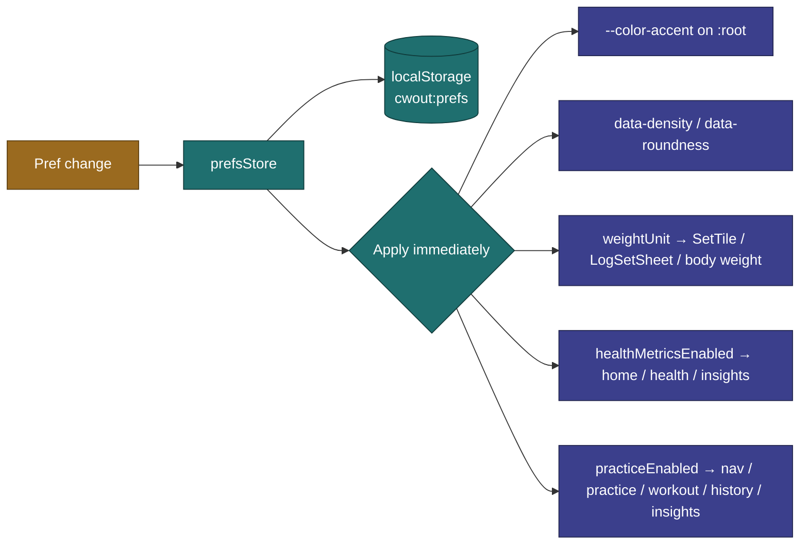

[Wiki](../README.md) › [5k — Requirements](../README.md#5k--requirements) › Settings & Preferences

# Settings & Preferences

User-configurable behavior and appearance.

**Tied to:** [Data Model — UserPrefs](../architecture/data-model.md) | [State Management](../implementation/state.md)

---

## Implementation Status

| Story                                        | Status    | Notes                                                                                                                                                                                          |
| -------------------------------------------- | --------- | ---------------------------------------------------------------------------------------------------------------------------------------------------------------------------------------------- |
| Preferences store + localStorage persistence | Built     | `prefsStore` ↔ `cwout:prefs`                                                                                                                                                                   |
| Settings hub + sub-routes (`/settings`)      | Built     | One row per feature since v1.10.0 ([US-045](../features/v1.10.0/US-045-settings-feature-hub.md)); originally [US-030](../features/v1.7.0/US-030-settings-restructure.md)                       |
| Health metrics master toggle                 | Built     | On `/settings/health` ([US-029](../features/v1.7.0/US-029-health-metrics.md), moved by US-045)                                                                                                 |
| Lift plans master toggle                     | Built     | On `/settings/practice` ([US-033](../features/v1.9.0/US-033-goal-progression-plans.md)); UI name **Lift plans**                                                                                |
| Baselines master toggle + Settings CRUD      | Built     | [US-034](../features/v1.9.0/US-034-baselines-setup.md)                                                                                                                                         |
| Habits / Activity log master toggles         | Built     | Both default off; every tracking feature is opt-in                                                                                                                                             |
| Practice master toggle                       | Built     | Default off; Lift plans nest inside it                                                                                                                                                         |
| Overview card order (`homeCardOrder`)        | Built     | Drag or arrows on Personalization (and `/settings/overview`); `src/lib/homeCards.ts`                                                                                                           |
| Weight unit applied in display/input         | Built     | Default `lb`; a **label only** — switching does not convert stored readings                                                                                                                    |
| Accent / density / roundness applied on boot | Built     | Read from stored prefs and applied; see appearance-UI note below                                                                                                                               |
| Personalization page                         | Built     | `/settings/personalization` — accent, weight unit, density, roundness, card order ([US-046](../features/v1.10.0/US-046-personalization.md)). Restores the Appearance page dropped after US-030 |
| Insights chart visibility (`hiddenCharts`)   | Built     | `/settings/insights` + ⋯ → Hide on each chart ([US-043](../features/v1.10.0/US-043-insights-chart-visibility.md))                                                                              |
| Light mode                                   | Deferred  | Next version — [Roadmap](../roadmap/README.md)                                                                                                                                                 |
| Completion feel toggle                       | Not built | No `completionFeel` pref; the completion confetti always plays                                                                                                                                 |
| Per-item weight increment (2.5 / 5 / 10)     | Built     | Set on the item form, not in global prefs                                                                                                                                                      |
| Clear workout data                           | Built     | On `/settings/data`; wipes IndexedDB + session state                                                                                                                                           |
| Reset preferences to defaults                | Built     | `prefsStore.resetToDefaults()`                                                                                                                                                                 |

> **Appearance UI note:** since v1.10.0, `accentColor`, `density`, `roundness`, and `weightUnit` are editable again on **Settings → Personalization** ([US-046](../features/v1.10.0/US-046-personalization.md)). The completion-feel story below still describes target UX only.

---

## Settings Information Architecture

Reshaped in [US-045](../features/v1.10.0/US-045-settings-feature-hub.md) (v1.10.0): **one row per feature**, iPhone-Settings style. Each row shows On / Off and opens that feature's page, which holds its switch, its manage list, and its own options. (Originally [US-030](../features/v1.7.0/US-030-settings-restructure.md).)

| Route                       | Contents                                                                                                               |
| --------------------------- | ---------------------------------------------------------------------------------------------------------------------- |
| `/settings`                 | **Hub** — Features: Habits · Baselines · Practice · Activity · Health. App: Insights · Personalization · Data & backup |
| `/settings/habits`          | Habits switch; habit CRUD, reorder, active toggle, colors; Mood colors                                                 |
| `/settings/baselines`       | Baselines switch; baseline CRUD ([US-037](../features/v1.10.0/US-037-flexible-baseline-metrics.md))                    |
| `/settings/practice`        | Practice switch; Lift plans switch; link to `/goals`                                                                   |
| `/settings/activity`        | Activity log switch                                                                                                    |
| `/settings/health`          | Health metrics switch                                                                                                  |
| `/settings/insights`        | Show / hide each Insights chart                                                                                        |
| `/settings/personalization` | Accent, weight unit, density, roundness, Overview card order                                                           |
| `/settings/overview`        | Overview card order (kept for old links)                                                                               |
| `/settings/data`            | Export / restore ([US-028](../features/v1.7.0/US-028-data-export-backup.md)), clear data, debug seed                   |

Settings feature pages are never gated by their own flag — they hold the switch that turns the feature on. Destructive and infrequent actions live on **Data & backup**.

### Feature toggles

Every feature toggle defaults **off** and hides UI only — data always persists ([state.md](../implementation/state.md#feature-flags-hide-ui-data-always-persists)).

| Toggle                        | Covers                                                                  |
| ----------------------------- | ----------------------------------------------------------------------- |
| `habitsEnabled`               | Habits **and mood** — daily check-in, CRUD, dots, charts                |
| `activityLogEnabled`          | The activity log — runs, walks, yoga, and other one-off activities      |
| `practiceEnabled`             | The whole Practice / session engine, plus its History & Insights marks  |
| `goalProgressionPlansEnabled` | Lift plans — **nested under Practice**; only shown while Practice is on |
| `healthMetricsEnabled`        | Weight and blood pressure                                               |
| `baselinesEnabled`            | Daily baselines (1 to n metrics each)                                   |

**Everything is opt-in**, so a fresh install tracks nothing. Overview shows a "choose what to track" empty state rather than a blank page, and History day cells are not tappable until at least one feature is on.

Lift plans are nested because a plan can only be trained through `/workout`, which Practice owns. Code reads the derived `prefsStore.liftPlansEnabled` rather than and-ing the two flags.

Mood has no toggle of its own — it is a protected habit, locked _inside_ Habits but hidden along with it.

### Overview card order

Which feature sits at the top of Overview is the user's call, not a hardcoded default — some people lead with Habits, others with the Activity log. `homeCardOrder` holds the order, edited on **Personalization** (also `/settings/overview`) by drag or arrow buttons. Details and the stale-value repair rule: [state.md](../implementation/state.md#overview-card-order).

---

## Goal

A small set of meaningful preferences that change how the app feels and behaves — nothing more. No settings for the sake of settings.

---

## User Stories

### Choosing an Accent Color

> As a user, I want to pick an accent color that feels like mine.

- Color picker with a set of predefined options (at minimum: lime, lavender, red, blue, orange)
- Custom hex input optional
- When the accent is light (luminance > 140): text on accent surfaces uses dark ink (`#101010`). When dark: white ink (`#ffffff`).
- Color applies immediately across all UI surfaces — buttons, completed set tiles, rings, etc.

---

### Choosing Weight Units

> As a user, I want to track weight in my preferred unit (lbs or kg).

- Toggle between `lb` and `kg`
- Applies to all display and input throughout the app
- Historical logs store the raw number — unit preference determines how it's displayed

---

### Adjusting Completion Feel

> As a user, I want to tone down animations if I find them distracting.

- **Full** (default) — confetti on session complete, full ring animation on exercise complete
- **Subtle** — skip confetti, use minimal completion indicators

Separate from `prefers-reduced-motion` (which is a system setting). This is a conscious user choice within a normally-animated context.

---

### Adjusting Visual Density

> As a user, I want the UI to feel comfortable on my specific device.

Three values in storage (applied via `data-density` on `<html>`):

- **comfortable** (default) — standard tile height and gaps
- **compact** — tighter spacing
- **spacious** — more room between elements

---

### Adjusting Roundness

> As a user, I want the UI to match my aesthetic preference.

Three values in storage (applied via `data-roundness` on `<html>`):

- **default** — standard border radius
- **sharp** — smaller radius everywhere
- **soft** — larger, rounder corners

---

## Constraints

- Preferences are stored in `localStorage` — synchronous reads, always available
- Changes apply instantly — no "Save" button
- No account, no sync — preferences are device-local

---

## Out of Scope for v1

Deferred items on [roadmap](../roadmap/README.md): per-exercise rest timer, notifications, light mode (dark-only by design — see [Design Principles](../vision/principles.md)).

---

## Related

- [Data Model — UserPrefs](../architecture/data-model.md)
- [Session Logging](session-logging.md) — Where weight increment and completion feel are applied
- [Design Principles](../vision/principles.md) — Why dark-only and small surface area
- [US-030 — Settings Hub Restructure](../features/v1.7.0/US-030-settings-restructure.md)
