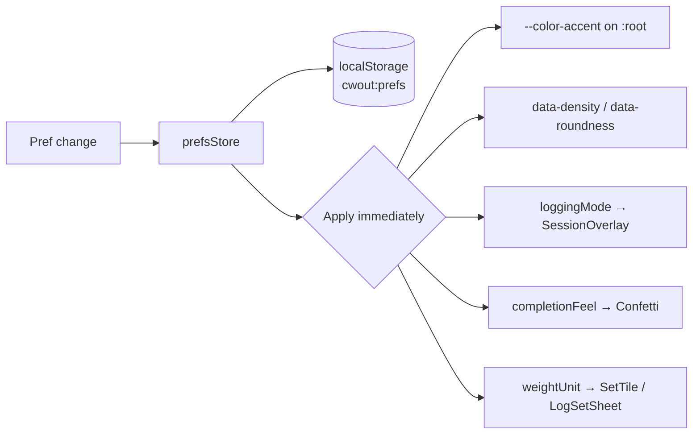

# Settings & Preferences

User-configurable behavior and appearance.

**Tied to:** [Data Model — UserPrefs](../architecture/data-model.md) | [State Management](../implementation/state.md)

---

## Implementation Status

| Story | Status |
|-------|--------|
| Preferences store + localStorage persistence | ✅ Built |
| Accent color applied at runtime | ✅ Built |
| Density/roundness via data attributes | ✅ Built |
| Logging mode affects session behavior | ✅ Built |
| Completion feel toggles confetti | ✅ Built |
| Weight unit in display/input | ✅ Built |
| Settings UI / route | ❌ Not built — no way to change prefs in-app |
| Change density / roundness in-app | ❌ Store loads them but has no public setters |

Prefs can be changed via browser DevTools → localStorage → `cwout:prefs`.

---

## Goal

A small set of meaningful preferences that change how the app feels and behaves — nothing more. No settings for the sake of settings.

---

## User Stories

### Choosing a Logging Mode

> As a user, I want to choose how I log sets so the input method matches how I train.

Three modes:
- **Instant** (default) — one tap logs at last-used weight + target reps. Fastest.
- **Stepper** — tap opens a +/- stepper. Good for users who regularly adjust weight.
- **Numpad** — tap opens a full numeric keyboard. Good for users who always type exact values.

Setting persists in `cwout:prefs`.

---

### Choosing an Accent Color

> As a user, I want to pick an accent color that feels like mine.

- Color picker with a set of predefined options (at minimum: lime, lavender, red, blue, orange)
- Custom hex input optional
- When the accent is light (luminance > 140): text on accent surfaces uses dark ink (`#101010`). When dark: white ink (`#ffffff`).
- Color applies immediately across all UI surfaces — buttons, completed set tiles, rings, etc.

---

### Choosing Weight Units

> As a user, I want to track weight in my preferred unit (lbs or kg).

- Toggle between `lb` and `kg`
- Applies to all display and input throughout the app
- Historical logs store the raw number — unit preference determines how it's displayed

---

### Adjusting Completion Feel

> As a user, I want to tone down animations if I find them distracting.

- **Full** (default) — confetti on session complete, full ring animation on exercise complete
- **Subtle** — skip confetti, use minimal completion indicators

Separate from `prefers-reduced-motion` (which is a system setting). This is a conscious user choice within a normally-animated context.

---

### Adjusting Visual Density

> As a user, I want the UI to feel comfortable on my specific device.

Three values in storage (applied via `data-density` on `<html>`):

- **comfortable** (default) — standard tile height and gaps
- **compact** — tighter spacing
- **spacious** — more room between elements

---

### Adjusting Roundness

> As a user, I want the UI to match my aesthetic preference.

Three values in storage (applied via `data-roundness` on `<html>`):

- **default** — standard border radius
- **sharp** — smaller radius everywhere
- **soft** — larger, rounder corners

---

## Constraints

- Preferences are stored in `localStorage` — synchronous reads, always available
- Changes apply instantly — no "Save" button
- No account, no sync — preferences are device-local

---

## Out of Scope for v1

- Per-exercise rest timer duration
- Notification settings (rest timer alerts)
- Theme beyond dark mode (no light mode — see [Design Principles](../vision/principles.md))

---

## Related

- [Data Model — UserPrefs](../architecture/data-model.md)
- [Session Logging](session-logging.md) — Logging mode is used here
- [Design Principles](../vision/principles.md) — Why dark-only and small surface area
