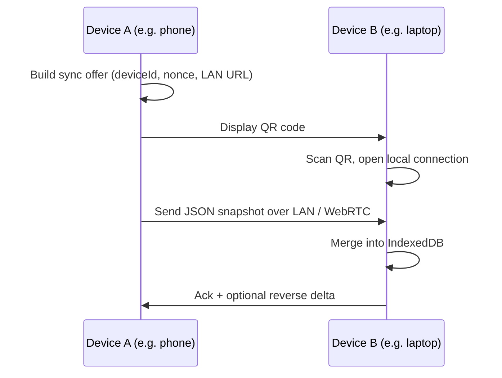
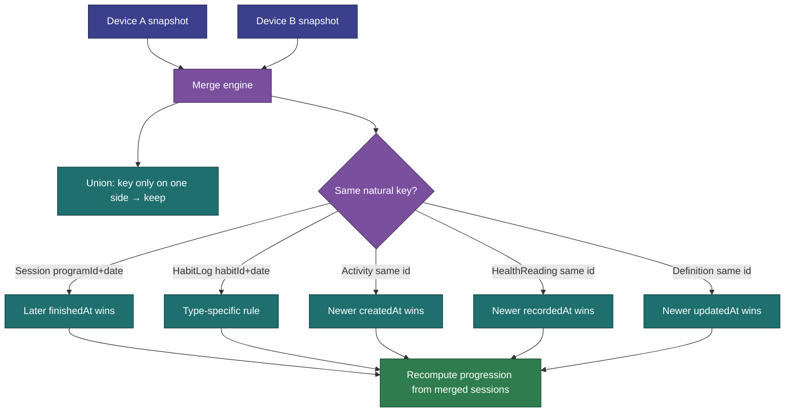

[Wiki](../README.md) › [Roadmap](README.md) › Device-to-Device Sync

# Device-to-Device Sync

> **Status:** Roadmap — not started  
> **Origin:** [US-028 Phase 2](../features/v1.7.0/US-028-data-export-backup.md)  
> **Depends on:** Phase 1 file export/import (shipped on Settings → Data)

Ongoing sync between phone and computer (or two phones) without cloud services. Phase 1 covers one-shot JSON backup files; this doc covers QR-paired peer sync with merge rules.

---

## Design North Star

> "Your data is yours — take it with you."

Same constraints as Phase 1: client-only, no accounts, no backend. QR is the **pairing handshake**, not the data pipe.

---

## Why QR alone is not enough

A single QR code holds roughly **2–4 KB**. Months of session history is often **tens to hundreds of KB**. QR encodes the sync offer; payload transfers over LAN or WebRTC.



---

## Sync flow

1. **Device A:** Settings → **Data & backup** → **Sync with another device** → shows QR (pairing payload + local endpoint).
2. **Device B:** Settings → **Data & backup** → **Sync from device** → camera scans QR → connects on same Wi‑Fi (or WebRTC).
3. **Device A** sends a snapshot (same envelope as Phase 1, plus sync metadata).
4. **Device B** runs the merge engine, shows a summary, reloads.
5. Reverse sync uses the same flow with roles swapped.

**Constraints:**

- Requires secure context (HTTPS or `localhost`) — same as PWA install.
- Same Wi‑Fi is the expected happy path; WebRTC is a fallback for direct peer transfer.
- No cloud relay, no accounts.

---

## Sync metadata (appended to envelope)

```json
{
	"sync": {
		"deviceId": "abc123",
		"lastSyncAt": "2026-06-23T10:00:00.000Z"
	}
}
```

Future syncs may send only records changed since `lastSyncAt` to keep payloads small.

---

## Web Share API (shipped)

On supported mobile browsers, Export builds a `File` and calls **`navigator.share({ files })`** (files only — no title/text, which breaks some Android browsers) so the user can **Save to Files**, Mail, or AirDrop. If `canShare` throws or `share` rejects (common on Brave desktop/Android), Export **falls back to download**. User dismiss (`AbortError`) is cancel, not failure. Still fully offline.

---

## Merge rules

"Same date" is not one rule — each entity has a **natural key**. The merge engine unions non-overlapping records and applies conflict rules when keys collide.

### Entity summary

| Entity                     | Natural key                              | Multiple per day?                                                   | Conflict rule                                                 |
| -------------------------- | ---------------------------------------- | ------------------------------------------------------------------- | ------------------------------------------------------------- |
| **Session**                | `programId` + `date`                     | No — one per program per day                                        | See below                                                     |
| **HabitLog**               | `habitId` + `date` (id = `habitId:date`) | No                                                                  | See below                                                     |
| **ActivityLog**            | `id`                                     | Yes — many per day                                                  | Union by `id`; same id → newer `createdAt`                    |
| **HealthReading**          | `id`                                     | Yes — many per day (BP); weight upserts one per `metricId` + `date` | Union by `id`; same id → newer `recordedAt`                   |
| **Item / Program / Habit** | `id`                                     | N/A                                                                 | Last-write-wins by `updatedAt` (add field when building sync) |
| **ItemLastUsed**           | `itemId`                                 | N/A                                                                 | Value from the newer session that touched the item            |
| **Prefs**                  | singleton                                | One blob                                                            | Receiving device keeps its prefs unless user opts in          |
| **activeProgramIds**       | per `disciplineId`                       | One per Discipline                                                  | Merge per discipline key                                      |

Strength and belly dance sessions on the **same calendar date** are **not** a conflict — different `programId` / `disciplineId`.

### Sessions (critical)

Both devices logged a workout for the **same program on the same date** → only one can survive (app invariant: `sessionForProgramDate`).

**Default policy:**

1. Keep the session with the **later `finishedAt`** timestamp.
2. On tie → keep the session with **more `totalSets`** (more complete).
3. If still tied → flag for user resolution (Phase 2b).

After merge, program progression (`completedSessionCount`) must be recomputed from the merged session list — never duplicate-count the same `programId` + `date`.

### Habit logs

Same `habitId` + `date` → one slot.

| Habit type              | Rule                                                        |
| ----------------------- | ----------------------------------------------------------- |
| Counter (water, coffee) | **Max `value`** — avoids double-counting offline increments |
| Minutes / words         | **Max `value`** or newer import timestamp                   |
| Mood (1–5)              | **Newer wins** — point-in-time choice                       |
| Checkbox                | `value > 0` wins, or newer                                  |

### Post-sync summary

Show a brief report: e.g. _"3 new sessions added, 1 session updated, 2 habit conflicts resolved, 5 new activities."_

### Conflict UI (Phase 2b — optional)

Silent auto-merge for v1 sync. Later: surface conflicts only when both sides edited the **same natural key** and tie-breakers fail — e.g. "Mon Jun 23 — Phone vs Laptop" with a one-tap pick.



---

## Out of scope

| Item                                   | Notes                                                            |
| -------------------------------------- | ---------------------------------------------------------------- |
| Cloud sync (iCloud, Dropbox, Firebase) | Violates client-only constraint                                  |
| User accounts / auth                   | No backend                                                       |
| QR-only full backup (no LAN)           | Impractical at real data sizes; chunked QR sequences last resort |
| Automatic background sync              | Manual export/sync only                                          |

---

## Key decisions

- **Replace on file restore; merge on device sync.** One-time restore is all-or-nothing; ongoing sync needs merge rules.
- **QR is pairing, not payload.** Data transfers over LAN or WebRTC after scan.
- **Session conflicts use `finishedAt`, not import order.** Progression correctness depends on getting sessions right.
- **Habit log ids are deterministic** (`habitId:date`) — merge is straightforward.
- **Skip `activeSession` on export.** Crash-recovery state must not leak across devices.

---

## Related

- [Roadmap index](README.md)
- [US-028 Phase 1](../features/v1.7.0/US-028-data-export-backup.md) — shipped file export/import
- [Offline Strategy](../architecture/offline-strategy.md)
- [Program Progression](../implementation/program-progression.md) — Why session merge must not duplicate `programId` + `date`
