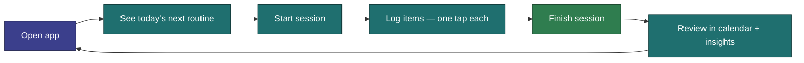

# North Star

> **CosmicWorkOut is the simplest possible tool for following a structured movement practice — offline, on your phone, with zero friction between you and logging what you did.**

---

## What We're Building

A web-based movement tracker that lets a small group of people follow structured, multi-week programs across more than one **Discipline** (Strength and Belly Dance today), plus lightweight tracking for the rest of their day — quick **activities**, daily **habits**, and optional **health metrics**. It logs sessions, tracks history, surfaces insights, and stays out of the way.

It is not a social platform. It is not a coaching app. It is not a marketplace for programs. It is a personal tool — closer to a digital training notebook than a fitness product.

---

## The Problem It Solves

Fitness tracking apps are either too simple (notes app) or too complex (full gym management platforms). The sweet spot — structured program tracking with flexibility — is underserved for people who just want to follow their own plan. And most tools assume a single kind of training; this one treats new movement types as **config**, not a rewrite.

The specific friction this app eliminates: **logging what you did should take under 5 seconds, one-handed, without thinking.**

---

## Who It's For

The developer and a small group of friends. These are people who:

- Already have a plan (lifting, dance, or both) or are willing to build one
- Want to track progress over a structured multi-week program
- Also want a quick place to log activities, habits, and how they feel
- Prefer a fast, clean tool over feature-rich complexity
- May or may not have reliable internet wherever they train

---

## Core User Journey

---

## Core Promise

1. **You can log what you did in under 5 seconds.** One tap in the default mode.
2. **It works offline.** Always. No spinner, no "sync required," no data loss.
3. **Your practice fits your life.** Any Discipline, any duration, any days per week, any items.
4. **It feels good to use.** Satisfying animations and tactile feedback make logging feel rewarding.

---

## What Success Looks Like

- You finish a workout and your session is logged correctly with minimal friction
- You can look back at the past 3 months and see what you did
- You never lose data because you were offline
- You don't need to think about the app — it just works

---

## What This Is Not

- Not a social app (no sharing, no followers, no leaderboards)
- Not a coaching platform (no AI recommendations, no form feedback)
- Not a program marketplace (no browsing other users' plans)
- Not a nutrition tracker
- Not a wearable integration

These are not "future features" — they're out of scope for this product's identity.

---

## Related

- [Design Principles](principles.md) — The rules that flow from this vision
- [System Overview](../architecture/overview.md) — How the system is built to serve this vision
