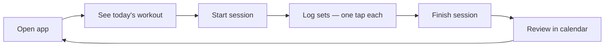

# North Star

> **CosmicWorkOut is the simplest possible tool for following a structured fitness program — offline, on your phone, with zero friction between you and logging a set.**

---

## What We're Building

A web-based fitness tracker that lets a small group of people follow customizable strength programs. It logs workouts, tracks history, and stays out of the way.

It is not a social platform. It is not a coaching app. It is not a marketplace for programs. It is a personal tool — closer to a digital training notebook than a fitness product.

---

## The Problem It Solves

Fitness tracking apps are either too simple (notes app) or too complex (full gym management platforms). The sweet spot — structured program tracking with flexibility — is underserved for people who just want to follow their own plan.

The specific friction this app eliminates: **logging a set after finishing it should take under 5 seconds, one-handed, without thinking.**

---

## Who It's For

The developer and a small group of friends. These are people who:

- Already have a fitness plan or are willing to build one
- Want to track progress over a structured multi-week program
- Prefer a fast, clean tool over feature-rich complexity
- May or may not have reliable internet at the gym

---

## Core User Journey

---

## Core Promise

1. **You can log a set in under 5 seconds.** One tap in the default mode.
2. **It works offline.** Always. No spinner, no "sync required," no data loss.
3. **Your program fits your life.** Any duration, any days per week, any exercises.
4. **It feels good to use.** Satisfying animations and tactile feedback make logging feel rewarding.

---

## What Success Looks Like

- You finish a workout and your session is logged correctly with minimal friction
- You can look back at the past 3 months and see what you did
- You never lose data because you were offline
- You don't need to think about the app — it just works

---

## What This Is Not

- Not a social app (no sharing, no followers, no leaderboards)
- Not a coaching platform (no AI recommendations, no form feedback)
- Not a program marketplace (no browsing other users' plans)
- Not a nutrition tracker
- Not a wearable integration

These are not "future features" — they're out of scope for this product's identity.

---

## Related

- [Design Principles](principles.md) — The rules that flow from this vision
- [System Overview](../architecture/overview.md) — How the system is built to serve this vision
