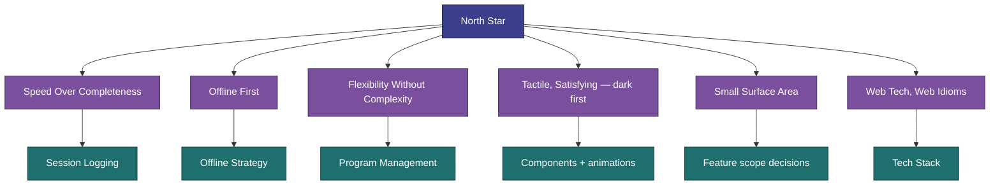

[Wiki](../README.md) › [30k — Vision](../README.md#30k--vision) › Design Principles

# Design Principles

These principles are derived from the [North Star](north-star.md). When a product or technical decision is unclear, test it against these.

---

## 1. Speed Over Completeness

The primary action — logging a set — must be frictionless. Default behavior should require zero configuration. Logging a set at last-used weight and target reps should be one tap. Optional detail (adjusting weight, adding notes) is one step deeper, never the default path.

**Test:** Could a user log a set in 5 seconds with one hand without looking at the screen for more than a glance?

---

## 2. Offline First, Always

The app must be fully functional with no network connection after initial load. This is not an edge case — it is the default assumption. Data is written locally and immediately. There is no "save to server" step.

**Test:** Pull the network. Does everything still work?

See [Offline Strategy](../architecture/offline-strategy.md) for implementation details.

---

## 3. Flexibility Without Complexity

Programs are not hardcoded. Any duration, any days per week, any exercises. Built-in plans are starting points — not the product. Users (or the developer) should be able to modify any aspect of a plan without hitting a wall.

**Test:** Could you build a 5-week, 2-day-per-week program using only the UI?

See [Program Management](../requirements/program-management.md) for requirements.

---

## 4. Tactile and Satisfying — Dark First

Dark is the default and the reference look; a light theme exists for daylight reading (v1.11.0, [US-048](../features/v1.11.0/US-048-light-mode.md)), and every screen must work in both. Interactions have physical weight — tapping a set tile should feel like checking something off a list. Animations use spring curves, not linear transitions. Completion moments (exercise done, session done) should feel earned.

This is not decoration. Satisfying feedback is what makes people actually log their workouts consistently.

**Test:** Does completing a set feel noticeably better than typing in a notes app?

---

## 5. Small Surface Area

This app is for a small group of known users. Do not build for hypothetical future users. Do not add features "just in case." Every screen, every option, every field has a cost in maintenance and cognitive load. Default to removing rather than adding.

**Test:** Would removing this make the core use case worse?

---

## 6. Web Tech, Web Idioms

The implementation stays in web technology (HTML, CSS, JavaScript/TypeScript, Svelte). Native-feeling behavior is achieved through CSS and JS, not a native framework. PWA is a secondary goal — not a constraint on architecture.

See [Tech Stack](../architecture/tech-stack.md) for specifics.

---

## Related

- [North Star](north-star.md) — Where these principles come from
- [System Overview](../architecture/overview.md) — How these principles shape the architecture
